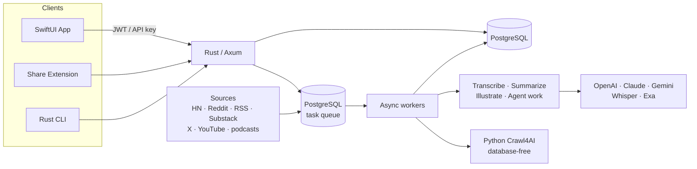

<p align="center">
  <picture>
    <source media="(prefers-color-scheme: dark)" srcset="docs/assets/newsbuddy-hero.png">
    <source media="(prefers-color-scheme: light)" srcset="docs/assets/newsbuddy-hero.png">
    
  </picture>
</p>

<h1 align="center">Newsbuddy</h1>

<p align="center">
  <strong>Stop drowning in tabs. Start understanding what matters.</strong>
</p>

<p align="center">
  <a href="#getting-started"></a>
  <a href="#python-islands"></a>
  <a href="#cli"></a>
  <a href="#ios-app"></a>
  <a href="https://github.com/willemave/newsbuddy/actions"></a>
  <a href="docs/architecture.md"></a>
  <a href="LICENSE"></a>
</p>

---

Newsbuddy is an AI-powered knowledge companion that keeps you informed without the noise. It pulls in content from RSS feeds, podcasts, Hacker News, Reddit, Techmeme, X bookmarks, and any URL you throw at it — then summarizes everything with LLMs so you get focused, non-sensationalized reading on the things you actually care about.

<br>

<p align="center">
  <a href="#ios-app"></a>
</p>

<p align="center">
  <sub>Newsbuddy is a native iOS app built with SwiftUI. Coming soon to the App Store — or <a href="#getting-started">self-host it yourself</a> with your own API keys.</sub>
</p>

<br>

## Highlights

<table>
<tr><td colspan="2"><br></td></tr>
<tr>
<td width="50%" valign="top">

<h3>
<picture></picture><br>
Focused Reading, Zero Noise
</h3>

<p>Stay informed on the go with content that respects your attention. Newsbuddy delivers non-sensationalized, AI-summarized reading across the topics you care about — so you read what matters, when you want to.</p>

</td>
<td width="50%" valign="top">

<h3>
<picture></picture><br>
Your Council of Experts
</h3>

<p>Chat with a council of AI experts grounded in your entire knowledge base. Dig deeper into any article, corroborate claims across sources, and explore new angles — all in one conversation.</p>

</td>
</tr>
<tr><td colspan="2"></td></tr>
<tr>
<td width="50%" valign="top">

<h3>
<picture></picture><br>
RSS Feeds &amp; Long-Form Content
</h3>

<p>First-class support for RSS and Atom feeds, podcasts, and long-form articles. Subscribe to your favorite blogs, newsletters, and shows — Newsbuddy monitors them continuously and processes new content as it arrives.</p>

</td>
<td width="50%" valign="top">

<h3>
<picture></picture><br>
Fast Tech News
</h3>

<p>Curated, quick-hit summaries from Hacker News, Techmeme, Reddit, and more. Get the signal from the noisiest corners of the internet in seconds, not hours of scrolling.</p>

</td>
</tr>
<tr><td colspan="2"></td></tr>
<tr>
<td width="50%" valign="top">

<h3>
<picture></picture><br>
Discover New Knowledge
</h3>

<p>Newsbuddy surfaces related content and new sources based on what you've read and what's trending across the open web — expanding your knowledge graph without you having to hunt for it.</p>

</td>
<td width="50%" valign="top">

<h3>
<picture></picture><br>
Sources You Already Use
</h3>

<p>Built-in support for <strong>X bookmarks</strong>, <strong>Hacker News</strong>, <strong>Techmeme</strong>, <strong>Reddit</strong>, <strong>Substack</strong>, <strong>YouTube</strong>, podcasts, and any RSS/Atom feed. Connect the sources you already follow and let Newsbuddy do the rest.</p>

</td>
</tr>
<tr><td colspan="2"></td></tr>
<tr>
<td width="50%" valign="top">

<h3>
<picture></picture><br>
CLI-Powered Content Management
</h3>

<p>A dedicated CLI lets you — or your AI agents — manage and curate your library from the terminal. Add feeds, submit articles, manage sources — the system classifies, processes, and enriches everything automatically.</p>

</td>
<td width="50%" valign="top">

<h3>
<picture></picture><br>
Local Markdown Sync
</h3>

<p>Export and sync your saved knowledge as Markdown files locally. Keep a searchable, offline archive of everything you've read for research, note-taking, or integration with your existing tools.</p>

</td>
</tr>
<tr><td colspan="2"><br></td></tr>
</table>

<br>

## CLI

The `newsbuddy` CLI is a Rust and Clap client for scripting content, source,
search, onboarding, and local Markdown-library operations. It uses the same
`newsly-contracts` request types as the Axum API while keeping its stable JSON
output envelope and forward-compatible response decoding.

Install it from this repository:

```bash
git clone https://github.com/willemave/newsbuddy.git
cd newsbuddy
cargo install --locked --path rust/crates/newsly-cli
```

The Homebrew formula lives in the independently released
`willemave/newsbuddy` tap. Verify that the current formula packages the Rust
`newsbuddy` binary before relying on it; the source install above always builds
the checked-out revision.

```bash
# Authenticate — scan the QR code in the app to approve, no password needed
newsbuddy auth login

# Subscribe to an RSS feed
newsbuddy sources add "https://simonwillison.net/atom/everything/" --feed-type atom --display-name "Simon Willison"

# Submit a one-off article and wait for processing
newsbuddy content submit "https://example.com/great-post" --wait

# Browse your unread content
newsbuddy content list --read-filter unread --limit 20

# Browse today's short-form news
newsbuddy news list --read-filter unread

# Convert a news item into a full article
newsbuddy news convert 4821

# Search across your sources
newsbuddy search "transformer architectures" --limit 10

# Sync your knowledge base to local Markdown
newsbuddy library sync --dir ~/newsbuddy-library --include-source

# List all your feed subscriptions
newsbuddy sources list
```

For full architecture details, see **[docs/architecture.md](docs/architecture.md)**.

<br>

## Getting Started

### Prerequisites

- **Rust 1.94.1** and Cargo
- **PostgreSQL 15+** (the setup helper uses Homebrew on macOS)
- **uv** only for the isolated Crawl4AI extractor and offline eval package
- **Docker Compose** only for a containerized development or production-style run

### Native PostgreSQL Quick Start

This is the default local-development path. For day-to-day local work, run the app and workers as normal host services against a local PostgreSQL instance.

```bash
# Clone
git clone https://github.com/willemave/newsbuddy.git
cd newsbuddy

# Install/start PostgreSQL, create the local app DB/user, and update .env
./scripts/setup_local_postgres.sh

# Start the full local stack
./scripts/start_services.sh all --env-file .env

# For bounded end-to-end testing on an explicit, unoccupied API port
./scripts/start_services.sh all --env-file .env --local-e2e --port 8010
```

The setup script installs Homebrew PostgreSQL if needed, starts the service, creates the `newsly` database + role, and rewrites `DATABASE_URL` in `.env` to point at `127.0.0.1:5432`.

### Docker Quick Start

Use this for staging or production-style container runs. Docker is not required for normal local development.

```bash
# Clone
git clone https://github.com/willemave/newsbuddy.git
cd newsbuddy

# Configure environment
cp .env.example .env
# Edit .env with your provider keys and development secrets

# Start PostgreSQL, SQLx migration, Rust API/workers/scheduler, the extractor,
# and the media worker's pinned PO-token provider
docker compose up --build -d

# View logs
docker compose logs -f api workers scheduler document-extractor bgutil-provider
```

The container exposes:

- API: `http://127.0.0.1:8000`
- PostgreSQL: `127.0.0.1:5432`

Production uses the separate blue-green topology in
[`docker-compose.production.yml`](docker-compose.production.yml). The root
Compose file is for local development only.

### Local Start Scripts

For native local development, use the unified launcher with `.env`:

```bash
# Run the local long-running stack
./scripts/start_services.sh all --env-file .env

# Run just the API server
./scripts/start_services.sh server --env-file .env --port 8000

# Run just the workers
./scripts/start_services.sh workers --env-file .env

# Run the Rust scheduler (scraper fan-out and queue recovery)
./scripts/start_services.sh scheduler --env-file .env

# Run only the isolated Crawl4AI service
./scripts/start_services.sh extractor --env-file .env

# Run migrations explicitly
./scripts/start_services.sh migrate --env-file .env
```

The `--local-e2e` profile constrains each process's PostgreSQL pool so the full
worker set can run against a normal local server. Pass the same API origin to
the iOS helper, for example
`./scripts/codex_run_ios.sh --api-base-url http://127.0.0.1:8010`.

### Environment Variables

| Variable | Required | Description |
|----------|:--------:|-------------|
| `DATABASE_URL` | Yes | Native PostgreSQL URL used by SQLx. Local host development uses `127.0.0.1:5432`. |
| `PORT` | | API port inside/outside the container (default `8000`) |
| `JWT_SECRET_KEY` | Yes | Token-signing key |
| `ADMIN_PASSWORD` | Yes | Admin panel access |
| `DOCUMENT_EXTRACTOR_SHARED_SECRET` | Yes | Separate shared secret for the Rust-to-extractor boundary |
| `E2B_API_KEY` | | Agent sandbox control and command streaming |
| `ANTHROPIC_API_KEY` | | Provider operations configured for Anthropic |
| `OPENAI_API_KEY` | | Provider operations configured for OpenAI |
| `GOOGLE_API_KEY` | | Provider operations configured for Google |
| `EXA_API_KEY` | | Web search in chat |

See [`.env.example`](.env.example) for the full non-secret template.

<br>

## iOS App

```bash
open client/newsly/newsly.xcodeproj
```

Build and run on a simulator or device. The app connects to `http://127.0.0.1:8000` by default. Features include:

- **Apple Sign In** authentication
- **Share extension** — save content from any app
- **Integrated chat** — converse with your knowledge base
- **Markdown sync** — export knowledge locally

<br>

## Development

```bash
# Rust backend checks
cd rust
cargo fmt --all -- --check
cargo clippy --workspace --all-targets -- -D warnings
cargo test --workspace
cd ..

# Public contract drift
scripts/check_public_contracts.sh

# Create a new reversible migration pair
# rust/crates/newsly-db/migrations/YYYYMMDDHHMMSS_describe_change.{up,down}.sql

# Apply migrations
scripts/run_sqlx_migrations.sh

# Validate the canonical E2B template definition without network access
scripts/build_agent_vm_template.sh --check
```

The manual `Publish E2B Template` workflow validates a full current-main SHA,
runs the complete quality gate, and rebuilds the fixed `newsly-agent` alias with
the pinned official E2B CLI and SDK. It stores a receipt containing the E2B
template ID, source SHA, Dockerfile digest, tool versions, and image metadata.

### Project Structure

```
rust/
└── crates/            # Axum API, domain, SQLx, queue, workers, providers, E2B
python/
├── document_extractor/ # Database-free Crawl4AI service
└── evals/              # Offline embedding and model pipelines
client/
└── newsly/            # SwiftUI iOS app + Share Extension
rust/crates/newsly-cli/ # Rust/Clap `newsbuddy` command-line client
contracts/             # Versioned OpenAPI and ownership policy artifacts
```

### Python Islands

Newsly-owned Python is intentionally isolated from application state. The
production extractor may fetch and parse documents but cannot access
PostgreSQL, the queue, auth, or migrations. The eval package runs model and
embedding experiments offline and calls the Rust eval driver for production
algorithm behavior. The Rust application image also includes the pinned
third-party `yt-dlp` executable/runtime as a bounded media subprocess; it is not
an application authority.

```bash
uv sync --project python/document_extractor --frozen --group dev
uv run --project python/document_extractor pytest -q python/document_extractor/tests

uv sync --project python/evals --frozen --group dev
uv run --project python/evals mypy --config-file python/evals/pyproject.toml \
  python/evals/src python/evals/scripts python/evals/tests
uv run --project python/evals pytest -q python/evals/tests
```

### Deployment

Production deploys are handled through [`.github/workflows/docker-racknerd-deploy.yml`](.github/workflows/docker-racknerd-deploy.yml). The workflow gates the exact SHA, builds separate Rust application and Python extractor images, then rolls the blue-green topology in [`docker-compose.production.yml`](docker-compose.production.yml).

<br>

## Architecture

One Rust modular monolith owns auth, APIs, chat, discovery, migrations, and processing orchestration. User submissions and scheduled ingestion enqueue work onto a PostgreSQL-backed durable queue. Workers prepare immutable plans in short transactions, release their connections during provider calls, and finalize through fresh lease-fenced transactions.



<br>

## Under the Hood

A few of the engineering decisions that make Newsbuddy interesting:

- **Postgres _is_ the queue.** The async task system is built directly on PostgreSQL — no Redis, Celery, or external broker. It claims jobs lock-free with `FOR UPDATE SKIP LOCKED`, wakes workers instantly via `LISTEN`/`NOTIFY` (with a polling fallback), dedupes with partial unique indexes, and renews time-based leases so long-running jobs survive. Scheduler-owned recovery re-routes stale or misrouted tasks, and rotating retry buckets keep old failures from starving fresh work.

- **One contract authority, three clients.** Utoipa types in the Rust API are the source of truth for public OpenAPI. A fail-closed generator emits the reviewed iOS app and Share Extension wire types, while the Rust CLI consumes `newsly-contracts` directly. Contract checks byte-diff the checked-in schema and generated native-client artifacts.

- **Content-aware model routing.** Each piece of content picks its own model — cheap-and-fast for short news, stronger models for long-form articles and podcasts — across OpenAI, Anthropic, Google Gemini, OpenRouter, and DeepSeek. Provider errors and context-limit overflows fall back automatically, and users can bring their own (encrypted) API keys.

- **Structured outputs, never string-scraping.** Newsly-owned Serde/Schemars contracts validate model and tool boundaries before typed domain values can be persisted. Rig and provider SDK objects remain transient adapter details.

- **A council of experts.** Ask a hard question and the chat agent can fan it out to several AI personas at once; each runs in its own server-side session and the conversation fills in as each expert finishes. It's fully async — the client polls for completion instead of holding a socket open.

- **Cover art chosen by information theory.** Editorial images come from Gemini + Runware, but the _brief_ is picked by scoring each story's Shannon entropy, information density, surprise keywords, conceptual tension, and abstractness — so a dense, surprising story gets a bolder, more dramatic image than a routine update.

- **Self-healing extraction.** Rust routes URL and media work through typed strategies; HTML is delegated over an authenticated, versioned boundary to the isolated Crawl4AI service. Podcasts, YouTube, and tweet videos flow through the native media workers.

- **One story, not fifty headlines.** When the same event surfaces from Hacker News, Techmeme, Reddit, and a dozen blogs, Newsbuddy collapses it into a single card. Every incoming news item runs a cost-tiered cascade — exact-URL match → a cheap lexical pre-filter → multi-view sentence-embedding similarity (title, summary, and source scored separately) → a Qwen cross-encoder asked, yes-or-no, whether two headlines describe _the same_ event (a fresh launch, lawsuit, or follow-up counts as different). Matches fold into one representative item that tracks how many sources covered it, and the feed only ever shows representatives. The whole thing runs incrementally on CPU inside a worker, narrowing thousands of items down to ~12 candidates before the heavy model ever loads.

- **Two read models, one product.** Long-form articles and short-form "Fast Reads" are separate canonical models — each with its own read-state, visibility, and discussion rules — bridged by an explicit link, so each surface stays fast without denormalizing the other. Article bodies live in pluggable local-or-S3 storage rather than the database, and comment threads refresh on a leased, TTL-bounded schedule that stops parallel workers from stampeding the same discussion.

- **One application image, explicit services.** The Rust image exposes API, worker, scheduler, migration, and `newsly-admin` modes, plus a pinned third-party `yt-dlp` media subprocess. Production runs PostgreSQL and the database-free extractor separately, with blue-green API slots and singleton worker/scheduler services.

See **[docs/architecture.md](docs/architecture.md)** for the full system reference.

<br>

## Tech Stack

| Layer | Technologies |
|-------|-------------|
| **Backend** | Rust 1.94, Axum, Tokio, Tower, Serde, Utoipa |
| **Database & queue** | PostgreSQL, SQLx migrations/queries, `SKIP LOCKED`, `LISTEN`/`NOTIFY`, leases |
| **AI / LLM** | Rig, typed provider HTTP/SDK adapters, OpenAI, Anthropic, Google, OpenRouter, Exa |
| **Ingestion & media** | Rust workers, isolated Python Crawl4AI extractor, yt-dlp, ffmpeg, Runware |
| **CLI** | Rust, Clap, reqwest, shared `newsly-contracts`, `newsbuddy` binary |
| **iOS** | SwiftUI, Apple Sign In, Share Extension |
| **Admin / Web** | Axum server rendering, Tailwind CSS v4, `newsly-admin` |
| **Observability** | Structured JSONL logs and vendor usage records |
| **Infrastructure** | Docker Compose, GitHub Actions, Cargo, uv-isolated Python packages |

<br>

## Documentation

| Resource | Description |
|----------|-------------|
| **[Architecture](docs/architecture.md)** | System design, database schema, API reference, worker pipeline |
| **[CLAUDE.md](CLAUDE.md)** | Development conventions, coding rules, project guidelines |
| **[docs/library/](docs/library/)** | Operational, deployment, and integration guides |

<br>

## Contributing

1. Fork the repository
2. Create a feature branch (`git checkout -b feat/amazing-feature`)
3. Make your changes and add tests
4. Run the focused Cargo/client checks and the complete quality gate for cross-cutting changes
5. Commit and push
6. Open a Pull Request

<br>

## License

Released under the [MIT License](LICENSE).

<br>

---

<p align="center">
  Built with Rust, SwiftUI, and a council of LLMs<br>
  <sub>Made by <a href="https://github.com/willemave">@willemave</a></sub>
</p>
