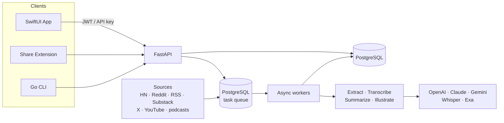

<p align="center">
  <picture>
    <source media="(prefers-color-scheme: dark)" srcset="docs/assets/newsbuddy-hero.png">
    <source media="(prefers-color-scheme: light)" srcset="docs/assets/newsbuddy-hero.png">
    
  </picture>
</p>

<h1 align="center">Newsbuddy</h1>

<p align="center">
  <strong>Stop drowning in tabs. Start understanding what matters.</strong>
</p>

<p align="center">
  <a href="#getting-started"></a>
  <a href="#getting-started"></a>
  <a href="#cli"></a>
  <a href="#ios-app"></a>
  <a href="https://github.com/willemave/newsbuddy/actions/workflows/ci.yml"></a>
  <a href="https://github.com/willemave/newsbuddy/actions"></a>
  <a href="docs/architecture.md"></a>
  <a href="LICENSE"></a>
</p>

---

Newsbuddy is an AI-powered knowledge companion that keeps you informed without the noise. It pulls in content from RSS feeds, podcasts, Hacker News, Reddit, Techmeme, X bookmarks, and any URL you throw at it — then summarizes everything with LLMs so you get focused, non-sensationalized reading on the things you actually care about.

<br>

<p align="center">
  <a href="#ios-app"></a>
</p>

<p align="center">
  <sub>Newsbuddy is a native iOS app built with SwiftUI. Coming soon to the App Store — or <a href="#getting-started">self-host it yourself</a> with your own API keys.</sub>
</p>

<br>

## Highlights

<table>
<tr><td colspan="2"><br></td></tr>
<tr>
<td width="50%" valign="top">

<h3>
<picture></picture><br>
Focused Reading, Zero Noise
</h3>

<p>Stay informed on the go with content that respects your attention. Newsbuddy delivers non-sensationalized, AI-summarized reading across the topics you care about — so you read what matters, when you want to.</p>

</td>
<td width="50%" valign="top">

<h3>
<picture></picture><br>
Your Council of Experts
</h3>

<p>Chat with a council of AI experts grounded in your entire knowledge base. Dig deeper into any article, corroborate claims across sources, and explore new angles — all in one conversation.</p>

</td>
</tr>
<tr><td colspan="2"></td></tr>
<tr>
<td width="50%" valign="top">

<h3>
<picture></picture><br>
RSS Feeds &amp; Long-Form Content
</h3>

<p>First-class support for RSS and Atom feeds, podcasts, and long-form articles. Subscribe to your favorite blogs, newsletters, and shows — Newsbuddy monitors them continuously and processes new content as it arrives.</p>

</td>
<td width="50%" valign="top">

<h3>
<picture></picture><br>
Fast Tech News
</h3>

<p>Curated, quick-hit summaries from Hacker News, Techmeme, Reddit, and more. Get the signal from the noisiest corners of the internet in seconds, not hours of scrolling.</p>

</td>
</tr>
<tr><td colspan="2"></td></tr>
<tr>
<td width="50%" valign="top">

<h3>
<picture></picture><br>
Discover New Knowledge
</h3>

<p>Newsbuddy surfaces related content and new sources based on what you've read and what's trending across the open web — expanding your knowledge graph without you having to hunt for it.</p>

</td>
<td width="50%" valign="top">

<h3>
<picture></picture><br>
Sources You Already Use
</h3>

<p>Built-in support for <strong>X bookmarks</strong>, <strong>Hacker News</strong>, <strong>Techmeme</strong>, <strong>Reddit</strong>, <strong>Substack</strong>, <strong>YouTube</strong>, podcasts, and any RSS/Atom feed. Connect the sources you already follow and let Newsbuddy do the rest.</p>

</td>
</tr>
<tr><td colspan="2"></td></tr>
<tr>
<td width="50%" valign="top">

<h3>
<picture></picture><br>
CLI-Powered Content Management
</h3>

<p>A dedicated CLI lets you — or your AI agents — manage and curate your library from the terminal. Add feeds, submit articles, manage sources — the system classifies, processes, and enriches everything automatically.</p>

</td>
<td width="50%" valign="top">

<h3>
<picture></picture><br>
Local Markdown Sync
</h3>

<p>Export and sync your saved knowledge as Markdown files locally. Keep a searchable, offline archive of everything you've read for research, note-taking, or integration with your existing tools.</p>

</td>
</tr>
<tr><td colspan="2"><br></td></tr>
</table>

<br>

## CLI

The Newsbuddy CLI is a Go, Cobra-based binary that gives you full control over your knowledge base from the terminal — perfect for scripting, automation, or letting your AI agents manage content on your behalf.

Install it with Homebrew:

```bash
brew tap willemave/newsbuddy
brew install newsbuddy
```

```bash
# Authenticate — scan the QR code in the app to approve, no password needed
newsbuddy auth login

# Subscribe to an RSS feed
newsbuddy sources add "https://simonwillison.net/atom/everything/" --feed-type rss --display-name "Simon Willison"

# Submit a one-off article and wait for processing
newsbuddy content submit "https://example.com/great-post" --wait

# Browse your unread content
newsbuddy content list --read-filter unread --limit 20

# Browse today's short-form news
newsbuddy news list --read-filter unread

# Convert a news item into a full article
newsbuddy news convert 4821

# Search across your sources
newsbuddy search "transformer architectures" --limit 10

# Sync your knowledge base to local Markdown
newsbuddy library sync --dir ~/newsbuddy-library --include-source

# List all your feed subscriptions
newsbuddy sources list
```

For full architecture details, see **[docs/architecture.md](docs/architecture.md)**.

<br>

## Getting Started

### Prerequisites

- **Homebrew** for the CLI install and native PostgreSQL local-dev path
- **uv** for Python environment management
- **Docker** and **Docker Compose** only if you want the containerized runtime

### Native PostgreSQL Quick Start

This is the default local-development path. For day-to-day local work, run the app and workers as normal host services against a local PostgreSQL instance.

```bash
# Clone
git clone https://github.com/willemave/newsbuddy.git
cd newsbuddy

# Install/start PostgreSQL, create the local app DB/user, and update .env
./scripts/setup_local_postgres.sh

# Install Python dependencies
uv sync && . .venv/bin/activate

# Start the full local stack
./scripts/start_services.sh all --env-file .env
```

The setup script installs Homebrew PostgreSQL if needed, starts the service, creates the `newsly` database + role, and rewrites `DATABASE_URL` in `.env` to point at `127.0.0.1:5432`.

### Docker Quick Start

Use this for staging or production-style container runs. Docker is not required for normal local development.

```bash
# Clone
git clone https://github.com/willemave/newsbuddy.git
cd newsbuddy

# Configure environment
cp .env.docker.example .env.docker.local
# Edit .env.docker.local with your secrets

# Start the single-container stack (FastAPI + embedded Postgres)
docker compose --env-file .env.docker.local up --build -d

# View logs
docker compose logs -f newsly
```

The container exposes:

- API: `http://127.0.0.1:8000`
- PostgreSQL: `127.0.0.1:5432`

Set `NEWSLY_RUNTIME_MODE=server` in `.env.docker.local` to skip workers, the queue watchdog, and the scheduler while keeping the API server and embedded Postgres.
The default Docker runtime starts the same queue partitions as production:
content, media, audio episode, image, onboarding, backfill, discussion, twitter,
and chat.

### Local Start Scripts

For native local development, use the unified launcher with `.env`:

```bash
# Run the local long-running stack
./scripts/start_services.sh all --env-file .env

# Run just the API server
./scripts/start_services.sh server --env-file .env --port 8000 --reload

# Run just the workers
./scripts/start_services.sh workers --env-file .env --content-workers 4 --discussion-workers 1 --media-workers 1

# Run migrations explicitly
./scripts/start_services.sh migrate --env-file .env
```

The legacy entrypoints still work and now delegate to `start_services.sh`:

```bash
./scripts/start_server.sh --env-file .env
./scripts/start_workers.sh --env-file .env
./scripts/start_scrapers.sh --env-file .env --show-stats
./scripts/start_queue_watchdog.sh --env-file .env
```

### Environment Variables

| Variable | Required | Description |
|----------|:--------:|-------------|
| `DATABASE_URL` | Yes | SQLAlchemy connection URL. Local dev uses native PostgreSQL on `127.0.0.1:5432`; Docker uses `.env.docker.local`. |
| `PORT` | | API port inside/outside the container (default `8000`) |
| `JWT_SECRET_KEY` | Yes | Token signing key — generate with `python -c "import secrets; print(secrets.token_urlsafe(32))"` |
| `ADMIN_PASSWORD` | Yes | Admin panel access |
| `ANTHROPIC_API_KEY` | | Summarization, chat agents |
| `OPENAI_API_KEY` | | Summarization, deep research |
| `GOOGLE_API_KEY` | | Image generation (Gemini) |
| `EXA_API_KEY` | | Web search in chat |

Docker-only env templates remain in `.env.docker.example` and `.env.docker.local`.

<br>

## iOS App

```bash
open client/newsly/newsly.xcodeproj
```

Build and run on a simulator or device. The app connects to `http://127.0.0.1:8000` by default. Features include:

- **Apple Sign In** authentication
- **Share extension** — save content from any app
- **Integrated chat** — converse with your knowledge base
- **Markdown sync** — export knowledge locally

<br>

## Development

```bash
# Run tests
pytest tests/ -v

# Lint & format
ruff check .
ruff format .

# Create a new migration
alembic -c migrations/alembic.ini revision -m "describe your change"

# Apply migrations
alembic -c migrations/alembic.ini upgrade head
```

### Project Structure

```
app/
├── routers/           # API endpoints
├── commands/          # Write operations (CQRS)
├── queries/           # Read operations (CQRS)
├── repositories/      # Data access layer
├── services/          # Business logic & integrations
├── pipeline/          # Task queue workers
├── processing_strategies/  # Content extraction
├── scraping/          # Feed & site scrapers
├── models/            # SQLAlchemy ORM models
└── core/              # Settings, DB, auth
client/
└── newsly/            # SwiftUI iOS app + Share Extension
cli/                   # Go (Cobra) command-line client
migrations/
└── alembic/           # Alembic env, templates, and schema history
```

### Deployment

Production deploys are handled via GitHub Actions with Docker image build + RackNerd container rollout through [`.github/workflows/docker-racknerd-deploy.yml`](.github/workflows/docker-racknerd-deploy.yml). The server runs the repo `docker-compose.yml` and a single `newsly` container.

<br>

## Architecture

One FastAPI backend owns auth, APIs, chat, discovery, and processing orchestration. Scrapers and user submissions create canonical content rows and enqueue work onto a PostgreSQL-backed task queue; a fleet of async workers extracts, transcribes, summarizes, and illustrates that content. The SwiftUI app, Share Extension, and Go CLI all consume the same API as the single source of truth.



<br>

## Under the Hood

A few of the engineering decisions that make Newsbuddy interesting:

- **Postgres _is_ the queue.** The async task system is built directly on PostgreSQL — no Redis, Celery, or external broker. It claims jobs lock-free with `FOR UPDATE SKIP LOCKED`, wakes workers instantly via `LISTEN`/`NOTIFY` (with a polling fallback), dedupes with partial unique indexes, and holds time-based leases that a background thread renews so long-running jobs survive. A watchdog re-routes stale or misrouted tasks, and rotating retry buckets keep old failures from starving fresh work.

- **One API spec, three clients, zero drift.** The FastAPI app is the single source of truth: it exports an OpenAPI schema that generates _both_ the Swift iOS client and the Go CLI. A pre-commit/CI check regenerates every artifact and diffs it against what's committed, so the server, app, and CLI can never silently fall out of sync.

- **Content-aware model routing.** Each piece of content picks its own model — cheap-and-fast for short news, stronger models for long-form articles and podcasts — across OpenAI, Anthropic, Google Gemini, Cerebras, OpenRouter, and DeepSeek. Provider errors and context-limit overflows fall back automatically, and users can bring their own (encrypted) API keys.

- **Structured outputs, never string-scraping.** Classification, summaries, editorial briefs, and discussion digests are all generated as validated Pydantic schemas through pydantic-ai, then stored as JSON — the pipeline never parses free-form text out of a model response.

- **A council of experts.** Ask a hard question and the chat agent can fan it out to several AI personas at once; each runs in its own server-side session and the conversation fills in as each expert finishes. It's fully async — the client polls for completion instead of holding a socket open.

- **Cover art chosen by information theory.** Editorial images come from Gemini + Runware, but the _brief_ is picked by scoring each story's Shannon entropy, information density, surprise keywords, conceptual tension, and abstractness — so a dense, surprising story gets a bolder, more dramatic image than a routine update.

- **Self-healing extraction.** A URL is routed through an ordered strategy registry — Hacker News, arXiv, PubMed, YouTube, X, PDF, image, plain text, HTML — and HTML extraction degrades gracefully from crawl4ai to trafilatura to a paid Firecrawl fallback, only escalating when the cheaper tiers hit a paywall or return junk. Podcasts, YouTube, and tweet videos all flow through one yt-dlp + Whisper audio pipeline.

- **One story, not fifty headlines.** When the same event surfaces from Hacker News, Techmeme, Reddit, and a dozen blogs, Newsbuddy collapses it into a single card. Every incoming news item runs a cost-tiered cascade — exact-URL match → a cheap lexical pre-filter → multi-view sentence-embedding similarity (title, summary, and source scored separately) → a Qwen cross-encoder asked, yes-or-no, whether two headlines describe _the same_ event (a fresh launch, lawsuit, or follow-up counts as different). Matches fold into one representative item that tracks how many sources covered it, and the feed only ever shows representatives. The whole thing runs incrementally on CPU inside a worker, narrowing thousands of items down to ~12 candidates before the heavy model ever loads.

- **Two read models, one product.** Long-form articles and short-form "Fast Reads" are separate canonical models — each with its own read-state, visibility, and discussion rules — bridged by an explicit link, so each surface stays fast without denormalizing the other. Article bodies live in pluggable local-or-S3 storage rather than the database, and comment threads refresh on a leased, TTL-bounded schedule that stops parallel workers from stampeding the same discussion.

- **Ships as a single container.** One Docker image runs Postgres, the API, every queue worker, the watchdog, and a cron scheduler under Supervisor (with a lighter server-only mode). The `admin` CLI SSHes into the box and runs commands inside the container behind a stable JSON envelope, and `newsbuddy auth login` links the CLI by QR code — approve it in the app, no passwords in the terminal.

See **[docs/architecture.md](docs/architecture.md)** for the full system reference.

<br>

## Tech Stack

| Layer | Technologies |
|-------|-------------|
| **Backend** | Python 3.13, FastAPI, SQLAlchemy 2, Pydantic v2, Alembic |
| **Async & queue** | PostgreSQL-backed queue (`SKIP LOCKED`, `LISTEN`/`NOTIFY`), Supervisor, cron scheduler |
| **AI / LLM** | pydantic-ai · OpenAI, Anthropic Claude, Google Gemini, Cerebras, OpenRouter, DeepSeek · Exa search · local SentenceTransformers + Qwen reranker |
| **Ingestion & media** | crawl4ai, trafilatura, Firecrawl, feedparser, yt-dlp, Whisper, Gemini + Runware images |
| **CLI** | Go, Cobra, ogen, `newsbuddy` binary |
| **iOS** | SwiftUI, Apple Sign In, Share Extension |
| **Admin / Web** | Jinja2 templates, Tailwind CSS v4 |
| **Observability** | Langfuse tracing, structured JSONL logs |
| **Infrastructure** | Docker (single-container), GitHub Actions, uv |

<br>

## Documentation

| Resource | Description |
|----------|-------------|
| **[Architecture](docs/architecture.md)** | System design, database schema, API reference, worker pipeline |
| **[CLAUDE.md](CLAUDE.md)** | Development conventions, coding rules, project guidelines |
| **[docs/library/](docs/library/)** | Operational, deployment, and integration guides |

<br>

## Contributing

1. Fork the repository
2. Create a feature branch (`git checkout -b feat/amazing-feature`)
3. Make your changes and add tests
4. Run `ruff check . && ruff format . && pytest tests/ -v`
5. Commit and push
6. Open a Pull Request

<br>

## License

Released under the [MIT License](LICENSE).

<br>

---

<p align="center">
  Built with FastAPI, SwiftUI, and a council of LLMs<br>
  <sub>Made by <a href="https://github.com/willemave">@willemave</a></sub>
</p>
