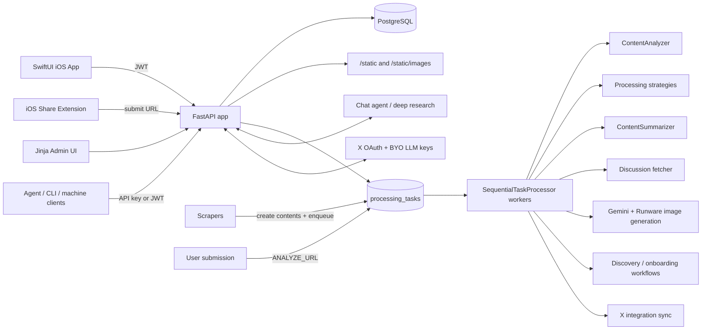
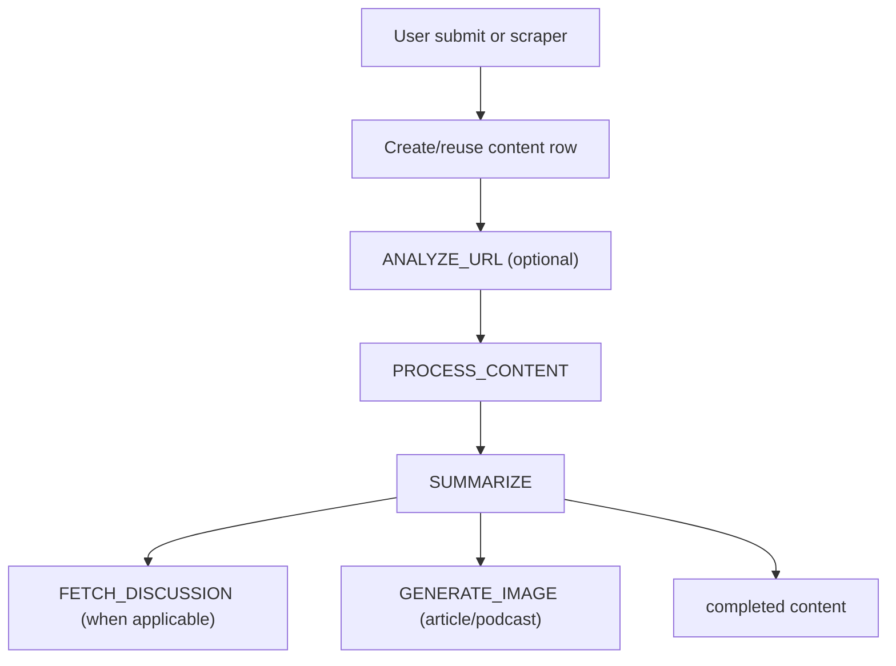

# Newsly Architecture

> Canonical architecture reference for the FastAPI backend, DB-backed processing pipeline, discovery and chat systems, and the SwiftUI iOS client.

**Last Updated:** 2026-04-19
**Repository Root:** `newsbuddy/`
**Primary Runtime:** Python 3.13, FastAPI, SQLAlchemy 2, Pydantic v2, pydantic-ai
**Primary Clients:** SwiftUI iOS app, iOS Share Extension, Jinja admin UI, machine-facing agent/CLI APIs
**Storage:** PostgreSQL for local/staging/production with native queue and search support
**Processing Model:** Database-backed async task queue with queue partitions and sequential workers

## 1. Documentation Map

- `docs/architecture.md`
  - This file. It explains system boundaries, runtime flows, package responsibilities, data model, APIs, workers, and operational constraints.
- `docs/codebase/`
  - Codex-generated folder-by-folder reference for `app/`, `cli/`, and `client/`, plus a small `config/` support section.
- `docs/library/`
  - Durable operational, deployment, integration, and feature docs.
- `docs/initiatives/`
  - Historical plans, specs, and research grouped by initiative.

## 2. System Summary

Newsly is a content ingestion and reading system with four major surfaces:

1. A FastAPI backend that owns auth, APIs, admin pages, chat, voice, discovery, integrations, and processing orchestration.
2. A database-backed task queue that handles analysis, extraction, summarization, discussion fetching, image generation, onboarding discovery, digest generation, and external sync.
3. Scrapers and ingestion paths that create canonical `contents` records from feeds, user submissions, and synced external sources.
4. A SwiftUI iOS client plus share extension that consume the backend as the source of truth.

The backend is not split into microservices. Most application logic lives in one deployable FastAPI codebase with clear internal boundaries:

- routers and HTML endpoints in `app/routers/`
- router-facing commands and queries in `app/commands/` and `app/queries/`
- persistence/query logic in `app/repositories/`
- orchestration and external integrations in `app/services/`
- task execution in `app/pipeline/`
- extraction implementations in `app/processing_strategies/`
- scrapers in `app/scraping/`

## 3. Runtime Topology

## 4. FastAPI Application Structure

### 4.1 App bootstrap

`app/main.py` creates the FastAPI app and is the top-level runtime entrypoint.

Current bootstrap responsibilities:

- load settings via `app/core/settings.py`
- initialize structured logging
- initialize Langfuse tracing during lifespan startup
- initialize the database during lifespan startup
- mount `/static/images` from `settings.images_base_dir`
- mount `/static` from the local `static/` directory
- register exception handlers for request validation and admin auth redirects
- add request logging middleware
- add permissive CORS middleware
- expose `/health`
- redirect `/` to `/admin`

### 4.2 Mounted routers

The app currently mounts:

- `/auth`
  - Apple Sign In, token refresh, `/me`, profile updates, admin login/logout.
- `/admin`
  - Dashboard, eval tooling, API key management, onboarding lane preview.
- `/admin/logs` and `/admin/errors`
  - Log browser and error reset utilities.
- `/api/content`
  - Main content list/detail/actions/state/chat/digests/narration surface.
- `/api`
  - Discovery, onboarding, analytics interactions, X integrations, LLM integrations, agent APIs, OpenAI helper endpoints, voice APIs.

### 4.3 Middleware and request behavior

Actual middleware/handler behavior in `app/main.py`:

- request logging with duration-based severity and Langfuse trace context
- CORS allowing all origins, methods, and headers
- validation exceptions logged with redacted sensitive headers and bounded request body summaries
- admin auth failures redirected to login through a custom exception handler

## 5. Core Backend Packages

### 5.1 `app/core/`

Infrastructure authority for:

- settings and environment loading
- SQLAlchemy engine/session setup
- JWT and Apple token verification helpers
- admin/session and current-user dependencies
- logging setup and logger helpers
- lightweight timing utilities

Important files:

- `app/core/settings.py`
- `app/core/db.py`
- `app/core/security.py`
- `app/core/deps.py`
- `app/core/logging.py`

### 5.2 `app/commands/` and `app/queries/`

Router-facing use-case entrypoints. These modules are intentionally thin and stable.

Commands in `app/commands/`:

- content submission and ingestion
- mark read / unread
- toggle favorites
- start and complete agent onboarding
- create and revoke API keys
- upsert and delete user-managed LLM provider keys
- queue agent digest generation

Queries in `app/queries/`:

- list/search content cards
- content detail
- favorites and recently read
- unread/processing/long-form stats
- job status
- API key listing
- user LLM integration listing
- external machine-oriented search

### 5.3 `app/repositories/`

SQLAlchemy query composition and persistence helpers.

Notable repository slices:

- `content_card_repository.py`
  - card/list/favorites/recently-read projections
- `content_detail_repository.py`
  - detail projection
- `content_feed_query.py`
  - feed visibility rules shared by list-like endpoints
- `stats_repository.py`
  - unread/processing/long-form metrics
- `api_key_repository.py`
  - machine API key CRUD
- `user_integration_repository.py`
  - user-managed provider credentials

### 5.4 Content response builders

The old top-level presenter package was collapsed into the API and models layers:

- `app/routers/api/content_responses.py`
  - builds content list/detail API DTOs
- `app/models/content_display.py`
  - image URL resolution, list readiness checks, and feed-subscription affordances

### 5.5 Search and API key helpers

Implementation seams now live alongside the layers that use them:

- `app/repositories/search_repository.py`
  - PostgreSQL full-text and trigram-backed search helpers for content and news queries
- `app/core/api_keys.py`
  - API key formatting, generation, hashing, and verification helpers

### 5.6 Content mapping helpers

The old top-level domain package was collapsed into `app/models/`:

- `app/models/content_mapper.py`
  - converts ORM `Content` rows to and from canonical `ContentData`
- `app/models/content_form.py`
  - derives canonical short/long form labels from content type

### 5.7 `app/services/`

Most orchestration logic lives here. Major service families:

- ingestion and content analysis
- LLM model resolution and prompt building
- summarization and long-form image support
- feed detection and feed discovery
- onboarding flows
- chat and deep research
- X integration and sync
- content interactions, favorites, read state
- narration and voice systems
- Langfuse tracing
- Exa and external API clients

### 5.8 `app/pipeline/`

Task execution runtime for the async processing system:

- queue polling
- task dispatch
- per-task handlers
- checkout/lock handling
- content worker orchestration
- podcast download and transcription workers

### 5.9 `app/processing_strategies/`

URL/content-type-specific extraction logic:

- Hacker News
- arXiv
- PubMed
- YouTube
- PDF
- image URLs
- general HTML fallback
- Twitter/X share strategy

### 5.10 `app/scraping/`

Unified scrapers for scheduled or manual feed ingestion:

- Hacker News
- Reddit
- Substack
- Techmeme
- Podcast RSS
- Atom feeds
- YouTube scraper code exists, but is disabled in the default runner

## 6. Configuration and Environment

`app/core/settings.py` is the config authority. Settings are loaded from `.env` and exposed through a cached `Settings` object.

### 6.1 Core configuration groups

- database
  - `DATABASE_URL`, pool size, overflow
- auth
  - `JWT_SECRET_KEY`, algorithm, access/refresh expiry, `ADMIN_PASSWORD`
- worker limits
  - max workers, timeouts, retry limits, checkout timeout
- external providers
  - OpenAI, Anthropic, Google, Cerebras, Exa, ElevenLabs, Firecrawl
- tracing
  - Langfuse host, keys, sample rate, instrumentation mode
- discovery and onboarding
  - default models and limits
- podcast search
  - Listen Notes, Spotify, Podcast Index, circuit breaker settings
- X integration
  - OAuth client settings, bearer token, encryption key
- PDF extraction
  - Gemini model validation
- Whisper
  - model size and device selection
- HTTP client
  - timeout and retry counts
- storage paths
  - media, logs, and generated images
- crawl4ai options
  - table extraction and chunking flags
- Firecrawl
  - API key and timeout for HTML fallback extraction

### 6.2 Path conventions

- media defaults to `./data/media`
- logs default to `./logs`
- images default to `/data/images` when writable, otherwise `./data/images`

## 7. Data Model

The SQLAlchemy schema lives primarily in `app/models/schema.py` and `app/models/user.py`.

### 7.1 Primary tables

| Table | Purpose | Notes |
|---|---|---|
| `users` | End users and admin users | Apple identity, profile, onboarding flags, X username |
| `contents` | Canonical content records | Content type, URL, source/platform, lifecycle status, JSON metadata, publication date |
| `processing_tasks` | Async task queue | Task type, queue partition, payload, retries, timestamps |
| `content_read_status` | Per-user read marks | One row per user/content |
| `content_favorites` | Per-user favorites | One row per user/content |
| `content_unlikes` | Per-user dislike/unlike state | One row per user/content |
| `content_status` | Per-user inbox/feed membership | Used to decide whether long-form content is visible to a given user |
| `content_discussions` | Persisted discussion payload | HN/Reddit/Techmeme/social discussion snapshots |
| `user_scraper_configs` | User-managed feed subscriptions | Substack, Atom, podcast RSS, YouTube, Reddit |
| `event_logs` | Flexible event telemetry | Scraper stats, errors, maintenance events |
| `news_items` | Short-form news rows | Visible news feed items, summaries, source metadata, clustering relations |
| `feed_discovery_runs` | Discovery run metadata | Seed favorites, token/timing usage, status |
| `feed_discovery_suggestions` | Discovery recommendations | Feed/podcast/YouTube suggestions with score/rationale |
| `onboarding_discovery_runs` | Async onboarding runs | Audio/topic-driven discovery state |
| `onboarding_discovery_lanes` | Onboarding lane plans | Lane target, queries, progress |
| `onboarding_discovery_suggestions` | Onboarding recommendations | Sources/subreddits chosen during onboarding |
| `analytics_interactions` | Append-only interaction events | Surface + context payload |
| `user_integration_connections` | Per-user external connections | X OAuth and BYO provider credential storage |
| `user_integration_sync_state` | Cursor/state for a connection | Last sync cursor, status, metadata |
| `user_api_keys` | Machine access keys | Prefix + hash + audit fields |
| `chat_sessions` | Stored chat sessions | Session type, model/provider, optional content link, snapshot |
| `chat_messages` | Stored message history | Serialized pydantic-ai messages plus async message status |

### 7.2 Fast-news read model

`news_items` is the canonical read model for short-form/fast-news product surfaces. New fast-news ingestion, list rendering, read-state, relation clustering, and article-conversion work should start from `news_items`.

`contents` rows with `content_type='news'` are legacy compatibility records. They may still exist as bridges for older content-card/detail surfaces, historical discussion payloads, or conversion flows, but they should not be treated as the source of truth for new fast-news behavior. When a bridge exists, `news_items.legacy_content_id` is the explicit link back to the legacy `contents` row.

### 7.3 Content model

`contents` is the central table. Key fields:

- `content_type`
  - `article`, `podcast`, `news`, `unknown`
- `url`
  - canonical normalized URL
- `source_url`
  - original submission/source URL when different from canonical
- `source`
  - human-readable source label
- `platform`
  - source platform such as `youtube`, `substack`, `reddit`, `hackernews`, `x`
- `status`
  - `new`, `pending`, `processing`, `completed`, `failed`, `skipped`
- `classification`
  - currently used for read priority / skip behavior
- `content_metadata`
  - type-specific JSON payload and processing/summarization state

The `content_metadata` JSON holds most type-specific payloads:

- article body and author data
- podcast transcript/audio/thumbnail
- news article/discussion metadata
- summaries and summary version/kind
- image generation outputs
- feed detection payloads
- processing workflow state
- share-and-chat flags and other submission metadata

### 7.4 User visibility model

Long-form content visibility is user-scoped. News items are globally visible once completed; articles and podcasts usually require a `content_status` inbox row for that user.

The shared visibility query in `app/repositories/content_feed_query.py` enforces:

- `Content.status == completed`
- `classification != skip`
- digest-only content excluded from the normal feed
- inbox membership for articles and podcasts
- favorites/recently-read derived from overlay tables

### 7.5 Chat persistence model

Chat is server-stored, not client-authoritative.

- `chat_sessions`
  - one logical conversation
- `chat_messages`
  - serialized pydantic-ai message arrays plus render metadata
- async message state
  - `processing`, `completed`, `failed`

### 7.6 Schema evolution

Alembic migration history in `migrations/alembic/versions/` shows the app’s major feature evolution:

- initial content + user schema
- read/favorite state and user-based tracking
- chat tables
- per-user scraper configs and `content_status`
- news content type
- feed discovery tables
- onboarding discovery tables
- analytics interactions
- content discussions
- user integration tables
- daily news digests
- chat context snapshots
- user API keys
- digest checkpoint settings
- X digest filter prompt
- daily digest bullet details

## 8. API Surface

The API is split between the main content namespace and additive feature namespaces.

### 8.1 Auth and profile

Prefix: `/auth`

Key endpoints:

- `POST /auth/apple`
- `POST /auth/debug/new-user`
- `POST /auth/refresh`
- `GET /auth/me`
- `PATCH /auth/me`
- `GET /auth/admin/login`
- `POST /auth/admin/login`
- `POST /auth/admin/logout`

Behavior:

- Apple Sign In creates or reuses a user and returns JWT access + refresh tokens.
- `/me` includes digest settings, onboarding flags, X sync state summary, and profile metadata.
- Admin auth is cookie-based and separate from mobile JWT auth.
- The shared bearer auth dependency also accepts Newsly API keys with the `newsly_ak_...` prefix on routes that use `get_current_user`.

### 8.2 Content API

Prefix: `/api/content`

#### List and search

- `GET /api/content/`
- `GET /api/content/search`
- `GET /api/content/search/mixed`
- `GET /api/content/search/podcasts`

#### Daily digests

- `GET /api/news/digests`
- `POST /api/news/digests/{digest_id}/mark-read`
- `DELETE /api/news/digests/{digest_id}/mark-unread`
- `POST /api/news/digests/{digest_id}/bullets/{bullet_index}/dig-deeper`
- `POST /api/news/digests/{digest_id}/dig-deeper`

#### Detail and narration

- `GET /api/content/{content_id}`
- `GET /api/content/{content_id}/discussion`
- `GET /api/content/{content_id}/chat-url`
- `GET /api/content/narration/{target_type}/{target_id}`

#### Content actions

- `POST /api/content/{content_id}/convert-to-article`
- `POST /api/content/{content_id}/download-more`
- `POST /api/content/{content_id}/tweet-suggestions`

#### Read/favorite state

- `POST /api/content/{content_id}/mark-read`
- `DELETE /api/content/{content_id}/mark-unread`
- `POST /api/content/bulk-mark-read`
- `GET /api/content/recently-read/list`
- `POST /api/content/{content_id}/favorite`
- `DELETE /api/content/{content_id}/unfavorite`
- `GET /api/content/favorites/list`

#### Submission and status

- `POST /api/content/submit`
- `GET /api/content/submissions/list`

#### Stats

- `GET /api/content/unread-counts`
- `GET /api/content/processing-count`
- `GET /api/content/long-form`

#### Chat

- `GET /api/content/chat/sessions`
- `POST /api/content/chat/sessions`
- `PATCH /api/content/chat/sessions/{session_id}`
- `GET /api/content/chat/sessions/{session_id}`
- `DELETE /api/content/chat/sessions/{session_id}`
- `POST /api/content/chat/sessions/{session_id}/messages`
- `POST /api/content/chat/assistant/turns`
- `GET /api/content/chat/messages/{message_id}/status`
- `POST /api/content/chat/sessions/{session_id}/initial-suggestions`

### 8.3 Discovery

Prefix: `/api/discovery/...`

Endpoints:

- `GET /api/discovery/suggestions`
- `GET /api/discovery/history`
- `GET /api/discovery/search/podcasts`
- `POST /api/discovery/refresh`
- `POST /api/discovery/subscribe`
- `POST /api/discovery/add-item`
- `POST /api/discovery/dismiss`
- `POST /api/discovery/clear`

### 8.4 Onboarding

Prefix: `/api/onboarding`

Endpoints:

- `POST /api/onboarding/profile`
- `POST /api/onboarding/parse-voice`
- `POST /api/onboarding/fast-discover`
- `POST /api/onboarding/audio-discover`
- `GET /api/onboarding/discovery-status`
- `POST /api/onboarding/complete`
- `POST /api/onboarding/tutorial-complete`

### 8.5 Scraper config management

Prefix: `/api/scrapers`

Endpoints:

- `GET /api/scrapers/`
- `POST /api/scrapers/`
- `PUT /api/scrapers/{config_id}`
- `DELETE /api/scrapers/{config_id}`
- `POST /api/scrapers/subscribe`

### 8.6 Analytics interactions

Prefix: `/api`

Endpoints:

- `POST /api/analytics`

### 8.7 Agent / machine-facing APIs

Prefix: `/api`

Endpoints:

- `GET /api/jobs/{job_id}`
- `POST /api/agent/search`
- `POST /api/agent/onboarding`
- `GET /api/agent/onboarding/{run_id}`
- `POST /api/agent/onboarding/{run_id}/complete`
- `POST /api/agent/digests`

These are additive APIs for machine or agent flows, not a separate v2 backend.

### 8.8 X integrations

Prefixes:

- `/api/integrations/x`
- `/api/integrations/llm`

X endpoints:

- `GET /api/integrations/x/connection`
- `POST /api/integrations/x/oauth/start`
- `POST /api/integrations/x/oauth/exchange`
- `DELETE /api/integrations/x/connection`

LLM integration endpoints are mounted from `integrations.llm_router` and back user-managed provider keys.

### 8.9 OpenAI helper endpoints

Prefix: `/api/openai`

Endpoints:

- `POST /api/openai/realtime/token`
- `POST /api/openai/transcriptions`

### 8.10 Admin UI and logs

Prefix: `/admin`

Representative routes:

- dashboard
- onboarding lane preview
- eval summaries and eval run trigger
- API key management
- log browser and error reset tools

## 9. Queue and Worker Architecture

Async work is persisted in `processing_tasks`, not delegated to an external broker.

### 9.1 Task types

Defined in `app/models/contracts.py`:

- `scrape`
- `analyze_url`
- `process_content`
- `download_audio`
- `transcribe`
- `summarize`
- `fetch_discussion`
- `generate_image`
- `discover_feeds`
- `onboarding_discover`
- `dig_deeper`
- `sync_integration`
- `generate_agent_digest`

### 9.2 Queue partitions

Defined in `TaskQueue`:

- `content`
- `image`
- `transcribe`
- `onboarding`
- `twitter`
- `chat`

Current task-to-queue mapping in `app/services/queue.py`:

| Task type | Queue |
|---|---|
| `scrape` | `content` |
| `analyze_url` | `content` |
| `process_content` | `content` |
| `download_audio` | `transcribe` |
| `transcribe` | `transcribe` |
| `download_tweet_video_audio` | `transcribe` |
| `transcribe_tweet_video` | `transcribe` |
| `summarize` | `content` |
| `fetch_discussion` | `content` |
| `generate_image` | `image` |
| `generate_agent_digest` | `content` |
| `discover_feeds` | `content` |
| `onboarding_discover` | `onboarding` |
| `dig_deeper` | `chat` |
| `sync_integration` | `twitter` |

### 9.3 Queue semantics

`QueueService` provides:

- enqueue with optional dedupe for selected content task types
- dequeue with compare-and-set claiming
- retry bucket rotation to reduce starvation
- retry scheduling through delayed `created_at`
- completion and retry state transitions

This design assumes PostgreSQL row-locking and notification features, including
`FOR UPDATE SKIP LOCKED` and `LISTEN`/`NOTIFY`.

### 9.4 Sequential task processor

`app/pipeline/sequential_task_processor.py` is the runtime for workers.

Responsibilities:

- poll one queue partition
- normalize task payload into `TaskEnvelope`
- dispatch to a typed handler
- wrap execution in Langfuse tracing
- apply retry/backoff policy
- gracefully handle shutdown signals

Registered handlers:

- scrape
- analyze URL
- process content
- download audio
- transcribe
- download tweet video audio
- transcribe tweet video
- summarize
- fetch discussion
- generate image
- generate daily news digest
- discover feeds
- onboarding discover
- dig deeper
- sync integration

## 10. Content Ingestion and Processing Flow

### 10.1 Main long-form flow

### 10.2 User submission flow

Implemented primarily in `app/services/content_submission.py`.

Behavior:

- normalize and validate URL
- reuse existing `contents` row when possible
- create `content_type=unknown` when new
- attach submission metadata such as `submitted_by_user_id`, `submitted_via`, `platform_hint`
- ensure inbox status for the submitting user
- enqueue `ANALYZE_URL`
- optionally set `crawl_links`, `subscribe_to_feed`, or `share_and_chat`

### 10.3 URL analysis

`app/services/content_analyzer.py`:

- fetches page HTML with `httpx`
- extracts readable text with `trafilatura`
- detects podcast/video/media patterns in raw HTML
- extracts RSS/Atom links
- uses an LLM to classify `article`, `podcast`, or `video`
- supports optional instruction-driven link extraction for share flows

### 10.4 Content processing worker

`app/pipeline/worker.py` is the main orchestrator for content extraction.

High-level behavior:

- load ORM content and convert to `ContentData`
- choose a processing strategy by URL
- download/extract strategy-specific data
- merge metadata safely
- persist workflow state transitions
- enqueue `SUMMARIZE` when extraction succeeded and summarization is applicable

### 10.5 Processing strategies

Ordered strategy selection is provided by `app/processing_strategies/registry.py`.

Current strategy set:

- `HackerNewsProcessorStrategy`
- `ArxivProcessorStrategy`
- `PubMedProcessorStrategy`
- `YouTubeProcessorStrategy`
- `PdfProcessorStrategy`
- `ImageProcessorStrategy`
- `HtmlProcessorStrategy`
- `TwitterShareStrategy`

Behavioral notes:

- arXiv can redirect processing toward PDF extraction
- YouTube extraction can provide transcript and provider thumbnail metadata
- Twitter/X posts can carry embedded-video metadata and route through media transcription before summarization.
- image URLs can short-circuit to skipped states
- HTML is the broad fallback: crawl4ai is primary, with Firecrawl scrape as the paid recovery path when crawl4ai fails or returns suspect content.

### 10.6 Podcast-specific flow

Podcast processing is split further:

- `download_audio`
  - fetch audio and store under `settings.podcast_media_dir`
- `transcribe`
  - run Whisper through `app/services/whisper_local.py`
- `summarize`
  - summarize transcript once text is available

Workers:

- `PodcastDownloadWorker`
- `PodcastTranscribeWorker`

Tweet video processing reuses the same audio primitives:

- X API ingestion records native video attachments as metadata on Twitter news items.
- `download_tweet_video_audio` downloads audio from the tweet URL via yt-dlp.
- `transcribe_tweet_video` writes `video_transcript`, deletes the temporary audio file, and enqueues `summarize`.
- media failures degrade to the existing tweet-text summary path.

### 10.7 Summarization

`app/services/llm_summarization.py` owns summary generation and fallbacks.

Current defaults:

- news, news digests, daily rollups
  - `google:gemini-3.1-flash-lite-preview`
- articles
  - `openai:gpt-5.4-mini`
- podcasts, editorial/interleaved/long-bullets
  - `openai:gpt-5.4`
- fallback model
  - `google:gemini-2.5-flash`

Key behaviors:

- payload clipping for long inputs
- structured summary cleanup
- quote pruning
- fallback routing for provider errors, context limits, and event-loop issues

Summary shapes live in `app/models/metadata.py` and `app/models/summary_contracts.py`.

### 10.8 Discussion fetching

`app/services/discussion_fetcher.py` persists separate discussion payloads for eligible content.

Supported discussion sources include:

- Hacker News
- Reddit
- Techmeme-linked discussions
- selected social/link platforms when discoverable

Stored output lands in `content_discussions` and may also denormalize preview fields into content metadata.

### 10.9 Image generation

`app/services/image_generation.py` uses Google Gemini image generation to create:

- editorial infographics for articles and podcasts
- thumbnails and derivative resized assets

Generated files are stored in image directories resolved by `app/utils/image_paths.py` and exposed from `/static/images/...`.

## 11. Scrapers and Feed Sources

### 11.1 Default runner

`app/scraping/runner.py` currently runs these scrapers by default:

- Hacker News
- Reddit
- Substack
- Techmeme
- Podcast RSS
- Twitter/X
- Atom

The YouTube scraper implementation exists but is commented out in the default runner.

### 11.2 Scraper behavior

Scrapers generally:

- fetch items from a source
- normalize URLs and metadata
- dedupe against existing content
- create new `contents` rows with `status=new`
- enqueue processing
- ensure inbox visibility for relevant users when source ownership is user-specific
- emit stats and errors into `event_logs`

### 11.3 User-managed source configs

`user_scraper_configs` lets each user add feeds for:

- `substack`
- `atom`
- `podcast_rss`
- `youtube`
- `reddit`

`app/services/scraper_configs.py` normalizes config payloads and enforces limits and required fields.

## 12. Discovery and Onboarding

These are related but separate systems.

### 12.1 Feed discovery

`app/services/feed_discovery.py` is a favorites-driven discovery workflow.

Inputs:

- user favorites
- Exa web results
- LLM-selected discovery directions and lanes

Outputs:

- `feed_discovery_runs`
- `feed_discovery_suggestions`

Supported suggestion targets:

- Atom/Substack-like feeds
- podcast RSS
- YouTube

### 12.2 Onboarding discovery

`app/services/onboarding.py` handles the new-user source discovery experience.

Capabilities:

- build onboarding profile from interests
- parse voice transcript into candidate topics
- run fast source discovery
- run audio-driven discovery planning with multiple lanes
- persist onboarding lanes and suggestions
- complete onboarding by creating user scraper configs and feed memberships

Primary/default onboarding model today:

- `cerebras:zai-glm-4.7`

Fallbacks are defined for discovery and audio plan generation.

### 12.3 Discovery boundaries

Discovery does not directly replace the content feed. It proposes sources or feed subscriptions that then become normal user scraper configs or inbox content through the existing ingestion pipeline.

## 13. Chat, Deep Research, and Agent Features

### 13.1 Chat sessions

`app/services/chat_agent.py` powers server-side chat using pydantic-ai.

Capabilities:

- article-aware deep-dive chat
- topic chat
- ad hoc chat
- source-backed Exa web search
- persisted sessions and messages
- model/provider tracking per session

The system prompt explicitly instructs the agent to use web search and cite sources when it does.

### 13.2 Deep research

`app/services/deep_research.py` is a separate OpenAI Responses API path for long-running research.

Characteristics:

- async/background execution
- model from `app/services/llm_models.py` (`DEEP_RESEARCH_MODEL`)
- web search + code interpreter tools enabled
- response polling every 2 seconds
- 10 minute default timeout window

### 13.3 Daily digest chat

Daily digest routes can start dig-deeper chats from:

- the whole digest
- a specific digest bullet

This keeps digest exploration inside the same chat infrastructure instead of inventing a separate discussion stack.

### 13.4 Agent-facing APIs

The `/api/agent/*` surface wraps existing features into machine-friendly flows:

- external search
- onboarding start/status/complete
- digest generation
- job polling

These APIs are intended for assistant and CLI style clients that do not need the full mobile UI semantics.

## 14. Audio and Narration Systems

Audio support is intentionally non-live.

Active modules:

- `app/services/voice/narration_tts.py`
- `app/routers/api/openai.py`

### 14.1 Transcription flow

`/api/openai/transcriptions` accepts uploaded audio and returns backend-managed STT results.

### 14.2 Narration flow

Narration text is generated from content and rendered to one-shot TTS audio via `narration_tts.py`.

## 15. X Integration and External Connections

`app/services/x_integration.py` owns per-user X integration state and bookmark-first sync.

Capabilities:

- start and exchange OAuth flow
- store encrypted access/refresh tokens
- fetch bookmarks and persist bookmark-derived tweet snapshots
- persist a per-user synced-item ledger for bookmark history
- support downstream tweet lookup, thread lookup, linked tweet lookup, and linked article resolution
- persist sync cursors and summaries

Explicit non-goals in the active runtime:

- no reverse-chronological home timeline ingestion into digest/news rows
- no scheduled X list scraping in the default scraper runner

Related storage:

- `user_integration_connections`
- `user_integration_sync_state`
- `user_integration_synced_items`

Related APIs:

- `/api/integrations/x/*`
- sync tasks through `sync_integration`

### 15.1 BYO LLM keys

User-managed provider keys are stored through the LLM integrations API and repository path.

Supported providers are enforced in the integration repository and command layer. This allows user-specific model credentials without changing the rest of the router contract.

## 16. Search

Search is intentionally abstracted from the routers.

### 16.1 Content search

`app/queries/search_content_cards.py` uses:

- `build_user_feed_query(...)`
- PostgreSQL search helpers in `app/repositories/search_repository.py`

### 16.2 External search

`/api/agent/search` and parts of chat/discovery rely on:

- Exa web search
- podcast episode search providers

## 17. iOS Client Architecture

The SwiftUI client lives in `client/newsly/newsly/`.

### 17.1 App structure

Top-level app bootstrap:

- `client/newsly/newsly/newslyApp.swift`

Primary layers:

- `Models/`
  - API-facing and UI-facing model types, including generated API contracts
- `Repositories/`
  - content/read-status/news-digest repository wrappers
- `Services/`
  - API client, auth, chat, discovery, narration, voice, X integration, image cache, notifications
- `ViewModels/`
  - feature-level state and pagination
- `Views/`
  - authenticated root, lists, detail, chat, discovery, onboarding, settings, sources, live voice, knowledge views
- `Shared/`
  - app chrome, state stores, shared container utilities

### 17.2 Auth model

The iOS app authenticates with Apple Sign In against `/auth/apple`, stores credentials in Keychain, and boots the authenticated shell from `AuthenticationViewModel`.

### 17.3 Client features visible from code structure

The client has dedicated flows for:

- content lists and search
- content detail
- daily digests
- chat session history and message views
- discovery and onboarding
- live voice
- settings and sources
- submissions and processing status
- X integration

### 17.4 Generated API contracts

The canonical public HTTP contract is the checked-in OpenAPI export:

- `docs/library/reference/openapi.json`

Derived generated client artifacts are checked in under:

- `client/newsly/newsly/Models/Generated/`
- `client/newsly/OpenAPI/Generated/`
- `cli/openapi/agent-openapi.json`
- `cli/internal/api/`

Supporting scripts:

- `scripts/export_openapi_schema.py`
- `scripts/export_agent_openapi_schema.py`
- `scripts/generate_ios_contracts.py`
- `scripts/generate_ios_openapi_artifacts.sh`
- `scripts/generate_agent_cli_artifacts.sh`
- `scripts/regenerate_public_contracts.sh`
- `scripts/check_public_contracts.sh`

OpenAPI is authoritative for the public wire format. Checked-in Go and Swift generated artifacts must be regenerated from those scripts rather than edited manually.

## 18. iOS Share Extension

The share extension lives in `client/newsly/ShareExtension/`.

`ShareViewController.swift` currently supports three submission modes:

- Add content
- Add links
- Add feed

The extension:

- extracts shared URLs from extension items
- shares auth state through the app group / shared keychain
- submits URLs to the backend
- lets the user choose whether the backend should summarize, crawl linked pages, or subscribe to the site feed

## 19. Admin UI

The server-rendered admin UI is intentionally simple and lives alongside the API.

Capabilities visible in `app/routers/admin.py`:

- queue partition status
- task phase status
- recent failure rollups
- scraper health metrics
- onboarding lane preview
- eval execution and summaries
- API key creation/revocation

This is not a separate frontend application. Templates are rendered via Jinja in `app/templates/`.

## 20. Observability and Logging

### 20.1 Structured logging

The codebase standard is direct `logger.error()` / `logger.exception()` calls with structured `extra` payloads such as:

- `component`
- `operation`
- `item_id`
- `context_data`

### 20.2 Event logs

`event_logs` stores flexible JSON payloads for:

- scraper stats
- scraper failures
- maintenance/cleanup events
- other service-level telemetry

### 20.3 Langfuse

Langfuse tracing is initialized during app startup and used in:

- request traces
- queue task traces
- LLM generation paths
- selected provider integrations

### 20.4 Error file logging

Per repo conventions, ERROR+ logs are written to JSONL error logs under `logs/errors/`.

## 21. Operations and Scripts

Representative scripts under `scripts/`:

### 21.1 Core runtime

- `scripts/start_server.sh`
- `scripts/run_workers.py`
- `scripts/start_workers.sh`
- `scripts/run_scrapers.py`
- `scripts/start_scrapers.sh`

### 21.2 Schema and bootstrapping

- `scripts/init_database.py`
- `scripts/check_and_run_migrations.sh`
- Alembic migrations under `migrations/alembic/`

### 21.3 Discovery and sync

- `scripts/run_feed_discovery.py`
- `scripts/run_integration_sync.py`

### 21.4 Content maintenance

- `scripts/reset_errored_content.py`
- `scripts/reset_content_processing.py`
- `scripts/reconcile_stale_long_form_processing.py`
- `scripts/cancel_ineligible_generate_image_tasks.py`
- `scripts/resummarize_podcasts.py`
- `scripts/retranscribe_podcasts.py`
- `scripts/generate_thumbnails.py`
- `scripts/resize_thumbnails.py`

### 21.5 Contract and documentation generation

- `scripts/export_openapi_schema.py`
- `scripts/export_agent_openapi_schema.py`
- `scripts/generate_ios_contracts.py`
- `docs/generate_codebase_docs.sh`
- `docs/generate_architecture.sh`
- `scripts/update-docs-from-commit.sh`

### 21.6 Diagnostics and reports

- `scripts/dump_database.py`
- `scripts/dump_system_stats.py`
- `scripts/view_remote_errors.sh`
- `scripts/build_prompt_debug_report.py`
- `scripts/generate_eval_html_report.py`

## 22. Testing Strategy

The test suite under `tests/` mirrors the codebase structure and covers both unit and integration concerns.

Top-level coverage areas include:

- `tests/core/`
- `tests/domain/`
- `tests/http_client/`
- `tests/integration/`
- `tests/models/`
- `tests/pipeline/`
- `tests/presenters/`
- `tests/processing_strategies/`
- `tests/routers/`
- `tests/scraping/`
- `tests/services/`
- `tests/utils/`
- `tests/cli/`

Key test infrastructure:

- isolated PostgreSQL schemas via `app/testing/postgres_harness.py` and `tests/conftest.py`
- FastAPI `TestClient`
- fixture-driven content samples in `tests/fixtures/`

The suite covers:

- API route behavior
- queue and retry logic
- processing handlers and worker terminal paths
- discovery and onboarding logic
- chat and voice services
- X integration
- search and visibility semantics
- scraper behavior

## 23. Known Constraints and Risks

The architecture is intentionally pragmatic, but a few constraints are explicit in the code:

### 23.1 Admin sessions are in memory

`app/routers/auth.py` stores admin sessions in an in-memory set.

Implications:

- lost on restart
- not multi-instance safe
- no persistent audit trail
- no TTL-backed expiry

### 23.2 Apple token verification is not production-grade yet

`app/core/security.py` currently decodes Apple ID tokens without verifying the signature against Apple's public keys. The file explicitly marks this as MVP-only behavior.

### 23.3 CORS is wide open

`app/main.py` currently allows all origins, methods, and headers.

### 23.4 Queue is DB-backed

This keeps deployment simple, but it also means:

- worker throughput is constrained by DB polling and row updates
- partitioning is logical, not broker-native
- horizontal scale requires care

### 23.5 Metadata is flexible JSON

`content_metadata` makes the system adaptable, but schema drift is always possible if validations or migration discipline weaken.

## 24. Mental Model for Working in This Repo

When making backend changes, use this dependency direction:

1. routers
2. application commands/queries
3. repositories/services
4. models/infrastructure

When making processing changes, use this direction:

1. task type or handler
2. worker/service orchestration
3. strategy or provider implementation
4. persistence and presenter updates

When making product changes, remember the system has three parallel user-facing states:

- shared canonical content in `contents`
- per-user visibility/state overlays in `content_status`, read, favorite, unlike
- per-user conversational/discovery/integration state in dedicated tables

That split is the core architectural idea behind Newsly.
