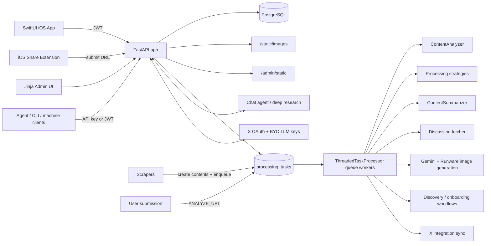
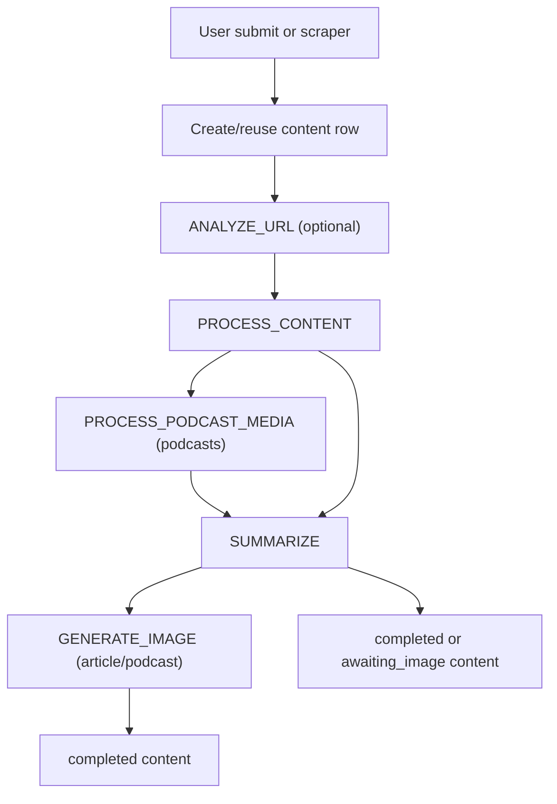

# Newsly Architecture

> Canonical architecture reference for the FastAPI backend, DB-backed processing pipeline, discovery and chat systems, and the SwiftUI iOS client.

**Last Reviewed:** 2026-05-19
**Repository Root:** `news_app/`
**Use:** Cross-boundary architecture reference. For canonical product behavior, use `docs/laws/`.
**Primary Runtime:** Python 3.13, FastAPI, SQLAlchemy 2, Pydantic v2, pydantic-ai
**Primary Clients:** SwiftUI iOS app, iOS Share Extension, Jinja admin UI, machine-facing agent/CLI APIs
**Storage:** PostgreSQL for local/staging/production, plus local or S3-compatible content-body storage
**Processing Model:** Task-spec-routed database queue with partition-owned threaded workers

## 1. Documentation Map

- `docs/architecture.md`
  - This file. It explains system boundaries, runtime flows, package responsibilities, data model, APIs, workers, and operational constraints.
- `docs/laws/`
  - Canonical, implementation-independent product behavior and invariants.
- `docs/library/`
  - Durable operational, deployment, integration, and feature docs.
- `docs/initiatives/`
  - Historical plans, specs, and research grouped by initiative.

## 2. System Summary

Newsly is a content ingestion and reading system with four major surfaces:

1. A FastAPI backend that owns auth, APIs, admin pages, chat, voice, discovery, integrations, and processing orchestration.
2. A database-backed task queue that handles analysis, extraction, summarization, discussion fetching, image generation, audio episodes, onboarding discovery, and external sync.
3. Scrapers and ingestion paths that create canonical long-form `contents` records and short-form `news_items` from feeds, user submissions, and synced external sources.
4. A SwiftUI iOS client plus share extension that consume the backend as the source of truth.

The backend is not split into microservices. Most application logic lives in one deployable FastAPI codebase with clear internal boundaries:

- routers and HTML endpoints in `app/routers/`
- router-facing commands and queries in `app/commands/` and `app/queries/`
- persistence/query logic in `app/repositories/`
- orchestration and external integrations in `app/services/`
- task execution in `app/pipeline/`
- extraction implementations in `app/processing_strategies/`
- scrapers in `app/scraping/`
- server-rendered admin UI in `app/admin_web/`
- production operator workflows in `admin/`

## 3. Runtime Topology

```mermaid
flowchart LR
  iOS["SwiftUI iOS App"] -->|JWT| API["FastAPI app"]
  Share["iOS Share Extension"] -->|submit URL| API
  Admin["Jinja Admin UI"] --> API
  Agent["Agent / CLI / machine clients"] -->|API key or JWT| API

  API --> DB[(PostgreSQL)]
  API --> GeneratedImages["/static/images"]
  API --> AdminAssets["/admin/static"]
  API --> Queue[(processing_tasks)]

  Scrapers["Scrapers"] -->|create contents + enqueue| Queue
  Submit["User submission"] -->|ANALYZE_URL| Queue
  Queue --> Workers["ThreadedTaskProcessor queue workers"]
  Workers --> Analyzer["ContentAnalyzer"]
  Workers --> Strategies["Processing strategies"]
  Workers --> Summarizer["ContentSummarizer"]
  Workers --> Discussion["Discussion fetcher"]
  Workers --> ImageGen["Gemini + Runware image generation"]
  Workers --> Discovery["Discovery / onboarding workflows"]
  Workers --> XSync["X integration sync"]

  API <--> Chat["Chat agent / deep research"]
  API <--> Integrations["X OAuth + BYO LLM keys"]
```

## 4. FastAPI Application Structure

### 4.1 App bootstrap

`app/main.py` creates the FastAPI app and is the top-level runtime entrypoint.

Current bootstrap responsibilities:

- load settings via `app/core/settings.py`
- initialize structured logging
- initialize the database during lifespan startup
- mount `/static/images` from `settings.images_base_dir`
- mount `/admin/static` from `app/admin_web/static`
- register exception handlers for request validation and admin auth redirects
- add request logging middleware
- add CORS middleware from `settings.cors_allow_origins`
- expose `/health`
- redirect `/` to `/admin`

### 4.2 Mounted routers

The app currently mounts:

- `/auth`
  - Apple Sign In, token refresh, `/me`, profile updates, admin login/logout.
- `/admin`
  - Dashboard, eval tooling, API key management, feedback, usage dashboards, onboarding lane preview.
- `/admin/logs` and `/admin/errors`
  - Log browser and error reset utilities.
- `/api/content`
  - Long-form content list/detail/actions/state/chat/knowledge/narration/audio-episode surface.
- `/api/news`
  - Short-form Fast Reads list/detail/body/discussion/read-state/conversion/audio surface backed by `news_items`.
- `/api`
  - Onboarding, analytics, feedback, scraper config, X and LLM integrations, agent APIs, CLI link, agent library, OpenAI transcription helpers.

### 4.3 Middleware and request behavior

Actual middleware/handler behavior in `app/main.py`:

- request logging with duration-based severity and structured context
- CORS allowing configured origins, all methods, and all headers; production rejects wildcard origins
- validation exceptions logged with redacted sensitive headers and bounded request body summaries
- admin auth failures redirected to login through a custom exception handler

## 5. Core Backend Packages

### 5.1 `app/core/`

Infrastructure authority for:

- settings and environment loading
- SQLAlchemy engine/session setup
- JWT and Apple token verification helpers
- admin/session and current-user dependencies
- logging setup and logger helpers
- lightweight timing utilities

Important files:

- `app/core/settings.py`
- `app/core/db.py`
- `app/core/security.py`
- `app/core/deps.py`
- `app/core/logging.py`

### 5.2 `app/commands/` and `app/queries/`

Router-facing use-case entrypoints. These modules are intentionally thin and stable.

Commands in `app/commands/`:

- content submission and ingestion
- mark read / unread
- save to / remove from Knowledge
- convert short-form news items into long-form article content
- submit feedback
- start and complete agent onboarding
- create and revoke API keys
- upsert and delete user-managed LLM provider keys
- queue content and onboarding jobs

Queries in `app/queries/`:

- list/search content cards
- list/search Knowledge library
- news-item body and discussion lookups
- content detail
- recently read
- unread/processing/long-form stats
- queue health
- job status
- API key listing
- user LLM integration listing
- external machine-oriented search

### 5.3 `app/repositories/`

SQLAlchemy query composition and persistence helpers.

Notable repository slices:

- `content_card_repository.py`
  - card/list/recently-read projections
- `content_detail_repository.py`
  - detail projection
- `content_feed_query.py`
  - feed visibility rules shared by list-like endpoints
- `knowledge_repository.py`
  - per-user Knowledge saves
- `stats_repository.py`
  - unread/processing/long-form metrics
- `api_key_repository.py`
  - machine API key CRUD
- `user_integration_repository.py`
  - user-managed provider credentials

### 5.4 Content response builders

The old top-level presenter package was collapsed into the API and models layers:

- `app/routers/api/content_responses.py`
  - builds content list/detail API DTOs
- `app/models/domain/content_display.py`
  - image URL resolution, list readiness checks, and feed-subscription affordances

### 5.5 Search and API key helpers

Implementation seams now live alongside the layers that use them:

- `app/repositories/search_repository.py`
  - PostgreSQL full-text and trigram-backed search helpers for content and news queries
- `app/repositories/news_search_expressions.py`
  - canonical News search documents whose SQL shape matches the functional GIN indexes
- `app/repositories/news_relation_repository.py`
  - indexed exact-key and title-ranked candidate retrieval before bounded semantic relation scoring
- `app/core/api_keys.py`
  - API key formatting, generation, hashing, and verification helpers

### 5.6 Content mapping helpers

The old top-level domain package was collapsed into `app/models/`:

- `app/models/domain/content_mapper.py`
  - converts ORM `Content` rows to and from canonical `ContentData`
- `app/models/domain/content.py`
  - derives canonical short/long form labels from content type

Model ownership is split by boundary:

- `app/models/db/`
  - SQLAlchemy tables
- `app/models/api/`
  - HTTP request/response DTOs
- `app/models/domain/`
  - app-domain objects and mappers
- `app/models/metadata/`
  - structured metadata and summary contracts
- `app/models/internal/`
  - worker/admin/runtime-only shapes
- `app/models/llm/`
  - structured LLM outputs
- `app/models/contracts.py`
  - shared enums such as content types, task types, queues, and providers

### 5.7 `app/services/`

Most orchestration logic lives here. Major service families:

- ingestion and content analysis
- LLM model resolution and prompt building
- summarization and long-form image support
- feed detection and feed discovery
- onboarding flows
- chat and deep research
- briefing generation, live dig-deeper, and unread-edition refresh
- X integration and sync
- content interactions, Knowledge saves, read state
- narration, transcription, and audio episodes
- content-body storage and personal markdown sync
- Exa and external API clients

### 5.8 `app/pipeline/`

Task execution runtime for the async processing system:

- queue polling
- task dispatch
- per-task handlers
- checkout/lock handling
- content worker orchestration
- podcast download and transcription workers

### 5.9 `app/processing_strategies/`

URL/content-type-specific extraction logic:

- Hacker News
- arXiv
- PubMed
- YouTube
- Twitter/X share URLs
- PDF
- image URLs
- plain text
- general HTML fallback

### 5.10 `app/scraping/`

Unified scrapers for scheduled or manual feed ingestion:

- configured news aggregators loaded from `config/aggregators.yml`
- Reddit
- Substack
- Podcast RSS
- Atom feeds
- discussion-comment catch-up refresh

X sync and YouTube configuration paths exist outside the default scheduled scraper runner.

## 6. Configuration and Environment

`app/core/settings.py` is the config authority. Settings are loaded from `NEWSLY_ENV_FILE` with `.env` as the default and exposed through a cached `Settings` object. Docker Compose defaults to `.env.docker.local`; RackNerd deploys use `.env.racknerd`.

### 6.1 Core configuration groups

- database
  - `DATABASE_URL`, pool size, overflow; PostgreSQL is required
- auth
  - `JWT_SECRET_KEY`, algorithm, access/refresh expiry, `ADMIN_PASSWORD`
- worker limits
  - max workers, timeouts, retry limits, checkout timeout
- external providers
  - OpenAI, Anthropic, Google, Cerebras, OpenRouter, Exa, Firecrawl, Runware
- observability
  - structured logs and per-vendor usage records
- discovery and onboarding
  - default models and limits
- podcast search
  - Listen Notes, Spotify, Podcast Index, circuit breaker settings
- X integration
  - OAuth client settings, bearer token, encryption key
- PDF extraction
  - Gemini model validation
- Whisper
  - model size and device selection
- HTTP client
  - timeout and retry counts
- storage paths
  - media, logs, generated images, content bodies, personal markdown libraries
- object storage
  - local or S3-compatible content-body storage
- crawl4ai options
  - table extraction and chunking flags
- Firecrawl
  - API key and timeout for HTML fallback extraction

Production rejects wildcard CORS origins and non-PostgreSQL database URLs during settings validation.

### 6.2 Path conventions

- media defaults to `./data/media`
- logs default to `./logs`
- images default to `/data/images` when writable, otherwise `./data/images`
- content bodies default to `./data/content_bodies`
- personal markdown libraries default to `./data/personal_markdown`

## 7. Data Model

SQLAlchemy tables live under `app/models/db/`. API DTOs, domain objects, metadata contracts, internal runtime shapes, and LLM output models live in sibling `app/models/` subpackages.

### 7.1 Primary tables

| Table | Purpose | Notes |
|---|---|---|
| `users` | End users and admin users | Apple identity, profile, onboarding flags, X username, display preferences |
| `contents` | Canonical long-form records and compatibility rows | Content type, URL, source/platform, lifecycle status, compact metadata, publication date |
| `content_bodies` | Canonical body storage pointers | Source/rendered text stored outside `content_metadata` in local or S3-compatible storage |
| `processing_tasks` | Async task queue | Task type, queue partition, normalized payload, active dedupe key, retries, lease owner/token/timestamps |
| `content_status` | Per-user inbox/feed membership | Main long-form visibility overlay |
| `content_read_status` | Per-user read marks for `contents` | One row per user/content |
| `content_knowledge_saves` | Per-user Knowledge saves | Drives saved-content state and personal markdown sync |
| `content_unlikes` | Per-user dislike/unlike state | One row per user/content |
| `content_discussions` | Long-form and legacy discussion payloads | HN/Reddit/Techmeme/social discussion snapshots tied to `contents` |
| `news_items` | Canonical short-form/Fast Reads rows | Visible representative news items, summaries, source metadata, clustering relations |
| `news_item_discussions` | Canonical short-form discussion payloads | Latest raw-comment storage pointer, structured summary, refresh status and lease |
| `news_item_read_status` | Per-user read marks for `news_items` | Separate from `content_read_status` |
| `audio_episodes` | On-demand podcast-style episode state | Fast Reads, discussions, custom narration, and grouped Briefing chapter episodes |
| `briefing_states` | Per-user Briefing masthead/version state | Versioned ETag source for the Briefing index |
| `briefing_lenses` | Per-user Briefing lenses | Fixed podcast/article lenses plus dynamic news category lenses |
| `briefing_segments` | Immutable composed Briefing documents | Typed passage/figure/pullquote blocks over frozen unread source sets |
| `briefing_pending_sources` | Unread sources waiting for Briefing composition | Event-driven and bootstrap source queue for append refresh |
| `user_scraper_configs` | User-managed feed subscriptions | Substack, Atom, podcast RSS, YouTube, Reddit, aggregator subscriptions |
| `feed_discovery_runs` | Discovery run metadata | Seed Knowledge items, token/timing usage, status |
| `feed_discovery_suggestions` | Discovery recommendations | Feed/podcast/YouTube suggestions with score/rationale |
| `onboarding_discovery_runs` | Async onboarding runs | Audio/topic-driven discovery state |
| `onboarding_discovery_lanes` | Onboarding lane plans | Lane target, queries, progress |
| `onboarding_discovery_suggestions` | Onboarding recommendations | Sources/subreddits/aggregators chosen during onboarding |
| `analytics_interactions` | Append-only interaction events | Surface + context payload |
| `user_integration_connections` | Per-user external connections | X OAuth and BYO provider credential storage |
| `user_integration_sync_state` | Cursor/state for a connection | Last sync cursor, status, metadata |
| `user_integration_synced_items` | Per-user integration sync ledger | Prevents duplicate bookmark-derived items |
| `vendor_usage_records` | Provider usage and cost ledger | LLM, image, transcription, and other provider usage |
| `user_api_keys` | Machine access keys | Prefix + hash + audit fields |
| `cli_link_sessions` | CLI/device link sessions | Links local agent clients to approved API keys |
| `chat_sessions` | Stored chat sessions | Session type, model/provider, optional content/news link, snapshot |
| `chat_messages` | Stored message history | Serialized pydantic-ai messages plus async message status |
| `user_feedback` | User-submitted feedback | Admin-visible product feedback |

### 7.2 Fast-news read model

`news_items` is the canonical read model for short-form/fast-news product surfaces. New fast-news ingestion, list rendering, read-state, relation clustering, and article-conversion work should start from `news_items`.

`contents` rows with `content_type='news'` are legacy compatibility records. They may still exist as bridges for older content-card/detail surfaces, historical discussion payloads, or conversion flows, but they should not be treated as the source of truth for new fast-news behavior. When a bridge exists, `news_items.legacy_content_id` is the explicit link back to the legacy `contents` row.

Visible Fast Reads are ready representative `news_items` filtered by one of:

- `visibility_scope='user'` and matching `user_id`
- global aggregator/topic rows that match the user's selected source configs

Read state for Fast Reads is stored in `news_item_read_status`, not `content_read_status`.

Relation reconciliation first resolves every representative with the same normalized story, item,
or platform/external key, then ranks title-adjacent representatives across the configured lookback.
Only that bounded shortlist reaches embedding and reranking. Hash expression indexes own exact URL
keys, and a title-only GIN document owns lexical candidate retrieval; the final semantic and
distinctive-detail gates remain in `app/services/news_relations.py`.

### 7.3 Content model

`contents` is the central table. Key fields:

- `content_type`
  - `article`, `podcast`, `news`, `insight_report`, `unknown`
- `url`
  - canonical normalized URL
- `source_url`
  - original submission/source URL when different from canonical
- `source`
  - human-readable source label
- `platform`
  - source platform such as `youtube`, `substack`, `reddit`, `hackernews`, `x`
- `status`
  - `new`, `pending`, `processing`, `awaiting_image`, `completed`, `failed`, `skipped`
- `classification`
  - currently used for read priority / skip behavior
- `content_metadata`
  - type-specific JSON payload and processing/summarization state

The `content_metadata` JSON holds most type-specific payloads:

- compact article and author data
- podcast audio/thumbnail metadata
- news article/discussion metadata
- summaries and summary version/kind
- image generation outputs
- feed detection payloads
- processing workflow state
- share-and-chat flags and other submission metadata

Full source/rendered body text belongs in `content_bodies`; API metadata sanitization strips legacy full-body fields before responses.

### 7.4 User visibility model

Long-form content visibility is user-scoped. Articles and podcasts usually require a `content_status` inbox row for that user. Fast Reads have a separate `news_items` visibility model described above.

The shared visibility query in `app/repositories/content_feed_query.py` enforces:

- `Content.status == completed`
- `classification != skip`
- inbox membership for articles and podcasts
- Knowledge/read-state overlays from `content_knowledge_saves` and `content_read_status`

### 7.5 Chat persistence model

Chat is server-stored, not client-authoritative.

- `chat_sessions`
  - one logical conversation, optionally attached to `content_id` or `news_item_id`
- `chat_messages`
  - serialized pydantic-ai message arrays plus render metadata
  - nullable cumulative `partial_text` plus attempt `stream_generation`, `stream_revision`, and update timestamp for advisory in-flight display
- async message state
  - `processing`, `completed`, `failed`
  - the status endpoint returns a stable-ID partial assistant DTO only while processing; completed message arrays remain canonical
  - the iOS client polls one coalesced sequence, applies newer partial cursors in place, and resets its idle polling budget while the stream advances

### 7.6 Schema evolution

Alembic migration history in `migrations/alembic/versions/` shows the app’s major feature evolution:

- initial content + user schema
- read/Knowledge state and user-based tracking
- chat tables
- per-user scraper configs and `content_status`
- news content type
- feed discovery tables
- onboarding discovery tables
- analytics interactions
- content discussions
- user integration tables
- short-form news items
- chat context snapshots
- user API keys
- news feed ranking settings
- user feedback submissions
- content-body storage
- CLI link sessions
- vendor usage records
- Knowledge-save rename
- news-item discussions and news chat linkage
- audio episodes
- user integration synced-item ledger

## 8. API Surface

The API is split between the main content namespace, the short-form news namespace, and additive feature namespaces. Exact wire contracts are exported to `docs/library/reference/openapi.json`; generated Swift and Go artifacts must be regenerated from that export rather than edited manually.

### 8.1 Auth and profile

Prefix: `/auth`

Key endpoints:

- `POST /auth/apple`
- `POST /auth/debug/new-user` (development only)
- `POST /auth/refresh`
- `GET /auth/me`
- `PATCH /auth/me`
- `DELETE /auth/me`
- `GET /auth/admin/login`
- `POST /auth/admin/login`
- `POST /auth/admin/logout`

Behavior:

- Apple Sign In creates or reuses a user and returns JWT access + refresh tokens.
- `/me` includes onboarding flags, X sync state summary, and profile metadata.
- Account deletion requires fresh Apple authorization, revokes the Apple grant, immediately deactivates the account after durable queueing, and removes account-owned rows and files through the backfill worker. The deletion handler also revokes X credentials and waits for active user work without consuming retries.
- Admin auth is cookie-based and separate from mobile JWT auth.
- The shared bearer auth dependency also accepts Newsly API keys with the `newsly_ak_...` prefix on routes that use `get_current_user`.

### 8.2 Content API

Prefix: `/api/content`

#### List and search

- `GET /api/content/`
- `GET /api/content/search`
- `GET /api/content/search/mixed`
- `GET /api/content/search/podcasts`

#### Detail and narration

- `GET /api/content/{content_id}`
- `GET /api/content/{content_id}/body`
- `GET /api/content/{content_id}/discussion`
- `POST /api/content/{content_id}/discussion/refresh`
- `GET /api/content/{content_id}/chat-url`
- `GET /api/content/narration/{target_type}/{target_id}`
- `POST /api/content/audio-episodes/fast-news`
- `POST /api/content/{content_id}/audio-episodes/council`
- `POST /api/content/audio-episodes/custom-narrations`
- `GET /api/content/audio-episodes/custom-narrations`
- `GET /api/content/audio-episodes/{audio_episode_id}`
- `GET /api/content/audio-episodes/{audio_episode_id}/audio`
- `GET /api/content/audio-episodes/{audio_episode_id}/stream`
- `POST /api/content/audio-episodes/{audio_episode_id}/share`
- `DELETE /api/content/audio-episodes/{audio_episode_id}/share`

Public custom narration share routes:

- `GET /audio/share/{token}/`
- `GET /audio/share/{token}/audio`

#### Content actions

- `POST /api/content/{content_id}/convert-to-article`
- `POST /api/content/{content_id}/download-more`
- `POST /api/content/{content_id}/tweet-suggestions`

#### Read and Knowledge state

- `POST /api/content/{content_id}/mark-read`
- `DELETE /api/content/{content_id}/mark-unread`
- `POST /api/content/bulk-mark-read`
- `GET /api/content/recently-read/list`
- `POST /api/content/{content_id}/knowledge`
- `DELETE /api/content/{content_id}/knowledge`
- `GET /api/content/knowledge/list`

#### Submission and status

- `POST /api/content/submit`
- `GET /api/content/submissions/list`

#### Stats

- `GET /api/content/stats/unread-counts`
- `GET /api/content/stats/processing-count`
- `GET /api/content/stats/long-form`

#### Chat

- `GET /api/content/chat/sessions`
- `GET /api/content/chat/sessions/list`
- `POST /api/content/chat/sessions`
- `PATCH /api/content/chat/sessions/{session_id}`
- `GET /api/content/chat/sessions/{session_id}`
- `DELETE /api/content/chat/sessions/{session_id}`
- `POST /api/content/chat/sessions/{session_id}/messages`
- `POST /api/content/chat/sessions/{session_id}/council/start`
- `POST /api/content/chat/sessions/{session_id}/council/select`
- `POST /api/content/chat/sessions/{session_id}/council/retry`
- `POST /api/content/chat/assistant/turns`
- `GET /api/content/chat/messages/{message_id}/status`
- `POST /api/content/chat/sessions/{session_id}/initial-suggestions`

### 8.3 News API

Prefix: `/api/news`

This is the canonical short-form/Fast Reads surface. SwiftUI news-only lists use this API rather than `/api/content`.

Endpoints:

- `GET /api/news/items`
- `POST /api/news/items/mark-read`
- `GET /api/news/items/{news_item_id}`
- `GET /api/news/items/{news_item_id}/body`
- `GET /api/news/items/{news_item_id}/discussion`
- `POST /api/news/items/{news_item_id}/discussion/refresh`
- `POST /api/news/items/{news_item_id}/convert-to-article`
- `POST /api/news/items/{news_item_id}/audio-episodes/discussion`

### 8.3.1 Briefing API

Prefix: `/api/briefing`

The Briefing API exposes the user's unread edition: an ETag-backed index, lazy lens payloads,
batched read marks, manual refresh, live dig-deeper, and audio narration creation. It is mounted
under `/api` and uses the same bearer auth/current-user dependency as the content and news APIs.

Refresh planning and LLM composition run without a long database lock. Publication then locks the
user's `briefing_states` row and atomically rechecks the planned version, pending-row ownership, and
complete eligible-unread source set before changing segments. Briefing read marking uses the same
state-row lock, giving publication and those reads one serial order while leaving stale work pending
for a later sweep instead of publishing it.

Endpoints:

- `GET /api/briefing`
- `GET /api/briefing/lenses/{lens_key}`
- `POST /api/briefing/read-marks`
- `POST /api/briefing/refresh`
- `POST /api/briefing/dig/search`
- `POST /api/briefing/dig/summarize`
- `POST /api/briefing/narration` (legacy full-length episode response)
- `POST /api/briefing/narrations` (chapter manifest)
- `GET /api/briefing/narrations/{episode_group_id}`

### 8.4 Onboarding

Prefix: `/api/onboarding`

Endpoints:

- `POST /api/onboarding/profile`
- `POST /api/onboarding/parse-voice`
- `POST /api/onboarding/fast-discover`
- `POST /api/onboarding/audio-discover`
- `GET /api/onboarding/discovery-status`
- `POST /api/onboarding/complete`
- `POST /api/onboarding/tutorial-complete`

### 8.5 Scraper config management

Prefixes: `/api/scrapers` and `/api/content/scrapers`

Endpoints:

- `GET /api/scrapers/`
- `POST /api/scrapers/`
- `PUT /api/scrapers/{config_id}`
- `DELETE /api/scrapers/{config_id}`
- `POST /api/scrapers/subscribe`

### 8.6 Analytics interactions and feedback

Prefix: `/api`

Endpoints:

- `POST /api/analytics`
- `POST /api/feedback`

### 8.7 Agent / machine-facing APIs

Prefix: `/api`

Endpoints:

- `GET /api/jobs/{job_id}`
- `POST /api/agent/search`
- `POST /api/agent/onboarding`
- `GET /api/agent/onboarding/{run_id}`
- `POST /api/agent/onboarding/{run_id}/complete`
- `POST /api/agent/cli/link/start`
- `POST /api/agent/cli/link/{session_id}/approve`
- `GET /api/agent/cli/link/{session_id}`
- `GET /api/agent/library/manifest`
- `GET /api/agent/library/file`

These are additive APIs for machine or agent flows, not a separate v2 backend.

### 8.8 X integrations

Prefixes:

- `/api/integrations/x`
- `/api/integrations/llm`

X endpoints:

- `GET /api/integrations/x/connection`
- `POST /api/integrations/x/oauth/start`
- `POST /api/integrations/x/oauth/exchange`
- `DELETE /api/integrations/x/connection`

LLM integration endpoints are mounted from `integrations.llm_router` and back user-managed provider keys.

### 8.9 OpenAI helper endpoints

Prefix: `/api/openai`

Endpoints:

- `GET /api/openai/transcriptions/health`
- `POST /api/openai/transcriptions`

### 8.10 Admin UI and logs

Prefix: `/admin`

Representative routes:

- dashboard
- onboarding lane preview
- eval summaries and eval run trigger
- API key management
- feedback review
- log browser and error reset tools
- vendor and LLM usage dashboards

## 9. Queue and Worker Architecture

Async work is persisted in `processing_tasks`, not delegated to an external broker.

### 9.1 Task types

Defined in `app/models/contracts.py`:

- `scrape`
- `backfill_feeds`
- `analyze_url`
- `process_content`
- `enrich_news_item_article`
- `process_news_item`
- `process_podcast_media`
- `download_tweet_video_audio`
- `transcribe_tweet_video`
- `summarize`
- `fetch_news_item_discussion`
- `generate_image`
- `discover_feeds`
- `onboarding_discover`
- `dig_deeper`
- `chat_turn`
- `sync_integration`
- `generate_audio_episode`
- `run_llm_task`
- `briefing_refresh`
- `delete_user_account`

### 9.2 Queue partitions

Defined in `TaskQueue`:

- `content`
- `media`
- `audio_episode`
- `image`
- `onboarding`
- `backfill`
- `discussion`
- `twitter`
- `chat`
- `llm`

Current task-to-queue mapping is declared in `app/pipeline/task_specs.py` and
used by `app/services/queue.py`:

| Task type | Queue |
|---|---|
| `scrape` | `content` |
| `backfill_feeds` | `backfill` |
| `analyze_url` | `content` |
| `process_content` | `content` |
| `enrich_news_item_article` | `content` |
| `process_news_item` | `content` |
| `process_podcast_media` | `media` |
| `download_tweet_video_audio` | `media` |
| `transcribe_tweet_video` | `media` |
| `summarize` | `content` |
| `fetch_news_item_discussion` | `discussion` |
| `generate_image` | `image` |
| `discover_feeds` | `content` |
| `onboarding_discover` | `onboarding` |
| `dig_deeper` | `chat` |
| `chat_turn` | `chat` |
| `sync_integration` | `twitter` |
| `generate_audio_episode` | `audio_episode` |
| `run_llm_task` | `llm` |
| `briefing_refresh` | `llm` |
| `delete_user_account` | `backfill` |

### 9.3 Queue semantics

`QueueService` provides:

- enqueue with task-spec-normalized payloads and queue names from `TASK_SPECS`
- dedupe controlled by `TaskSpec`, explicit `dedupe_key`, and a partial unique index over active `pending`/`processing` rows
- dequeue with SQLAlchemy Core compare-and-set claiming via `FOR UPDATE SKIP LOCKED`
- a unique `lease_token` for each claim attempt in addition to the diagnostic `locked_by` worker name
- ownership-checked lease renewal and finalization, with expired `processing` rows eligible for reclaim
- a database check constraint that permits tokenless rolling-deploy claims but requires every
  tokenized row to remain `processing` with a lock timestamp, owner, and lease expiry
- retry bucket rotation to reduce starvation
- retry scheduling through delayed `available_at`
- one atomic completion, failure, retry, or deferral transition
- daily terminal-row retention after 14 days, committed in 5,000-row batches with a
  50,000-row cap per run so initial cleanup drains gradually

Claim, renewal, and finalization live in `ProcessingTaskQueueRepository`. They use the Core table,
short engine-owned transactions, validated internal result models, and the PostgreSQL UTC
transaction clock. They do not use ORM session synchronization or ORM `UPDATE ... RETURNING`
adaptation. Renewal and finalization match task id, status, worker name, exact lease token,
unexpired lease, and retry count so a stale attempt cannot overwrite a newer claim.
`QueueService` resolves success, failure, retry, deferral, and backoff once before passing the claim,
resolved outcome, error, and delay to the repository. The repository returns the typed
`TaskTransition`. Every finalization and administrative recovery path clears all four lease fields
through the same helper.

This design assumes PostgreSQL row-locking and notification features, including `FOR UPDATE SKIP
LOCKED` and `LISTEN`/`NOTIFY`.

### 9.4 Threaded worker and sequential claim loop

`app/pipeline/threaded_task_processor.py` owns one queue process and runs multiple
`SequentialTaskProcessor` claim loops. Each loop has its own worker name and carries the exact
`ClaimedTask` through heartbeat and finalization. Handlers receive a smaller `TaskEnvelope`; lease
identity stays in the processor and can only be renewed through the bound `TaskContext` callback.
Heartbeat database failures are retried within the current lease window, and ownership loss blocks
finalization of that attempt.

Article chat, contextual-assistant chat, and the dig-deeper adapter share detached state and ledger
helpers in `app/services/chat_turn_runtime.py`, exact-lease provider orchestration in
`app/services/queued_chat_turn.py`, and advisory snapshots in
`app/services/chat_partial_stream.py`. A queue retry installs a monotonic stream generation. After
preparation and immediately before provider submission, the owner renews the exact claim; it renews
again before terminal persistence, where the message row checks the same generation. Superseded
work cannot incur new provider cost or overwrite the newer message attempt, and its attempt ledger
is cancelled.

Deep Research retains its provider-specific lifecycle while using the same lease and generation
fences. Its OpenAI response ID is stored on the processing message before polling, so a reclaimed
worker resumes the existing provider run rather than submitting it again.

Responsibilities:

- poll one queue partition
- wait on PostgreSQL `LISTEN`/`NOTIFY` with polling fallback
- normalize task payload into `TaskEnvelope`
- dispatch to a typed handler
- bind structured task context for logs and usage records
- renew task leases while long tasks execute
- send the typed handler result to `QueueService` for one retry/backoff decision
- gracefully handle shutdown signals

Registered handlers:

- scrape
- backfill feeds
- analyze URL
- process content
- enrich news-item article
- process short-form news items
- process podcast media
- download tweet video audio
- transcribe tweet video
- summarize
- fetch news-item discussion
- generate image
- discover feeds
- onboarding discover
- dig deeper
- run durable chat turn
- sync integration
- generate audio episode
- run LLM task
- refresh briefing
- delete user account

### 9.5 LLM task workflows

`llm_tasks` is the canonical attempt ledger for queued agent workflows. `run_llm_task` dispatches
by `task_kind`; the workflow executor owns status history, model and sandbox metadata, errors,
usage, and artifact manifests. `processing_tasks` only owns queue delivery, leases, deferral, and
retry state.

Learning Decks use `learning_decks` as the stable product record and point to their latest and
latest-successful `llm_tasks` attempts. New attempts do not create `learning_deck_runs`; API fields
named `latest_run` remain a compatibility projection from the LLM task. Historical
`learning_deck_runs` rows remain readable through those projections, while the drained legacy task
handler, `generate_learning_deck` service branch, and dedicated E2B session implementation have
been retired. Historical run artifact pointers plus `sandbox_provider`/`sandbox_id` remain stored
and renderable; all new execution requires an `llm_tasks` workspace and uses `agent_vm_sessions.py`.
The worker handler owns terminal failure recording. Successful publication locks the stable deck row,
commits its new artifact bundle and attempt pointers together through
`app/services/learning_deck_publication.py`, then retires the superseded object-store bundle. Request
paths read the canonical ledger and do not reconcile queue failures as a side effect.
An explicit deck retry accepts only a failed or cancelled latest attempt, creates a new `llm_tasks`
attempt on the same stable deck, and is idempotent while that retry is active. The last successful
artifact pointers remain authoritative until a replacement publishes successfully.

Source preparation uses queue deferral rather than failure retry: a deferred task returns to
`pending`, preserves its retry count, clears stale errors, and waits until `available_at`. Content-
backed Learning Decks inspect the active source-preparation tasks instead of expiring against deck
wall-clock age, so a queued or processing dependency remains resumable regardless of queue delay.
The existing bounded deferral loop resumes generation when the source becomes readable without
spending the task's retry budget. Terminal content/prerequisite failures and sources with no active
preparation path fail explicitly. Before publishing, the workflow renews and verifies queue
ownership.
Share Action deck handoffs reuse the content row prepared for Knowledge when the agent-selected URL
still identifies that source. If ingestion later marks that row as a duplicate through
`canonical_content_id`, deck preparation follows the canonical row and updates its persisted source
pointer before classifying the source as terminal.

VM-backed agents share five direct host tools: `execute_bash`, `read_file`, `write_file`,
`list_files`, and `web_search`. File tools share one workspace-relative path contract across local
and E2B providers: an echoed absolute path is accepted only when it identifies the current task
workspace, while traversal and foreign absolute paths fail visibly. Tool results are structured.
Learning Deck output is validated automatically; a missing or invalid artifact gets one focused
repair turn before a typed terminal failure, and validation guidance names only contract-relative
paths.

New-feed discovery uses the same process-scoped agent VM pool. Mixed Search, contextual assistant
discovery, onboarding suggestions, add-feed resolution, scraper-config validation, and
ingestion-time feed detection send untrusted candidate probes through `SandboxFeedHttpService`
inside the configured E2B workspace. The canonical `FeedDetector` requires an injected HTTP service
and is constructed only by this E2B runtime, which rejects local/disabled VM sessions, so discovery
and validation cannot silently fall back to host HTTP or a host-backed sandbox.

Once a feed or fixed aggregator source is configured, steady-state ingestion uses the shared
application HTTP client with a hard decoded-body limit, public-unicast resolution pinned to the
dispatched address, environment-proxy bypass, bounded redirects, and validation of every redirect
target. Scheduled RSS, Atom, Substack, podcast, and fixed HTML
aggregator downloads therefore do not acquire an E2B session. Pipeline-time publisher RSS lookup
uses the same bounded host path, while discovery-time publisher-feed validation remains sandboxed. Trusted
fixed-provider/control-plane APIs (Exa, Apple/iTunes, Spotify, Podcast Index, Hacker News Firebase,
and model providers) also remain host-managed. General chat web search remains host-managed and does
not acquire a feed sandbox. Same-user discovery requests reuse one sandbox with task-isolated
workspace paths, and API and worker shutdown drain cached E2B sessions only after active work has
stopped.

Weekly discovery checkpoints a successful completed run for the current Sunday-based discovery
window before any paid provider call. A weekly-chat projection retry therefore reuses the completed
run instead of rebilling. Discovery persistence and mixed Search derive subscribed state from the
current user's active canonical scraper configs, and onboarding completion ensures one canonical
`discover_feeds` task exists for the new user. Feed URL writes and lookups share one canonical URL
identity, and an already-subscribed request is resolved before E2B validation. Per-feed sandbox
failures remain isolated during discovery. Per-source HTTP failures remain isolated across
concurrent steady-state scrapes and increment `ScraperStats`; onboarding and Analyze URL backfills
report an error-only result as unavailable/failed rather than completed.

### 9.6 Worker launch and drift guards

Workers are launched as one process per queue partition with configurable claim-loop threads.
`scripts/dev.sh` and `scripts/start_services.sh` start `content`, `media`, `audio_episode`, `image`,
`onboarding`, `backfill`, `discussion`, `twitter`, `chat`, and `llm` workers. The `content` queue
runs with higher parallelism by default because it carries the widest set of user-visible work.

`supervisor.conf` and `docker/supervisord.worker-programs.conf` mirror the same queue partitions. Both the all-in-one `docker/supervisord.conf` and split `docker/supervisord.workers.conf` include that canonical worker graph; `docker/supervisord.server.conf` intentionally starts only server/bootstrap processes. `tests/scripts/test_supervisor_queue_config.py` derives expected worker coverage from `TaskQueue` and guards host/Docker config drift.

`scripts/watchdog_queue_recovery.py` is part of the production runtime. It moves misrouted active tasks back to their task-spec queue and requeues stale media, process-content, process-news-item, and integration-sync work.

## 10. Content Ingestion and Processing Flow

### 10.1 Main long-form flow

```mermaid
flowchart TD
  Submit["User submit or scraper"] --> Create["Create/reuse content row"]
  Create --> Analyze["ANALYZE_URL (optional)"]
  Analyze --> Process["PROCESS_CONTENT"]
  Process --> Media["PROCESS_PODCAST_MEDIA (podcasts)"]
  Media --> Summary
  Process --> Summary["SUMMARIZE"]
  Summary --> Image["GENERATE_IMAGE (article/podcast)"]
  Image --> DoneImage["completed content"]
  Summary --> DoneSummary["completed or awaiting_image content"]
```

### 10.2 User submission flow

Implemented primarily in `app/services/content_submission.py`.

Behavior:

- normalize and validate URL
- reuse existing `contents` row when possible
- create `content_type=unknown` when new
- attach submission metadata such as `submitted_by_user_id`, `submitted_via`, `platform_hint`
- ensure inbox status for the submitting user
- enqueue `ANALYZE_URL`
- optionally set `crawl_links`, `subscribe_to_feed`, `share_and_chat`, or `save_to_knowledge_and_mark_read`

### 10.3 URL analysis

`app/services/content_analyzer.py`:

- fetches page HTML with `httpx`
- extracts readable text with `trafilatura`
- detects podcast/video/media patterns in raw HTML
- extracts RSS/Atom links
- uses an LLM to classify `article`, `podcast`, or `video`
- supports optional instruction-driven link extraction for share flows

### 10.4 Content processing worker

`app/pipeline/worker.py` is the main orchestrator for content extraction.

High-level behavior:

- load ORM content and convert to `ContentData`
- choose a processing strategy by URL
- download/extract strategy-specific data
- merge metadata safely
- persist workflow state transitions
- enqueue `SUMMARIZE` when extraction succeeded and summarization is applicable

### 10.5 Processing strategies

Ordered strategy selection is provided by `app/processing_strategies/registry.py`.

Current strategy set:

- `HackerNewsProcessorStrategy`
- `ArxivProcessorStrategy`
- `PubMedProcessorStrategy`
- `YouTubeProcessorStrategy`
- `TwitterShareStrategy`
- `PdfProcessorStrategy`
- `ImageProcessorStrategy`
- `PlainTextProcessorStrategy`
- `HtmlProcessorStrategy`

Behavioral notes:

- arXiv can redirect processing toward PDF extraction
- YouTube extraction can provide transcript and provider thumbnail metadata
- Twitter/X posts can carry embedded-video metadata and route through media transcription before summarization.
- image URLs can short-circuit to skipped states
- plain-text URLs are downloaded directly and summarized from their text body
- HTML is the broad fallback: crawl4ai is primary, with Firecrawl scrape as the paid recovery path when crawl4ai fails or returns suspect content.
- `app/processing_strategies/crawl4ai_manager.py` owns one process-lifetime Crawl4AI crawler on a
  dedicated event-loop thread. Access is single-flight, but every caller has a deadline covering
  both lock admission and the async crawl; deadline expiry cancels the crawl and replaces the
  crawler. Crawl4AI 0.9.2's public
  `max_pages_before_recycle` setting releases each completed page/context while retaining the
  browser process, so application code does not reach into Crawl4AI's private browser internals.

### 10.6 Podcast-specific flow

Normal podcast processing is:

- `PROCESS_CONTENT`
  - identify podcast metadata and enqueue media work
- `PROCESS_PODCAST_MEDIA`
  - download, normalize, transcribe when needed, persist transcript/body state, then enqueue `SUMMARIZE`
- `SUMMARIZE`
  - summarize transcript once text is available

Tweet video processing reuses the same audio primitives:

- X API ingestion records native video attachments as metadata on Twitter news items.
- `download_tweet_video_audio` downloads audio from the tweet URL via yt-dlp.
- `transcribe_tweet_video` writes `video_transcript`, deletes the temporary audio file, and enqueues `summarize`.
- media failures degrade to the existing tweet-text summary path.

### 10.7 Summarization

`app/services/llm_summarization.py` owns summary generation and fallbacks.

Current defaults:

- news
  - `openai:gpt-5.6-luna`
- discussion summaries
  - `openai:gpt-5.6-luna`
- articles
  - `openai:gpt-5.6-luna`
- podcasts
  - `openai:gpt-5.6-luna`
- editorial/interleaved/long-bullets/longform artifacts
  - `openai:gpt-5.6-terra`

Key behaviors:

- payload clipping for long inputs
- structured summary cleanup
- quote pruning
- fallback routing for provider errors, context limits, and event-loop issues

Summary shapes live in `app/models/metadata/` and `app/models/metadata/summary_contracts.py`.

### 10.8 Discussion fetching

`app/services/discussion_fetcher.py` persists separate discussion payloads for eligible long-form
content and unsupported/legacy news discussions.

`app/services/news_item_discussions.py` is the canonical path for Hacker News and Reddit
short-form news discussions. It keeps one latest `news_item_discussions` row per
`news_items` row, stores raw fetched comments in object storage, stores the latest structured
summary in the database, and enforces a one-hour refresh TTL. Before downloading comments it
claims the row with `last_refresh_status="processing"` and a short `next_refresh_after` lease so
queued work, explicit refreshes, and the scheduled catch-up scraper do not fetch the same thread
at the same time. Scrape-time comment counts are captured during news ingestion without fetching
full comment trees; newly-created supported news items enqueue `FETCH_NEWS_ITEM_DISCUSSION` on the
`discussion` queue so raw comments and summaries are generated asynchronously. The scheduled `DiscussionComments`
scraper is a periodic catch-up path for due or missed discussion refreshes.

Supported discussion sources include:

- Hacker News
- Reddit
- Techmeme-linked discussions
- selected social/link platforms when discoverable

Stored output lands in `content_discussions` for long-form/legacy content and `news_item_discussions` for canonical short-form news discussions.

### 10.9 Image generation

`app/services/image_generation.py` uses Google Gemini and optional Runware generation to create:

- editorial infographics for articles and podcasts
- news thumbnails
- derivative resized assets

Generated files are stored in image directories resolved by `app/utils/image_paths.py` and exposed from `/static/images/...`.

## 11. Scrapers and Feed Sources

### 11.1 Default runner

`app/scraping/runner.py` currently runs these scrapers by default:

- configured aggregators from `config/aggregators.yml`
  - Hacker News
  - Techmeme
  - Mediagazer
  - Memeorandum
  - SciURLs
  - FinURLs
  - Brutalist Report
- Reddit
- Substack
- Podcast RSS
- Atom
- DiscussionComments catch-up

X sync is handled through integration-sync jobs, not the default scraper runner. YouTube config support exists for user-managed sources, but there is no default scheduled YouTube scraper in the runner.

### 11.2 Scraper behavior

Scrapers generally:

- fetch items from a source
- normalize URLs and metadata
- dedupe against existing content or news rows
- upsert canonical `news_items` for short-form aggregator/news sources
- create or reuse `contents` rows for long-form article/podcast sources
- enqueue processing, enrichment, or discussion refresh work through `QueueService`
- ensure inbox visibility for relevant users when source ownership is user-specific
- emit structured log entries and in-process scraper metrics

### 11.3 User-managed source configs

`user_scraper_configs` lets each user add feeds for:

- `substack`
- `atom`
- `podcast_rss`
- `youtube`
- `reddit`
- `aggregator`

`app/services/scraper_configs.py` normalizes config payloads and enforces limits and required fields.

## 12. Discovery and Onboarding

These are related but separate systems.

### 12.1 Feed discovery

`app/services/feed_discovery.py` is a Knowledge-driven discovery workflow.

Inputs:

- user Knowledge saves
- Exa web results
- LLM-selected discovery directions and lanes

Outputs:

- `feed_discovery_runs`
- `feed_discovery_suggestions`

Supported suggestion targets:

- Atom/Substack-like feeds
- podcast RSS
- YouTube

### 12.2 Onboarding discovery

`app/services/onboarding/__init__.py` handles the new-user source discovery experience.

Capabilities:

- build onboarding profile from interests
- parse voice transcript into candidate topics
- run fast source discovery
- run audio-driven discovery planning with multiple lanes
- persist onboarding lanes and suggestions
- complete onboarding by creating user scraper configs, aggregator subscriptions, and feed memberships

Primary/default onboarding model today:

- `cerebras:zai-glm-4.7`

Fallbacks are defined for discovery and audio plan generation.

### 12.3 Discovery boundaries

Discovery does not directly replace the content feed. It proposes sources, aggregators, or feed subscriptions that then become normal user scraper configs or inbox content through the existing ingestion pipeline.

Feed discovery is service-owned rather than an on-demand HTTP product surface. The scheduled
workflow persists suggestions and `weekly_discovery_chat.py` projects them into a visible chat;
onboarding has its own `/api/onboarding` discovery endpoints. Feed subscription is canonicalized
through `/api/scrapers/subscribe`.

## 13. Chat, Deep Research, and Agent Features

### 13.1 Chat sessions

`app/services/chat_agent.py` powers server-side chat using pydantic-ai.

Capabilities:

- article-aware deep-dive chat
- short-form news-aware chat
- topic chat
- ad hoc chat
- source-backed Exa web search
- Knowledge search and personal markdown context
- persisted sessions and messages
- model/provider tracking per session
- async message status polling
- council mode start/select/retry flows

Chat sessions can attach to either `content_id` or `news_item_id`. The iOS client sends compact screen context, polls async message status, and can continue active sessions through `ActiveChatSessionManager`.

Article chat exposes the canonical `exa_web_search` tool. The contextual assistant exposes the same
Exa client as `search_web` and resolves a pure per-turn profile in
`app/services/assistant_turn_routing.py` before the model call. Ordinary routes use the profile as
primary guidance while retaining the normal host capability set, so compound turns can search and
then act. Explicit product modes remain narrow: small talk and grounded Learning Deck explanations
send no tools, Deck requests for current or external information send only Exa, and frozen weekly
discovery actions send only the matching mutation.

Personal-library tools are registered once in `chat_turn_runtime.py` for both article chat and the
contextual assistant. The canonical configured provider is E2B: turns whose capability profile
selects personal-library tools synchronize the user's markdown library, hydrate an isolated sandbox,
expose bounded search/list/read tools, and close the sandbox afterward. Other contextual turns do
not start E2B. `local` remains a deterministic development/test provider and `disabled` is an
explicit operational rollback.

Pydantic-ai event handlers persist only text belonging to a confirmed final text response, never
intermediate tool-planning text. The polling API projects those cumulative snapshots onto the same
assistant display key used by terminal and session-detail responses. Both full chat and the Learning
Deck flyover update that row in place and label it as still working. Streaming follows the bottom
only while the reader remains near it; scrolling upward preserves the transcript position. Portrait
deck chat has peek, compact, and approximately three-quarter-screen focused states; landscape sheets
expose medium, three-quarter, and large detents.

### 13.2 Deep research

`app/services/deep_research.py` is a separate OpenAI Responses API path for long-running research.

Characteristics:

- async/background execution
- model from `app/services/llm_models.py` (`DEEP_RESEARCH_MODEL`)
- web search + code interpreter tools enabled
- response polling every 2 seconds
- 10 minute default timeout window
- durable response IDs reused across worker retries

### 13.3 Agent-facing APIs

The `/api/agent/*` surface wraps existing features into machine-friendly flows:

- external search
- onboarding start/status/complete
- CLI link approval/polling
- personal markdown library manifest/file reads
- job polling

These APIs are intended for assistant and CLI style clients that do not need the full mobile UI semantics.

## 14. Audio and Narration Systems

Audio support is intentionally non-live. The active voice path is authenticated upload transcription, not a realtime websocket voice client.

Active modules:

- `app/services/audio_episodes/__init__.py`
- `app/services/voice/narration_tts.py`
- `app/routers/api/openai.py`

### 14.1 Transcription flow

`/api/openai/transcriptions` accepts uploaded audio and returns backend-managed STT results.

The iOS client uses this for onboarding voice input, chat composer dictation, Knowledge new-chat input, Learning Deck focus recording, and tweet suggestions.

### 14.2 Narration flow

Narration text is generated from content and rendered to one-shot TTS audio via `narration_tts.py`.

### 14.3 Audio episode flow

Audio episodes are separate from narration. They are backed by `audio_episodes` rows and `GENERATE_AUDIO_EPISODE` tasks on the `audio_episode` queue.

Current episode kinds:

- Fast Reads digest
- long-form content council discussion
- short-form news-item discussion
- custom narration
- Briefing narration, with each chapter stored as a normal episode row and grouped by
  `episode_group_id` plus `chapter_index`

Episode routes can enqueue background generation, generate inline for stream delivery, or serve a cached MP3.
`app/services/audio_episodes/presentation.py` is the delivery boundary for both single episodes and
chapter batches. It commits a batch atomically before enqueueing background work or running inline
generation, which keeps feature services from duplicating delivery side effects.

## 15. X Integration and External Connections

`app/services/x_integration.py` owns per-user X integration state and bookmark-first sync.

Capabilities:

- start and exchange OAuth flow
- store encrypted access/refresh tokens
- fetch bookmarks and persist bookmark-derived tweet snapshots
- persist a per-user synced-item ledger for bookmark history
- support downstream tweet lookup, thread lookup, linked tweet lookup, and linked article resolution
- persist sync cursors and summaries

The production scheduler fans out integration jobs every 15 minutes, while the service-level
cooldown makes hourly bookmark polling the default. Queue payload deduplication prevents duplicate
active jobs for the same connection and trigger, and the service persists the newest bookmark ID as its checkpoint.
Each run reads pages of 5 and stops as soon as that checkpoint is encountered, so ordinary runs
read only the first page while still retaining bounded pagination for bursts and initial backfill.

X usage telemetry keeps raw request/resource counts for operational analysis and stores returned
resource IDs so estimated cost can follow X's UTC-day resource deduplication. This prevents repeated
polls of the same first page from being counted as newly billable resources on every request.

Explicit non-goals in the active runtime:

- no reverse-chronological home timeline ingestion into news rows
- no scheduled X list scraping in the default scraper runner

Related storage:

- `user_integration_connections`
- `user_integration_sync_state`
- `user_integration_synced_items`

Related APIs:

- `/api/integrations/x/*`
- sync tasks through `sync_integration`

### 15.1 BYO LLM keys

User-managed provider keys are stored through the LLM integrations API and repository path.

Supported providers are enforced in the integration repository and command layer. This allows user-specific model credentials without changing the rest of the router contract.

## 16. Search

Search is intentionally abstracted from the routers.

### 16.1 Content search

`app/queries/search_content_cards.py` uses:

- `build_user_feed_query(...)`
- PostgreSQL search helpers in `app/repositories/search_repository.py`

### 16.2 External search

`/api/agent/search` and parts of chat/discovery rely on:

- Exa web search
- podcast episode search providers

### 16.3 Knowledge search

Knowledge search is intentionally scoped to user-saved content. Assistant tools and library APIs read from `content_knowledge_saves`, `content_bodies`, and the personal markdown library rather than searching every visible feed item.

## 17. iOS Client Architecture

The SwiftUI client lives in `client/newsly/newsly/`.

### 17.1 App structure

Top-level app bootstrap:

- `client/newsly/newsly/newslyApp.swift`

Primary layers:

- `Models/`
  - API-facing and UI-facing model types, including generated API contracts
- `Repositories/`
  - content and read-status repository wrappers
- `Services/`
  - API client, auth, chat, onboarding, narration, audio episodes, transcription, X integration, image cache, notifications
- `ViewModels/`
  - feature-level state and pagination
- `Views/`
  - authenticated root, Briefing, Knowledge, Learning, search, detail, chat, onboarding, settings, sources, and shared dictation views
- `Shared/`
  - app chrome, state stores, shared container utilities

### 17.2 Auth model

The iOS app authenticates with Apple Sign In against `/auth/apple`, stores credentials in Keychain, and boots the authenticated shell from `AuthenticationViewModel`. Settings exposes in-app account deletion, which performs fresh Apple authorization before calling `DELETE /auth/me`.

### 17.3 Client features visible from code structure

The client has dedicated flows for:

- content lists and search
- content detail
- short-form news
- Briefing reading experience, including lens paging, source modals, live dig-deeper, and narration
- audio episodes and narration playback
- chat session history, async message polling, and council flows
- onboarding, including aggregator selection and resumable voice-driven feed discovery
- backend-managed transcription/dictation
- settings, feedback, CLI link, X OAuth, display preferences, council personas, debug tools, and sources
- submissions and processing status
- X integration

Briefing data loading and lens content remain owned by `BriefingViewModel`. Per-lens narration
manifests, preparation polling, playback selection, completion advancement, and narration errors are
owned by `BriefingNarrationController`; `BriefingView` renders the controller session and sends user
intents to it.

### 17.4 Generated API contracts

The canonical public HTTP contract is the checked-in OpenAPI export:

- `docs/library/reference/openapi.json`

Derived generated client artifacts are checked in under:

- `client/newsly/newsly/Models/Generated/`
- `cli/openapi/agent-openapi.json`
- `cli/internal/api/`

Supporting scripts:

- `scripts/export_openapi_schema.py`
- `scripts/export_agent_openapi_schema.py`
- `scripts/generate_ios_contracts.py`
- `scripts/generate_go_contracts.py`
- `scripts/generate_agent_cli_artifacts.sh`
- `scripts/regenerate_public_contracts.sh`
- `scripts/check_public_contracts.sh`

OpenAPI is authoritative for the public wire format. `app/models/contracts_registry.py` is the reviewed generated-client surface for Swift and Go artifacts. Checked-in generated artifacts must be regenerated from the supporting scripts rather than edited manually.

The iOS runtime still uses hand-written `APIClient`, `APIEndpoints`, services, and domain DTOs for networking. Generated Swift contracts are consumed as canonical wire models and bridged into app-facing models. The Go CLI uses generated API models with a hand-written HTTP runtime client.

Contract evolution rules live in `docs/initiatives/typed-contracts-2026-06/20-contract-policy.md`.

## 18. iOS Share Extension

The share extension lives in `client/newsly/ShareExtension/`.

`ShareViewController.swift` currently presents four outcome-based actions:

- Add to Briefing
- Add to Knowledge
- Create Deck
- Chat

The extension:

- extracts shared URLs from extension items
- shares auth state through the app group / shared keychain
- submits URLs to the backend
- sends all four outcomes through `/api/share-actions`, leaving URL classification, canonicalization, and asynchronous processing to the backend
- resolves Add to Briefing into either continuing-source subscription or individual-item ingestion
- maps Add to Knowledge to the compatible backend `bookmark_only` mode, which saves the item and marks it read
- maps Create Deck to `presentation`; legacy content, links, and feed modes remain backend-only for older clients and queued tasks
- can submit a chat-start request that saves the item to Knowledge, processes it normally, and uses the typed share-sheet message as the first content-linked chat turn
- applies platform hints for X, YouTube, podcast hosts, and other known URL shapes

## 19. Admin UI

The server-rendered admin UI is intentionally simple and lives alongside the API.

Capabilities visible in `app/admin_web/`:

- queue partition status
- task phase status
- recent failure rollups
- onboarding lane preview
- eval execution and summaries
- API key creation/revocation
- feedback review
- log/error diagnostics
- vendor and LLM usage dashboards

This is not a separate frontend application. Controllers live under `app/admin_web/`, templates are rendered from `app/admin_web/templates/`, and admin static assets are served from `/admin/static`.

## 20. Observability and Logging

### 20.1 Structured logging

The codebase standard is direct `logger.error()` / `logger.exception()` calls with structured `extra` payloads such as:

- `component`
- `operation`
- `item_id`
- `context_data`

### 20.2 Structured log files

Structured JSONL logs store operational payloads for scraper events, failures, maintenance work, and HTTP/request diagnostics. The admin log views read these files from the configured logs directory.

Current log layout includes `logs/errors/` for ERROR+ records and `logs/structured/` for structured operational streams. Request logging attaches request IDs, response-time headers, redacted header/payload summaries, route names, and duration-based severity.

### 20.3 Error file logging

Per repo conventions, ERROR+ logs are written to JSONL error logs under `logs/errors/`.

## 21. Operations and Scripts

### 21.1 Admin CLI

The `admin` project script (`admin.cli:main`) is the operator surface for Docker-backed production. It exposes:

- `db`
- `logs`
- `usage`
- `health`
- `events`
- `debug`
- allowlisted `fix` commands

Commands emit a stable `--output json|text` envelope. Remote commands SSH to the host and run `python -m admin.remote` inside the stable `newsly-workers` container. Docker-log commands merge the split production container streams. Mutating fixes require explicit apply/confirmation flags.

### 21.2 Local runtime

Local development runs native services against local PostgreSQL. Docker is the staging/production runtime, not the default local-dev path.

Representative local entrypoints:

- `scripts/dev.sh`
- `scripts/start_services.sh`
- `scripts/start_server.sh`
- `scripts/run_workers.py`
- `scripts/start_workers.sh`
- `scripts/run_scrapers.py`
- `scripts/start_scrapers.sh`
- `scripts/run_supervisor_status.py`

### 21.3 Docker runtime

The image supports both the local all-in-one runtime and the split production runtime. `docker/entrypoint.sh` selects the role through `NEWSLY_RUNTIME_MODE`.

Local `full` mode embeds PostgreSQL and Supervisor and runs bootstrap/migrations, the API, all queue workers, the queue watchdog, and the scheduler. Local `server` mode intentionally starts only PostgreSQL, bootstrap, and the API.

RackNerd production uses `docker-compose.production.yml` and an external `newsly-internal` network. PostgreSQL, workers, and the scheduler are singletons; the API has blue and green slots bound to loopback ports 8001 and 8002. `scripts/deploy_blue_green.sh` migrates once, starts and health-checks the inactive API, atomically reloads the Nginx upstream, then replaces workers and the scheduler. PostgreSQL state and shared file-backed assets remain under host `/data` and outlive app containers.

`PUBLIC_BASE_URL` is the authoritative origin for absolute URLs returned outside the API boundary,
including Learning Deck viewer/source/share links and audio-episode share links. Production startup
requires an origin-only HTTPS value. Uvicorn accepts forwarded headers only from the configured
loopback/Docker proxy ranges, while public URL construction remains independent of proxy-header
interpretation. After an API slot switch, the deploy script probes that public HTTPS origin and
rolls Nginx back to the prior slot if the probe fails.

The previous API slot remains running as an immediate rollback target. Production migrations must therefore remain compatible with the old active API for the duration of the switch.

### 21.4 Schema and bootstrapping

- `scripts/check_and_run_migrations.sh`
- Alembic migrations under `migrations/alembic/`
- `scripts/setup_local_postgres.sh`
- `scripts/sync_production_state.py` for copying production state into localhost

### 21.5 Discovery and sync

- `scripts/run_feed_discovery.py`
- `scripts/run_integration_sync.py`
- `scripts/run_twitter_sync.py`
- `scripts/sync_production_state.py`

### 21.6 Queue and content maintenance

- `scripts/queue_control.py`
- `scripts/watchdog_queue_recovery.py`
- `scripts/start_queue_watchdog.sh`
- `scripts/reset_errored_content.py`
- `scripts/reset_content_processing.py`
- `scripts/reconcile_stale_long_form_processing.py`
- `scripts/cancel_ineligible_generate_image_tasks.py`
- `scripts/retranscribe_podcasts.py`
- `scripts/generate_thumbnails.py`
- `scripts/resize_thumbnails.py`

### 21.7 Contract and documentation generation

- `scripts/export_openapi_schema.py`
- `scripts/export_agent_openapi_schema.py`
- `scripts/generate_ios_contracts.py`
- `scripts/generate_agent_cli_artifacts.sh`
- `scripts/regenerate_public_contracts.sh`
- `scripts/check_public_contracts.sh`
- `docs/generate_architecture.sh`
- `scripts/update-docs-from-commit.sh`

### 21.8 Diagnostics, reports, and deploy helpers

- `scripts/dump_database.py`
- `scripts/dump_system_stats.py`
- `scripts/view_remote_errors.sh`
- `scripts/build_prompt_debug_report.py`
- `scripts/generate_eval_html_report.py`
- `scripts/sync_logs_from_server.sh`
- `scripts/deploy/push_envs.sh`

## 22. Testing Strategy

The test suite under `tests/` mirrors the codebase structure and covers both unit and integration concerns.

Top-level coverage areas include:

- `tests/core/`
- `tests/admin/`
- `tests/application/`
- `tests/contracts/`
- `tests/domain/`
- `tests/evals/`
- `tests/http_client/`
- `tests/integration/`
- `tests/ios_e2e/`
- `tests/models/`
- `tests/pipeline/`
- `tests/presenters/`
- `tests/processing_strategies/`
- `tests/queries/`
- `tests/repositories/`
- `tests/routers/`
- `tests/schemas/`
- `tests/scraping/`
- `tests/scripts/`
- `tests/services/`
- `tests/support/`
- `tests/utils/`

Key test infrastructure:

- isolated PostgreSQL schemas via `app/testing/postgres_harness.py` and `tests/conftest.py`
- FastAPI `TestClient`
- fixture-driven content samples in `tests/fixtures/`

The suite covers:

- API route behavior
- queue and retry logic
- processing handlers and worker terminal paths
- discovery and onboarding logic
- chat and voice services
- X integration
- search and visibility semantics
- scraper behavior
- generated contract drift
- admin CLI and operator tooling

Architecture drift can be checked locally with `scripts/architecture_guard.sh`, public contract checks, admin CLI tests, and supervisor queue tests. `tests/scripts/test_supervisor_queue_config.py` derives expected worker queues from `TaskQueue` and verifies host/Docker supervisor configs stay aligned.

## 23. Known Constraints and Risks

The architecture is intentionally pragmatic, but a few constraints are explicit in the code:

### 23.1 Admin sessions are stateless

Admin login issues a signed JWT cookie with a configured TTL. This is restart-safe, but there is no server-side revocation list or persistent admin-session audit trail.

### 23.2 Apple token verification depends on Apple JWKS

Apple Sign In verifies ID tokens with Apple JWKS, RS256, audience, and issuer checks. Runtime availability depends on reaching Apple's key endpoint when a signing key is needed.

### 23.3 CORS is permissive by default

Local defaults allow broad origins for development. Production settings validation rejects wildcard CORS origins, so deploy environments must configure explicit origins.

### 23.4 Queue is DB-backed

This keeps deployment simple, but it also means:

- worker throughput is constrained by DB polling and row updates
- partitioning is logical, not broker-native
- horizontal scale requires care
- high-volume user-facing queues need backlog and lease monitoring

### 23.5 Metadata is flexible JSON

`content_metadata` makes the system adaptable, but schema drift is always possible if validations or migration discipline weaken. Full body text is now pushed into `content_bodies`, but compact metadata still needs disciplined accessors and sanitization.

### 23.6 Generated contracts can drift

The backend, iOS hand-written services, generated Swift enum contracts, OpenAPI export, and Go CLI client are separate artifacts. Route/API changes need `scripts/regenerate_public_contracts.sh` and `scripts/check_public_contracts.sh` to keep them aligned.

## 24. Mental Model for Working in This Repo

When making backend changes, use this dependency direction:

1. routers
2. application commands/queries
3. repositories/services
4. models/infrastructure

When making processing changes, use this direction:

1. task type or handler
2. worker/service orchestration
3. strategy or provider implementation
4. persistence and response/contract updates

When making product changes, remember the system has three parallel user-facing states:

- shared canonical content in `contents`
- canonical short-form news in `news_items`
- per-user visibility/state overlays in `content_status`, read status, Knowledge saves, unlike state, and news-item read status
- per-user conversational/discovery/integration state in dedicated tables

That split is the core architectural idea behind Newsly.
