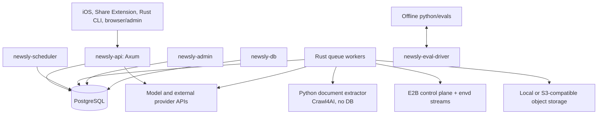
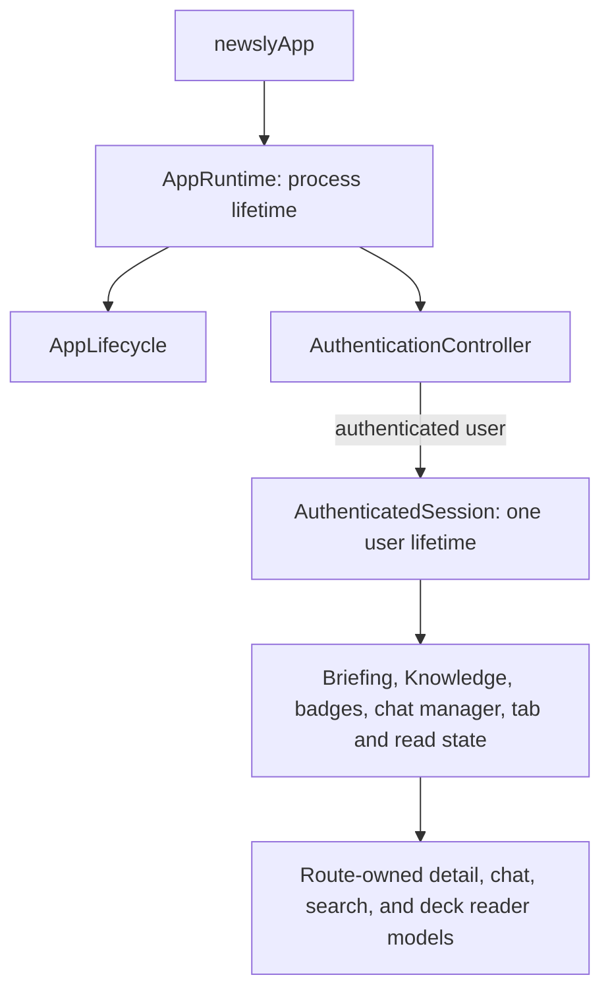

# Newsly Architecture

This document describes the authoritative Newsly system. For behavior that must
remain true, use [`docs/laws/`](laws/). Dated implementation and validation
records live in [`docs/log.md`](log.md) and repository history.

## 1. System summary

Newsly is a Rust modular monolith backed by PostgreSQL, with a native iOS app
and a Rust CLI. It ingests long-form Content and short-form News, builds
Briefings, supports Knowledge, chat, Learning Decks, audio, onboarding,
integrations, and agent workflows, and executes durable background work from a
PostgreSQL queue.

The production backend stack is:

- Rust 1.94, edition 2024;
- Axum, Tokio, and Tower for HTTP, middleware, and process orchestration;
- SQLx 0.9 for every PostgreSQL query and migration;
- Serde, Utoipa, and Schemars for wire, OpenAPI, task, tool, and model schemas;
- Rig behind a Newsly-owned agent interface;
- `async-openai` and typed `reqwest` adapters for provider-native APIs;
- direct E2B HTTP and ConnectRPC transport;
- `tracing` for structured observability.

PostgreSQL is both the durable state store and task queue. There is no Redis,
Kafka, Temporal, external vector database, or second workflow authority.

Newsly-owned Python has two explicit boundaries:

- `python/document_extractor` is the private, database-free Crawl4AI extraction
  process used by Rust workers;
- `python/evals` is offline model, embedding, judge, and report tooling.

No other Newsly-owned Python package owns routes, SQL, migrations, queue rows,
product state, agents, E2B, admin behavior, or production scheduling. The Rust
application image installs the pinned third-party `yt-dlp` executable and its
Python runtime for bounded media downloads; that vendor tool is not Newsly
application code or an authority boundary.

## 2. Runtime topology


```mermaid
flowchart TD
  Clients["iOS, Share Extension, Rust CLI, browser/admin"] --> API["newsly-api: Axum"]
  API --> PG[(PostgreSQL)]
  Scheduler["newsly-scheduler"] --> PG
  Workers["Rust queue workers"] --> PG
  Admin["newsly-admin"] --> PG
  DB["newsly-db"] --> PG
  API --> Providers["Model and external provider APIs"]
  Workers --> Providers
  Workers --> Extractor["Python document extractor\nCrawl4AI, no DB"]
  Workers --> E2B["E2B control plane + envd streams"]
  Workers --> Storage["Local or S3-compatible object storage"]
  Evals["Offline python/evals"] <--> EvalDriver["newsly-eval-driver"]
```

Production images are split by responsibility:

- the Rust application image supplies API, worker, scheduler, database, admin,
  account-deletion, and sandbox-helper binaries, plus the pinned third-party
  `yt-dlp` executable/runtime used only as a Rust-controlled media subprocess;
- the isolated extractor image contains Crawl4AI, browser dependencies, and
  extraction policy but receives no application database environment or volume;
- eval dependencies are excluded from production images.

Tokio channels and PostgreSQL notifications provide process-local wakeups. They
never replace durable queue or progress state. API replicas can scale
independently; singleton or partitioned background processes coordinate through
PostgreSQL leases and advisory locks.

## 3. Rust workspace and dependency direction

The Cargo workspace is under `rust/`.

| Crate | Authority |
|---|---|
| `newsly-api` | Axum routes, middleware, auth extraction, error projection, admin HTTP, Utoipa document |
| `newsly-contracts` | Public/task/provider wire types and generated schemas |
| `newsly-contract-codegen` | Fail-closed Swift app and Share Extension generation from Rust OpenAPI |
| `newsly-domain` | Product identifiers, states, ownership, and durable vocabulary |
| `newsly-db` | Shared SQLx repositories, cross-feature PostgreSQL operations, migrations, database CLI |
| `newsly-queue` | Claim, lease, retry, defer, cancel, notification, and finalization kernel |
| `newsly-worker` | Task executors and queue-specific worker binaries |
| `newsly-scheduler` | Recurring task fan-out and queue maintenance |
| `newsly-providers` | External model, search, media, social, and storage adapters |
| `newsly-agent-runtime` | Newsly agent loop and replaceable Rig engine |
| `newsly-e2b` | Direct sandbox lifecycle, streaming, files, network, snapshots, and corpus transport |
| `newsly-extraction` | Typed client for the private Python extractor |
| `newsly-eval-driver` | Canonical algorithms exposed to offline evaluations |
| `newsly-admin` | Ownership, health, task, usage, and eval-export operations |
| `newsly-cli` | Authenticated user-facing `newsbuddy` HTTP client, local config, and Markdown library sync |
| `newsly-vm-bootstrap` | Credential-free sandbox corpus/feed/capability helper |
| `newsly-account-deletion-worker` | Idempotent account and external-resource deletion |

The dependency direction is:

```text
Axum route / worker process
    -> application command, query, or task executor
        -> domain types and Newsly-owned gateway traits
            -> SQLx, provider, storage, extractor, or E2B adapter
```

Routes do not contain SQL or provider workflows. Shared persistence contracts
live in `newsly-db`; feature-local SQL remains private to a repository module in
the owning runtime crate. Provider crates do not depend on `newsly-db`. SQLx
repositories return owned projections, never handles that can lazily acquire
data later. SDK-native objects do not cross into public, domain, or persistence
layers.

## 4. Contracts and type system

### 4.1 Public contract authority

The `newsly-api` Utoipa document is the only route and public-schema authority.
It generates or supplies:

- `docs/library/reference/openapi.json`;
- `contracts/openapi/public.openapi.json`;
- checked Swift app and Share Extension artifacts generated by
  `newsly-contract-codegen` from the public schema and the reviewed
  `contracts/client_codegen_policy.toml` surface policy;
- shared Rust request and error types consumed directly by the `newsbuddy` CLI.

The internal `--agent` export mode remains a language-neutral, fail-closed
operation-inventory projection used by contract tests. It does not produce a
checked CLI-specific schema or generated CLI source.

`scripts/regenerate_public_contracts.sh` performs intentional regeneration and
`scripts/check_public_contracts.sh` rejects drift. Export fails if the expected
operation inventory is empty or a required agent operation is absent. Client
generation also fails closed on missing registered schemas, target-crossing
references, unsupported unions, or unreviewed untyped JSON fields.

Every public failure uses one typed envelope. Intentional 204 and streaming
responses are explicit exceptions, not untyped escape hatches.

### 4.2 Representation rules

The compatibility corpus captures persisted-data and installed-client
semantics. Rust preserves those semantics through explicit boundaries:

- Serde owns wire and durable encoding;
- Utoipa owns public OpenAPI;
- Schemars owns LLM and tool JSON Schema;
- explicit validation and `TryFrom` conversions enforce domain constraints;
- public, domain, database, and provider types remain distinct;
- absent, explicit `null`, and defaulted values are modeled deliberately;
- tagged unions replace unrelated nullable state bags;
- open versus closed enum policy is explicit;
- timestamps are typed RFC 3339 UTC values serialized with `Z`;
- legacy JSONB remains lenient only at documented compatibility boundaries.

Rust never persists Rig, `async-openai`, ConnectRPC, or E2B SDK types. Agent
history uses a versioned Newsly transcript with an explicit legacy decoder.

### 4.3 Canonical product identities

Long-form/legacy Content and short-form News are separate concepts with
independent keyspaces, DTOs, routes, and repositories. A Content lookup never
falls back to a same-number News row. Cross-product relationships are explicit
foreign keys or canonical links, not integer coincidence.

Submission status uses one canonical discriminated result with content, feed
subscription, Learning Deck, and no-action variants. Generated Swift clients
and shared Rust contracts expose that union. Temporary installed-client
top-level fields mirror the canonical result and must agree with it until
compatibility telemetry permits their removal. Pagination returns a real count
or does not claim a total. Generated wire types include the Share Extension.

## 5. PostgreSQL and SQLx

### 5.1 Data shape

PostgreSQL stores:

- users, Apple identity, refresh replay, API keys, integrations, and deletion;
- canonical `contents`, body storage references, per-user visibility, read and
  Knowledge state;
- canonical `news_items`, source snapshots, relations, clusters, embeddings,
  read state, and Briefing publication state;
- chat sessions, versioned messages, confirmed final text, tool progress, and
  stream-generation fences;
- durable `processing_tasks`, queue leases, retries, ownership stamps, and
  failure diagnostics;
- Briefing, Learning Deck/LLM-task, audio, onboarding, discovery, discussion,
  usage, feedback, and agent-data state;
- persistent E2B sandbox, snapshot, namespace, corpus revision, and lifecycle
  records;
- runtime ownership, replica acknowledgement, and audit records.

The schema uses PostgreSQL-specific JSONB, GIN/trigram/FTS, advisory locks,
partial indexes, `ON CONFLICT`, transaction timestamps, `SKIP LOCKED`, and
`LISTEN/NOTIFY`. SQLx keeps that behavior visible as parameterized SQL rather
than hiding it behind an ORM.

### 5.2 SQLx migration authority

Alembic was frozen at `20260829_02` before its source tree was removed. Its 91
historical revisions remain accessible through repository history, while the
audited catalog and compatibility evidence live in the SQLx baseline and
contract corpus. Alembic cannot be edited or executed for schema evolution.

The first embedded SQLx migration is the complete audited catalog at that head.
Fresh databases run it. Existing databases require deliberate adoption under a
maintenance barrier. One advisory lock spans:

1. Alembic-head, catalog, bounded data, extension, role, and grant verification;
2. recognition of an empty or exact checksum-matching SQLx prefix;
3. checksum-preserving baseline recording;
4. the first pending SQLx migration run;
5. final catalog verification.

Gaps, checksum mismatches, invalid indexes/constraints, unexpected roles or
grants, and unverified skip requests fail closed. API and worker replicas do not
auto-migrate; the exact-image `newsly-db` process runs migrations once before
application rollout.

Later changes use expand, compatible code, bounded backfill, validation, then
contract. Production rollback normally uses forward-compatible schema or a
roll-forward repair rather than destructive down migration.

## 6. API, authentication, and errors

`newsly-api` owns public, machine-facing, Share Extension, and server-rendered
admin routes. Middleware provides request IDs, structured tracing, panic/error
projection, compression where appropriate, CORS policy, timeouts, and health.

Authentication supports:

- Apple Sign In with issuer, audience, RS256, and JWKS validation;
- HS256 access and refresh tokens with exact claim compatibility;
- replay-safe refresh rotation keyed by old-token hash and durable attempt ID;
- `newsly_ak_...` API keys stored only as SHA-256 hashes and compared in constant
  time;
- signed admin-session cookies;
- encrypted integration credentials;
- account deletion with queue, data, object, and E2B cleanup.

Refresh replay is serialized by PostgreSQL advisory lock. A repeated old token
and matching attempt may receive its short-lived encrypted replacement pair; a
different or missing attempt after consumption is rejected. Corrupt replay
material fails closed and cannot mint a second pair.

The typed public error envelope exposes a stable code, safe message, structured
details where useful, and request identity. Internal sources and provider data
remain in structured logs, not client messages.

## 7. Durable queue and worker execution

`processing_tasks` is the only durable work queue. Each task has one payload
schema, queue/partition, retry and deferral policy, runtime namespace, and
executor.

Claim filters work by the worker's runtime and namespace, then uses `FOR UPDATE
SKIP LOCKED`. Each claim carries durable owner and executor-version stamps plus
an opaque lease token and retry generation. Renewal, progress, defer, retry,
terminal failure, and success are compare-and-set operations requiring those
exact stamps, token, generation, and an unexpired lease. Expired work is
reclaimable. Deferral preserves the retry budget. Notifications wake workers;
polling remains the correctness fallback.

Every provider-backed executor follows:

```text
prepare transaction
  validate task, owner, user, and product state
  load owned fields into an immutable plan
  commit

external phase
  no transaction or checked-out DB connection
  bounded, cancellable provider/extractor/E2B/storage work
  lease heartbeat through separate short operations

finalize transaction
  lock exact lease and canonical product rows
  revalidate ownership, generation, and lifecycle
  publish product state, usage, downstream tasks, and queue transition atomically
```

A lost or superseded attempt cannot publish. Attempt-scoped files are renamed
only after the fenced transaction proves authority; failed or superseded files
are cleaned without touching canonical output.

User-scoped content transactions acquire the active user lock before the
canonical content lock. When attribution must first be discovered from content
metadata, finalization performs an unlocked read, locks that user, then locks
and revalidates the content row; an attribution race releases only the content
lock and repeats that bounded lock sequence without repeating external work.

Rust owns the active runtime for every task. Workers claim only matching runtime
namespaces; the durable owner and executor-version stamps carried by the claim
remain authoritative audit and fencing evidence for that attempt.

The executor version is an authority-transition epoch, not an application build
number. A worker is selected by runtime and namespace, then renews and finalizes
the exact stamp it claimed. The ownership registry remains because P23 permits
audited runtime transitions and keeps in-flight work bound to its original
owner. Removing it would require an explicit change to that law, its schema, and
the admin transition workflow; it is not a mechanical migration cleanup.

## 8. Product processing

### 8.1 Content and extraction

Submission creates product state and its processing task together. URL analysis
and content processing use Rust for canonicalization, public-network policy,
feed/media routing, body storage, lifecycle, retries, usage, and downstream
enqueueing.

For documents, Rust calls the private Python extractor. The extractor owns
Crawl4AI, warm-browser recycling, static readability/trafilatura comparison,
publisher cleanup, access-gate detection, table extraction, GitHub handling,
PubMed delegation, and the decision that Firecrawl is required. Rust owns the
Firecrawl credential and call, persistence, and retry policy.

Content bodies are staged by hash and published only through the exact fenced
transaction. Feed links returned by extraction are candidates; Rust validates
and persists subscriptions/backfill work.

### 8.2 Short-form News

News enrichment may obtain article evidence through the same extractor and
Rust Firecrawl boundary. Extraction failure is soft when metadata-only
processing remains possible.

Processing reuses a durable or exact-representative summary before paid work,
bounds evidence, runs canonical relation policy in Rust, and performs production
embeddings through the configured hosted adapter. Local SentenceTransformers
and experimental rerankers belong only to offline evals.

Summary, relation/cluster state, relevant links, provider usage, Briefing pending
sources, Agent Data synchronization, and the queue transition publish
atomically. News never enters the long-form generated-artwork path.

### 8.3 Briefing, discussions, media, and images

Briefing uses durable source/pending/publication state and versioned client
observation. Publication is atomic; partial provider success cannot expose a
half-assembled edition.

Discussion collection and summary refresh have independent cadences and durable
claim fences. The first usable summary is immediate; later changes coalesce by
materiality and age.

Podcast and tweet-media workers perform bounded downloads, yt-dlp/ffmpeg
subprocess work, feed resolution, and transcription outside transactions.
Attempt files stay inside the configured root, reject symlinks/oversize input,
and are removed only after fenced state commits.

Generated long-form artwork uses an immutable summary fingerprint. Provider and
image transforms write attempt-scoped files without a database connection. The
final transaction revalidates the exact lease, fingerprint, and lifecycle before
publishing source image, thumbnail, UTC cache version, and usage together.

### 8.4 Chat, Learning Decks, Share Actions, and research

Chat commands are accepted once and then observed through durable message/task
identities. Tool progress is separate from confirmed transcript text. Queue
lease plus chat stream generation fence every partial and final publication.
Provider response IDs support resumable operations without replaying accepted
work.

Learning Deck and Share Action agents use the same Newsly-owned agent runtime,
E2B session layer, workspace bounds, artifact validators, and signed artifact
URLs. `llm_tasks` is canonical for new Learning Deck work. The
`learning_deck_runs` ledger remains for stored legacy decks and their cleanup
until production counts, backfill verification, and an explicit schema
migration permit its retirement.

Deep research uses provider-native background response create/retrieve/cancel
behind a dedicated gateway. Its resumable identity is durable; SDK objects are
not.

### 8.5 Onboarding, integrations, and discovery

Onboarding has one canonical discovery orchestration path. Long search, feed,
audio, and model operations execute outside transactions; persistence and task
fan-out occur through fresh ownership-fenced transactions.

X bookmark sync owns OAuth refresh, bounded pagination, resource billing
deduplication, synced-item ledger/checkpoints, canonical ingestion, Knowledge
routing, and reauthentication state. Other scheduled sources follow the same
durable checkpoint and bounded-provider model.

Feed research changes E2B network policy only for the candidate-scoped work and
always restores deny-by-default on success, failure, timeout, or cancellation.

## 9. Agents, providers, and direct E2B

### 9.1 Agent runtime

Rig 0.42 is pinned behind `newsly-agent-runtime`. Newsly owns:

- provider/model selection and privacy/routing policy;
- typed tool schemas, dynamic per-turn filtering, and tool results;
- multi-step limits, deadlines, cancellation, and validation repair;
- structured output modes and confirmed-final-text behavior;
- usage, cache/reasoning tokens, request/response identity, and tracing;
- versioned transcripts and legacy-history conversion.

`async-openai` supports OpenAI-native background Responses and other resources
where a normalized agent interface would lose capability. Provider adapters can
use typed direct HTTP as a tested escape hatch. Upgrades require real Newsly
contract canaries, not a toy prompt.

### 9.2 E2B

`newsly-e2b` uses typed `reqwest` calls for the E2B control plane and
ConnectRPC-over-HTTP/2 for envd processes. It owns:

- create, connect, replace, kill, and account-deletion cleanup;
- sandbox/snapshot identities, per-namespace locks, pooling, and idle eviction;
- template revision, root hardening, capability probing, and recovery snapshots;
- corpus full/delta hydration with manifest-last publication;
- files, process start/connect/signal, command progress, and output bounds;
- candidate network allow/reset and diagnostics/usage.

Template publication is an exact-SHA operator action, not a runtime gateway.
`scripts/build_agent_vm_template.sh` validates the pinned base image and static
Rust helper inputs without network access. The manual publication workflow then
runs the full quality gate and uses an exact-pinned official E2B CLI to rebuild
only the canonical `newsly-agent` alias, recording the resolved template ID and
source receipt. No Python SDK participates in template publication.

Command events preserve observed stdout/stderr order while decoding each stream
incrementally. Keepalives are not text. Nonzero exit is a structured command
result. Cancellation resets the stream and signals the process when needed.

Only connection failures proven to occur before delivery may retry `Start`.
After ambiguous delivery, Rust health-checks the sandbox, finds the uniquely
tagged process, and reattaches; it never starts the command twice. Snapshotting
is prohibited while a command lease is active because snapshots break live
streams.

The host is authoritative for the credential-free agent corpus. The VM cannot
call back into Newsly, read provider credentials, use passwordless sudo, or
write outside its task workspace. `newsly-vm-bootstrap` performs static corpus,
feed, and capability operations inside the sandbox. Other sandbox workload
languages are not backend authorities.

## 10. Python islands

### 10.1 Document extractor

`python/document_extractor` runs a warm, single-flight Crawl4AI browser behind a
private authenticated v1 request/result contract. Requests contain a schema
version, UUID, public URL, intent, absolute deadline, bounded options, and trace
identifiers. Results are a discriminated extraction success, delegation,
Firecrawl-required signal, or typed retryable/terminal failure.

The service independently validates the public network for the initial URL,
redirects, and browser requests. It accepts no arbitrary crawler configuration,
has no database or durable volume, and returns bounded content and safe
diagnostics. Production runs it non-root and read-only on a private ingress with
separate egress policy.

### 10.2 Offline evals

`python/evals` owns datasets, candidate/local embedding models, provider and
judge orchestration, checkpoints, maximum-cost controls, aggregation, reports,
and visualization. `newsly-admin` can export bounded read-only JSONL input;
Python never receives database credentials.

The eval package writes versioned embedding bundles and cases for
`newsly-eval-driver`. Rust owns canonical matching text, retrieval, scoring,
thresholds, reranking decisions, reconciliation, and decision traces. Eval
promotion measures completed validated-object latency, schema correctness,
quality, provider routing, usage, and cost against the real production logic.

Repository Python is mechanically limited to these two islands. The only
source-level exception is `docs/brand-exploration-2026-08`, whose scripts are
offline design-asset generators with no package or production-image role.

## 11. iOS client architecture

The SwiftUI client lives in `client/newsly/newsly/` and distinguishes process,
authenticated-user, and route lifetimes.


```mermaid
flowchart TD
  App["newslyApp"] --> Runtime["AppRuntime: process lifetime"]
  Runtime --> Lifecycle["AppLifecycle"]
  Runtime --> Auth["AuthenticationController"]
  Auth -->|authenticated user| Session["AuthenticatedSession: one user lifetime"]
  Session --> Roots["Briefing, Knowledge, badges, chat manager, tab and read state"]
  Roots --> Routes["Route-owned detail, chat, search, and deck reader models"]
```

### 11.1 Composition and ownership

`newslyApp` is the sole live composition point. It configures the shared
Keychain access group, resolves the process services, and passes one explicit
`RootDependencyFactory` graph into `AppRuntime`. The runtime has no fallback
constructors: it retains the supplied `AppLifecycle`, process authentication
controller, and at most one `AuthenticatedSession`. Reauthentication for the
same user updates that session; account change or logout detaches it before a
new one is displayed.

The session owns account-lifetime root state: badge polling, global chat
completion, tab/navigation state, reading caches, Briefing and Knowledge root
models, and submission status. Detach suspends polling and chat, clears
user-scoped navigation, and deactivates Briefing. Route models remain view-owned
and receive exact dependencies rather than using the runtime as a service
locator.

`RootDependencyFactory` is an instance-bound construction graph, not a static
service locator. It captures live service instances only at `newslyApp`, builds
the authenticated scope, and constructs route-owned models from exact inputs.
`AuthenticatedSession` never resolves `.shared` services or silently creates
account-scoped state. New root state belongs in the session; new route models
remain view-owned and prefer initializer injection. User-neutral image/audio
caches may remain process-global.

Notification routing follows the authenticated lifetime. Session construction
installs the current account's chat coordinator as the notification target, and
detach removes that target before account replacement or logout. Chat
navigation and completion polling therefore have no process-global singleton
that can retain the previous account.

### 11.2 Lifecycle and warm resume

`newslyApp` is the only product-level `scenePhase` observer. It writes facts to
`AppLifecycle`, which has no feature registry, network behavior, tab state, or
global refresh command.

- first active transition creates generation 1 as `initialLaunch`;
- background-to-active increments the generation as `warmResume` and records
  background duration;
- inactive-to-active without background is diagnostic interruption return and
  does not increment the generation;
- duplicate notifications are ignored.

`AppRuntime` forwards each fact once to the session and offers each activation
to `AuthenticationController` for one recoverable restoration replay per
generation. True background suspends badge and chat polling; inactive alone
does not. Briefing combines lifecycle with selected-tab visibility.

Visible Content Detail, Knowledge, chat, and Learning Deck routes receive the
shared lifecycle. They do not observe `scenePhase` independently. Feature
request generations still fence network results. A presented Content Detail
reader explicitly restarts a cancelled body read after activation because the
full-screen cover remains mounted. Audio-session and voice-capture interruptions
remain subsystem concerns.

Warm resume retains process models. Cold launch constructs a new runtime,
restores a locally confirmed authentication shell and feature snapshots where
possible, then validates server state.

### 11.3 Reads, commands, and observation

The client distinguishes:

- **Load:** first readable value;
- **Revalidate:** safe read while retaining a value;
- **Command:** send a mutation once;
- **Observe:** follow durable work by returned identity.

`TaskBag` owns keyed view-model tasks. Same-key reads coalesce; new keys replace
work; success and failure are generation-fenced. Dependent effects publish once
inside the winning generation. Cancellation follows work ownership, not the
first waiter to end. Secondary reads carry the same publication fence.

`PaginatedFeed` separately owns collection phase, cursor, `hasMore`, generation,
replacement merge, and append semantics. Content Detail uses typed Content or
News identity. Knowledge keeps a five-minute freshness policy and one aggregate
four-source revalidation barrier while retaining the existing timeline.
Briefing preserves its snapshot, ETag, lens, read, document, command, and
version-observation state machines. Chat and Deck commands remain single-attempt
and resume observation by durable ID.

Search cancellation has one coordinator. Views do not maintain competing
debounce tasks, request registries, and generation counters.

### 11.4 HTTP transport and recovery

```text
feature view model
  -> domain service
      -> APIClient
          -> HTTPTransport -> configured URLSession
          -> CredentialSession
              -> RefreshTokenExchange -> HTTPTransport
```

`HTTPTransport` executes prepared requests only. `APIClient` owns URL and body
construction, auth mode, status/error handling, one bearer-refresh replay,
decoding, and opt-in safe-read recovery. Its decoded, raw HTTP, and void request
forms use the same typed method and policy inputs.

Only typed GET/HEAD calls retry selected connectivity failures, with one bounded
budget spanning the resource request and auth replay. Commands are never
generically reissued after ambiguous failure. The main app and Share Extension
use different URLSession deadlines and refresh-retry budgets but the same core.

`ClientFailure` is the flat transport vocabulary for cancellation,
connectivity, authentication, request/response, HTTP, decoding, and unexpected
failure. Media caching stays independent because public media has no user
credential recovery.

### 11.5 Authentication and credential publication

`AuthenticationController` is process-scoped and owns authentication state and
the cached user profile. On launch it configures Keychain, inspects credentials
and cached identity, publishes a matching cached shell synchronously, validates
`/auth/me`, keeps the shell for recoverable failures, and clears it only after
definitive credential rejection. Recoverable launch failure records a pending
obligation that may replay once per later activation generation.

`CredentialSession` owns access-token acquisition, in-process single-flight
refresh, the app-group process lock, cross-process reread, terminal events by
credential generation, and publication order. Logout holds the same lock,
cancels and generation-fences auth work, and never bypasses an unavailable
secure store.

Before changing any credential leg, storage durably stages a
`CredentialPublication` containing the target envelope and observed baseline.
Under the process lock it may complete only while every visible leg remains at
the baseline or target. The journal is deleted only after refresh, access, user
ID, and envelope all commit. This makes every process-death boundary idempotent
without overwriting a newer login or logout.

During the installed-client compatibility window, publication also writes
legacy split keys refresh-first. A pending publication cannot authenticate a
cached shell; a stale plaintext mirror cannot supersede a valid envelope;
coherent legacy takeover waits for server identity validation; unjournaled
one-leg divergence fails unavailable.

Refresh rotation stores an attempt UUID keyed by the current refresh-token
fingerprint before sending. Ambiguous loss or process recreation reuses that
attempt. The attempt clears only after replacement publication or definitive
rejection. The server serializes by old-token hash and returns a short-lived
encrypted replay pair only for the same attempt.

### 11.6 Feature ownership and generated contracts

Dedicated models own Content, News, Briefing, Knowledge, audio, chat, onboarding,
settings, submissions, sources, integrations, and Learning Deck flows.
`BriefingViewModel` owns data/lens state;
`BriefingNarrationController` owns narration preparation and playback.
`KnowledgeTimelineViewModel` composes saved Content, chat, Deck, and narration
sources into one reverse-chronological projection and owns pagination and
source-specific recovery.

The iOS runtime uses `APIClient`, `APIEndpoints`, services, and domain DTOs
around canonical generated wire models. The Rust `newsbuddy` CLI uses shared
`newsly-contracts` requests with a reqwest transport and preserves ordinary
successful responses as JSON so new enum cases do not break an installed CLI.
The Rust Utoipa source is authoritative.

## 12. iOS Share Extension

The Share Extension lives in `client/newsly/ShareExtension/` and offers Add to
Briefing, Add to Knowledge, Create Deck, and Chat. All four use
`/api/share-actions`; the backend owns URL classification, canonicalization, and
asynchronous work.

The extension shares the app-group Keychain and a deliberately small networking
core: `APIClient`, `HTTPTransport`, `CredentialSession`,
`RefreshTokenExchange`, generated refresh/share contracts, credential storage,
and the cross-process refresh lock. Its shorter session does not create a
second auth stack.

`ShareExtensionTransport` is a thin target-local adapter that configures the
extension policy, delegates submission, and maps `ClientFailure` into the small
presentation vocabulary. Request construction, bearer rejection, safe error
detail, refresh coalescing, replay-attempt storage, and journaled credential
publication use the same implementations as the app.

Native UI automation is client-owned as well: executable flows live under
`client/newsly/Maestro/flows/` and reference images under
`client/newsly/Maestro/baselines/`. There is no repository-root shadow suite or
backend-owned iOS E2E runner.

## 13. Admin, observability, and operations

Rust provides server-rendered admin routes plus the `newsly-admin` CLI. The CLI
supports ownership prepare/acknowledge/promote/rollback, health snapshots and
queue diagnostics, bounded failed-task inspection, usage summaries, and
privacy-safe eval export. Mutations require explicit audit context and expected
versions.

Structured `tracing` records request ID, component, operation, resource IDs,
duration, ownership version, task lease/generation, and bounded error context.
Secrets, tokens, prompt/user content, raw provider responses, and database URLs
are redacted. Durable health comes from PostgreSQL/queue/usage state; process
liveness alone is not product health.

Local development runs native Rust processes and local PostgreSQL. Docker is
the production/staging runtime. Deployment builds immutable Rust and extractor
images from one tested SHA, runs `newsly-db` once, starts and probes the inactive
API slot, drains the singleton workers and scheduler, switches public routing,
then replaces those writers from the same image. This prevents old workers from
claiming tasks emitted by the new API; queue ownership epochs do not act as
application-build fences. The old API slot may remain only for a bounded
rollback window against expand/contract-compatible schema.

The required quality workflow precedes build and deployment. Deployment rejects
a stale tested SHA. Baseline adoption of an eligible legacy database requires
all writers to stop and drain; normal deploys cannot infer that authority.

`PUBLIC_BASE_URL` is the authoritative origin for externally returned artifact,
audio, and share links. Proxy headers are accepted only from configured proxy
ranges and do not redefine that origin.

## 14. Testing and release proof

Required evidence is proportional to the boundary:

- Rust format, warning-denied Clippy, workspace tests, and offline build;
- online SQLx preparation against a freshly migrated PostgreSQL database;
- fresh, adopted, exact-prefix resume, interrupted, mismatch, and idempotent
  migration cases;
- PostgreSQL queue contention, lease, retry, defer, cancel, stale-finalize, and
  notification/polling cases;
- Utoipa/public/agent contract drift and typed wire-presence fixtures;
- affected Rust CLI, iOS, and Share Extension builds/tests;
- extractor golden, public-network, timeout, recycle, and failure cases;
- provider structured-output, routing/privacy, usage, timeout, and cancellation
  canaries;
- E2B split-UTF-8, event order, output bound, reconnect/no-duplicate-start,
  snapshots, network reset, corpus, hardening, cleanup, and product canaries;
- exact image SHA, public health, queue age, transaction age, provider cost,
  extractor comparison, and leaked-resource proof after deployment.

A release record names the exact revision and the gates that ran against it.
Checkout validation, tested SHA, built image, deployed revision, and live
provider/E2B or post-deploy health proof are separate evidence and must not be
inferred from one another.

## 15. Architectural invariants

When changing the backend, keep these mental models:

1. Public contract -> application operation -> domain/gateway -> adapter.
2. Durable intent and advancing task commit together.
3. External work never owns a database transaction.
4. Exact owner, lease, and generation fence every publication.
5. Content, News, and per-user overlays are distinct states.
6. Reads may be shadowed; writes and queue claims have one owner.
7. Rust owns persistence, providers, agents, E2B, and operations.
8. Newsly-owned Python is only the bounded extractor and offline eval
   environment; a pinned third-party Python-based executable is not an
   application authority.
9. Installed clients and durable data determine compatibility, not static source
   search alone.
10. Local implementation, tested SHA, deployed image, and production authority
    are different facts and must be reported separately.
