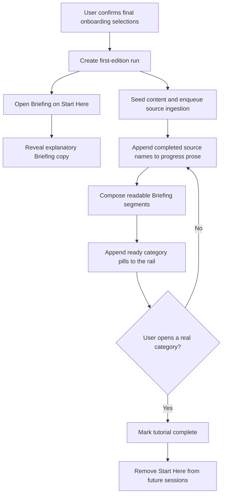

# Briefing Start Here Onboarding Design

**Date:** 2026-07-11
**Status:** Implemented and quality-hardened locally
**Scope:** onboarding completion, first-edition progress, Briefing index, and iOS Briefing UI
**Primary goal:** make Briefing the first product experience after onboarding and teach it inside a
temporary `Start Here` category while the user's first real categories arrive

## Summary

After the user finishes choosing sources, Newsly should open the real Briefing screen immediately.
There is no separate post-onboarding tutorial, warming-up page, or full-screen building state.

The category rail initially contains a temporary `Start Here` category. Its page explains how
Briefing works in the same editorial language as a normal Briefing. Beneath that explanation, a
single flowing paragraph describes first-edition progress. Completed source names append to the
paragraph as they finish. The final active phrase updates in place to name the source or sources
currently being read.

Example progression:

```text
We connected 12 sources. Reading Techmeme…

We connected 12 sources. Techmeme is in — 28 items processed. Reading Hacker News…

We connected 12 sources. Techmeme is in — 28 items processed.
Hacker News is in — 34 items processed.
Reading Stratechery and Decoder…

We connected 12 sources. Techmeme is in. Hacker News is in.
Stratechery is in. AI & Product is ready. Reading Decoder…
```

This is deliberately prose, not a checklist, timeline, activity table, or branching diagram. The
fixed prefix is append-only. Only the active tail is replaced in place.

As soon as a real Briefing lens has readable content, its pill appears independently at the end of
the category rail. The user can start reading that category while other sources and categories
continue processing. Entering the first real category completes the tutorial and removes
`Start Here` from future Briefing sessions.

## Goals

- Make Briefing the first view shown after onboarding is complete.
- Teach Briefing through the real product instead of a detached tutorial.
- Give the user honest, legible feedback during a potentially long first-edition generation.
- Append processed source names and item totals as prose without presenting a task checklist.
- Introduce Knowledge saves, search, and narration below the live source prose.
- Make every real category usable as soon as its first segment is ready.
- Let categories continue arriving while the user reads.
- Preserve resume behavior if the user backgrounds or relaunches the app.
- Keep first-run state separate from normal unread, read-marking, taxonomy, and narration data.

## Non-Goals

- Do not redesign the source-selection screens that precede onboarding completion.
- Do not remove the pre-selection discovery wait when suggestions do not yet exist.
- Do not show per-article rows, queue names, model names, task IDs, or technical stages.
- Do not estimate a completion percentage or remaining duration.
- Do not create disabled or ghost category pills before content is readable.
- Do not create a real onboarding row in `briefing_lenses`.
- Do not change how normal Briefing passages, citations, read marks, narration, or dig-deeper work.
- Do not automatically move the reader away from `Start Here` when a category becomes ready.

## Product Flow



### 1. Complete onboarding

The existing completion request still creates scraper configs, seeds immediately available
content, and queues initial ingestion. In the same transaction it also:

- opts the new user into the Briefing reading experience;
- creates one active first-edition run;
- snapshots the user's selected top-level sources in stable display order;
- schedules an immediate Briefing append refresh for already seeded unread content.

The response should tell the client that the destination is Briefing and that first-run onboarding
is active. The client should not route through `HowItWorksModal`.

### 2. Open the real Briefing shell

The app transitions directly to `ContentView` with the Briefing experience selected and
`RootTab.briefing` active. The normal masthead, category strip, paging behavior, bottom navigation,
and source interactions remain in place.

During first run:

- masthead title: `Briefing`;
- masthead deck: `Your sources, shaped into a briefing.`;
- first selected pill: `Start Here`;
- no `Building`, `Working`, `Warming up`, spinner, progress bar, or percentage copy.

`Start Here` is synthetic client presentation backed by the first-run payload. It is not included in
server lens counts and has no lens detail endpoint.

### 3. Write the explanatory passage

The page uses normal editorial typography rather than cards or a detached tutorial surface.

Recommended first-run copy:

> Your sources become one briefing.
>
> Newsly reads across the sources you chose, connects different coverage of the same story, and
> writes the useful context into one briefing. Categories appear as patterns emerge, then keep
> updating as new reporting comes in.

The initial copy reveals by phrase or sentence. It must not use a slow character-by-character
typewriter effect. The user should be able to finish a sentence at a natural reading speed.

The reveal is presentation-only. The copy is deterministic and available immediately; it must not
depend on an LLM response or source-processing success.

### 4. Append source progress as prose

Below the explanatory passage, use one flowing paragraph with no `LIVE DESK` eyebrow. There are no
source rows, checkmarks, timestamps, or connector lines.

The paragraph has two logical parts that render as one continuous block:

1. **Stable prefix:** an append-only sequence of completed source and category sentences.
2. **Active tail:** one mutable sentence describing the sources currently being read.

Example:

```text
We connected 12 sources. Techmeme is in — 28 items processed.
Hacker News is in — 34 items processed.
AI & Product is ready. Reading Stratechery and Decoder…
```

When an active source completes:

1. its completion sentence is appended to the stable prefix;
2. the prefix never rewrites or reorders earlier sentences;
3. the active tail crossfades to the next active source set;
4. any newly ready category sentence appends at the same point its pill becomes usable.

The progress unit is a top-level source chosen during onboarding, not every article discovered from
that source. Each source appends at most one completion sentence and includes the number of items
that completed the source's first ingestion pass.

User-facing copy should translate internal outcomes:

| Internal outcome | User-facing treatment |
| --- | --- |
| First ingest produced usable content | `<Source> is in — <N> items processed.` |
| First ingest completed with no usable items | `<Source> is in — 0 items processed.` |
| One or more sources actively processing | `Reading <Source list>…` |
| A lens gained its first readable segment | `<Category> is ready.` |
| A source is retrying | Keep it in the active tail; do not expose retry jargon |
| A source is terminally unavailable | `We couldn’t read <Source> this time.` Continue with every other source. |

The active source list uses normal localized list formatting. When many sources process concurrently,
show at most three names and summarize the remainder, for example:
`Reading Stratechery, Decoder, and 3 more…`.

After the source paragraph, show a compact `With Newsly, you can also:` list. It is explanatory
content, not progress UI, and remains stable while the source sentence updates:

- **Save to Knowledge.** Keep the stories and ideas worth remembering.
- **Search Newsly.** Find a story or detail across everything Newsly has read.
- **Listen instead.** Turn the Briefing into narration away from the screen.

### 5. Append real categories

A real category pill becomes visible only when all of the following are true:

- its lens is active;
- it has at least one active or degraded segment;
- its `segment_count` is greater than zero;
- its detail payload can be fetched and rendered.

During first run, `Start Here` remains first. Real category pills follow the stable canonical lens
order supplied by the Briefing index. They do not branch out of the progress paragraph and they
never appear as placeholders.

When a pill first appears:

- fade from zero opacity;
- resolve from a small amount of blur;
- move upward a few points into place;
- smoothly reposition neighboring pills;
- provide one light haptic for the first real category only;
- never auto-select the new category.

If a provisional lens is retired or merged before it has readable content, it never appears. Once a
visible lens is retired by later taxonomy work, use the existing selected-lens fallback and a quiet
exit rather than leaving a dead pill.

### 6. Complete Start Here

When at least one real category is readable, append `<Category> is ready.` and update the closing
copy to:

> Your first edition is ready. Start with any category; new briefings will continue to appear as
> fresh stories arrive.

The page may include an inline editorial action such as `Open AI & Product`. It should look like a
Briefing source link, not a large onboarding button.

`Start Here` must not disappear while the user is reading it. The tutorial completes when the user
opens any real category, whether from the rail or the inline action. Completion is optimistic in the
UI and retried in the background if the existing tutorial-complete request fails.

After completion:

- remove `Start Here` from the category rail;
- preserve the selected real category;
- stop first-run polling and writing animations;
- keep all real Briefing content unchanged;
- do not show `Start Here` on later launches or other devices once server completion is recorded.

## State Model

### Reading-experience eligibility

The Briefing backend must not infer eligibility independently at each event site, and the iOS
reading experience must not remain only a device-local `AppSettings` value. The server-owned user
preference is the canonical authority.

Add a server-owned user reading-experience field with values `classic` and `briefing`:

- existing users default to `classic` unless already explicitly migrated;
- newly completed onboarding sets `briefing`;
- `/me` exposes the value;
- iOS mirrors it into `AppSettings` and reconciles at authentication refresh;
- Briefing event fanout and `is_briefing_enabled_for_user` use durable user eligibility plus any
  temporary rollout override.

The settings allowlist can remain as an operator rollout override during migration, but it must not
be the permanent authority for new-user eligibility.

### First-edition persistence

Use dedicated first-edition state instead of overloading pre-selection
`onboarding_discovery_runs` or normal Briefing tables.

Recommended tables:

#### `onboarding_first_edition_runs`

- `id`
- `user_id`
- `status`: `active`, `completed`, or `expired`
- `revision`: monotonically increasing integer for polling/ETag invalidation
- `started_at`
- `completed_at`
- unique active-run constraint per user

#### `onboarding_first_edition_sources`

- `id`
- `run_id`
- `source_key`: stable, deduplicated source identity
- `display_name`
- `source_kind`
- `position`: original onboarding display order
- `status`: `queued`, `processed`, or `unavailable`
- `processed_item_count`: successful saved-or-deduplicated items from the source's first pass
- `completed_at`
- unique constraint on `(run_id, source_key)`

Do not duplicate values already owned by canonical tables. Connected-source count is derived from
the run's source rows. Ready category keys are derived from active Briefing lenses with persisted
segments. Source status updates are idempotent: the run row is locked before a source transition,
so concurrent workers serialize revision updates. Terminal rows are ordered by `completed_at`, then
original `position` and row ID as deterministic tie-breakers. A retry may improve `unavailable` to
`processed`; an identical duplicate callback does not advance the revision.

### Source-completion meaning

A source is complete for first-run prose when its initial ingest attempt reaches a stable outcome:

- selected feed: its config-specific initial backfill completes;
- Reddit or another user config: its first config-specific scrape completes;
- shared aggregator: the selected source scrape completes and seeded/visible content has been
  associated with the user;
- seeded source: usable existing content may mark it ready immediately.

This state does not claim that every discovered article has finished summarization. It only means
the source's first ingest pass has completed. Category readiness remains separately tied to persisted
Briefing segments.

## API Contract

Add an optional `first_run` object to `BriefingIndexResponse`:

```json
{
  "version": 42,
  "masthead_title": "Briefing",
  "masthead_deck": "Your sources, shaped into a briefing.",
  "lenses": [],
  "first_run": {
    "run_id": 83,
    "revision": 7,
    "phase": "active",
    "connected_source_count": 12,
    "completed_sources": [
      {
        "display_name": "Techmeme",
        "processed_item_count": 28,
        "outcome": "processed"
      },
      {
        "display_name": "Hacker News",
        "processed_item_count": 34,
        "outcome": "processed"
      }
    ],
    "active_sources": ["Stratechery"],
    "ready_category_keys": []
  }
}
```

Contract rules:

- `first_run` is absent after tutorial completion.
- `phase` is `active` while sources are progressing, `ready` after the first readable category, and
  `waiting_for_content` if initial source work is terminal but no category is readable.
- `run_id` identifies the exact onboarding run that produced the progress and scopes worker writes.
- `completed_sources` is ordered by terminal transition time and is append-only for a run except
  when a retry improves an `unavailable` outcome to `processed`.
- each completed source carries its non-negative first-pass `processed_item_count`.
- each completed source carries a typed `processed` or `unavailable` outcome.
- `active_sources` may change in place and is not treated as history.
- `ready_category_keys` is derived from readable entries in `lenses`; it is not separately
  persisted first-run state.
- the client derives prose from structured fields; the backend does not send arbitrary UI sentences.
- adding `first_run` is backward-compatible for older clients.

The Briefing ETag must incorporate the normal Briefing version, first-run ID, and first-run
revision. Including the run ID prevents a replacement run at revision 1 from reusing the previous
run's validator. A first-run progress update therefore invalidates the index even when no Briefing
segment has been persisted yet.

The existing `POST /api/onboarding/tutorial-complete` endpoint can remain the completion write in
this pass. Its meaning becomes: the user has left `Start Here` for a real Briefing category.

## Backend Orchestration

### Onboarding completion

Update the onboarding completion command/service to:

1. persist source selections and configs as today;
2. set the user's reading experience to `briefing`;
3. create the first-edition run and source snapshot;
4. seed recent and selected-feed content as today;
5. record already satisfied source rows as processed;
6. enqueue config-aware backfill and scrape work;
7. enqueue an immediate `briefing_refresh` append after seeded content is committed;
8. return a response that routes the client directly to Briefing.

### Progress events

Carry `first_edition_run_id` in the queued payload and record source transitions at the narrowest
existing orchestration seam:

- config-specific feed backfill completion;
- per-config Reddit/feed scrape completion;
- shared aggregator source completion;
- terminal retry exhaustion.

Do not infer progress by parsing log text or exposing raw `processing_tasks` rows to the client.
Grouped tasks may process several sources concurrently, so handlers must report and commit each
source outcome as soon as that source finishes rather than waiting for the whole task. One source
failure must be recorded as `unavailable` without preventing later sources in the batch from
running. Retried work remains scoped to its originating run and may improve that outcome.

### Briefing readiness

Normal ready-content events continue to populate `briefing_pending_sources` and enqueue debounced
LLM refreshes. The index derives first-run category readiness from the same active lenses and
persisted segments it returns to the client. No synchronization hook copies category keys or a
second readiness status into the onboarding run.

Briefing source coverage still comes from real active segments. The onboarding progress model must
not manufacture lens counts or mark a category ready based only on queued work.

### Dynamic Briefing users

`enqueue_news_item_for_briefing_if_ready` queries the canonical reading-experience preference and
retains the rollout allowlist as a bounded override. Content-event handling uses that same
eligibility authority so articles, podcasts, and news do not diverge.

## iOS Design

### Root routing

Simplify `AuthenticatedRootView` from `onboarding -> tutorial -> content` to
`onboarding -> content`:

- remove the full-screen `HowItWorksModal` presentation path;
- do not block content on `hasCompletedNewUserTutorial`;
- route incomplete tutorials into Briefing with `Start Here` active;
- initialize the tab coordinator with `.briefing` for a server-selected Briefing experience;
- preserve normal content routing for existing classic users.

The pre-selection `OnboardingLoadingStep` remains because it owns discovery results needed by later
selection screens. This design removes only passive post-selection waiting/tutorial presentation.

### View-model ownership

`BriefingViewModel` owns the typed destination (`startHere` or `lens(key)`) and integrates first-run
state with index, lens ordering, ETag refresh, and snapshots. A small
`BriefingFirstRunCoordinator` owns only polling and retryable completion work so the main view model
does not grow another long-running task state machine.

Responsibilities:

- present a stable typed `startHere` destination ahead of server lenses;
- select it on first entry while `first_run` is present;
- preserve the server-provided order for readable categories during first run;
- poll/revalidate the Briefing index while the run is active;
- animate response revision changes without manufacturing a fake lens key;
- never replay the full writing sequence after relaunch or snapshot restoration;
- complete the tutorial when a real category is selected;
- remove the synthetic item without disturbing the selected real lens;
- stop polling when the run completes or the app leaves the foreground.

Do not store `Start Here` inside the normal `lenses` dictionary because it has no
`APIBriefingLensResponse`. Give the pager an explicit presentation item enum such as
`startHere` versus `lens(APIBriefingLensSummary)`.

### View structure

Create a dedicated `BriefingStartHereView` under `Views/Briefing/` with small subviews for:

- deterministic explanatory prose;
- stable accumulated progress text;
- mutable active tail;
- stable feature bullets for Knowledge, search, and narration;
- ready-state closing text and inline category action.

The body should remain a normal scrollable Briefing page. Do not put progress in a floating card,
sheet, overlay, or fixed-height log container.

### Snapshot and resume

Extend the Briefing snapshot to preserve the last first-run payload and ETag. On cold launch:

- paint the latest accumulated prose immediately;
- revalidate with the server;
- animate only source keys or category keys that arrive after the restored revision;
- never replay completion haptics for categories already present in the snapshot.

Server state remains authoritative. A stale snapshot cannot resurrect `Start Here` after tutorial
completion.

## Motion and Feedback

### Explanatory copy

- Reveal sentences in semantic chunks with a short stagger.
- Use opacity, a small upward offset, and slight blur resolution.
- Do not animate each character.
- Once visible, explanatory copy never moves or rewrites.

### Progress paragraph

- Append each new stable sentence with a quiet ink-like reveal.
- Keep existing text perfectly stationary.
- Crossfade only the mutable active tail when active sources change.
- Coalesce bursts that arrive in one server response into one readable update rather than firing a
  rapid animation per source.

### Category pills

- Use stable identities and interruptible state transitions.
- Insert at its canonical position with opacity, slight blur, and a small upward offset.
- Reflow neighboring pills smoothly.
- Trigger one light haptic when the first real category appears, not for every category.
- New pills receive one restrained coral emphasis before settling into the standard pill style.

### Reduced motion

When Reduce Motion is enabled:

- show explanatory copy immediately;
- append progress sentences without blur or translation;
- crossfade the active tail or replace it immediately;
- insert category pills with opacity only;
- preserve all information and ordering.

## Empty, Slow, and Failure States

### No readable category yet

Remain on `Start Here`. The explanatory copy is fully usable and the active progress sentence keeps
updating. The user can switch to Knowledge or leave the app; generation continues server-side.

### Slow sources

After a product-defined delay, replace the active tail with:

> Some sources are taking longer. You can keep exploring; categories will appear here as they're
> ready.

Do not display a countdown or imply that the whole run failed.

### Partial source failures

Continue with successful sources and append one neutral sentence for the unavailable source:
`We couldn’t read <Source> this time.` The outcome stays structured for observability and can
improve to `processed` if a queued retry succeeds.

### No categories after terminal processing

Keep `Start Here` available with:

> Your sources are connected, but there isn't enough new material for a first category yet. Newsly
> will add one as soon as something new arrives.

The normal refresh affordance remains available. Do not mark the tutorial complete automatically.

### Relaunch before completion

Authenticated users with completed onboarding and incomplete tutorial skip the old modal and return
to Briefing. `Start Here` reconstructs from server state and the snapshot without restarting work.

## Analytics and Observability

Record product events for:

- first Briefing shell shown after onboarding;
- first source sentence appended;
- first real category became readable;
- first real category opened;
- Start Here completed;
- first run reached ready with elapsed time;
- first run reached a terminal no-category state.

Backend logs should include structured `run_id`, `user_id`, `source_key`, transition, revision, and
elapsed time. Do not log source credentials, feed payloads, or onboarding voice text.

Operational status should expose counts for active runs, ready runs, runs older than the expected
window, unavailable sources, and time to first readable category.

## Implementation Shape

### Phase 1: Contracts and persistence

- Add server-owned reading-experience eligibility.
- Add first-edition run/source tables and migration.
- Add Pydantic contracts and OpenAPI-generated iOS models.
- Add composite Briefing ETag behavior.
- Add focused model, migration, router, and contract tests.

### Phase 2: Backend orchestration

- Create the run during onboarding completion.
- Emit and commit idempotent per-source progress from backfill/scrape handlers as each source ends.
- Enqueue the first Briefing refresh immediately after seeded content commits.
- Derive readable categories from canonical Briefing segments instead of synchronizing duplicate
  run fields.
- Replace static allowlist-only event fanout with durable eligibility.
- Add service tests for ordering, dedupe, retries, and partial failures.

### Phase 3: iOS routing and state

- Remove the post-onboarding modal route.
- Reconcile server reading experience into `AppSettings`.
- Add a typed Start Here destination to `BriefingViewModel` without a fake lens key.
- Isolate first-run polling and retryable completion in `BriefingFirstRunCoordinator`.
- Preserve first-run state through the existing index snapshot and ETag.
- Add unit tests for selection, resume, new-source diffing, and tutorial completion.

### Phase 4: Start Here UI and motion

- Build `BriefingStartHereView` with deterministic copy, counted progress prose, and feature bullets.
- Add phrase-level reveal, active-tail crossfade, and category insertion motion.
- Add reduced-motion and Dynamic Type behavior.
- Verify light and dark appearances against the current Briefing surface.

### Phase 5: End-to-end validation and rollout

- Add seeded first-run fixtures for initial, one-source, mid-processing, ready, delayed, and resumed
  states with deterministic item totals.
- Add Maestro flows and screenshots for initial Start Here, appended source prose, and first category
  arrival.
- Validate app background/foreground behavior and interrupted network requests.
- Roll out behind a server flag before making Briefing the default for all new users.
- Measure time to first readable category and first-category open rate before widening rollout.

## Likely File Map

Backend surfaces:

- `app/services/onboarding/__init__.py`
- `app/pipeline/handlers/backfill_feeds.py`
- scraper orchestration completion seams under `app/scraping/`
- `app/services/briefing/events.py`
- `app/services/briefing/refresh.py`
- `app/services/briefing/presentation.py`
- `app/models/api/briefing.py`
- `app/models/db/briefing.py` or a dedicated onboarding first-edition model
- `app/models/db/users.py`
- `app/routers/api/briefing.py`
- `app/routers/api/onboarding.py`
- Alembic migration and focused tests under `tests/`

iOS surfaces:

- `client/newsly/newsly/Views/AuthenticatedRootView.swift`
- `client/newsly/newsly/ContentView.swift`
- `client/newsly/newsly/Shared/AppChrome.swift`
- `client/newsly/newsly/ViewModels/TabCoordinatorViewModel.swift`
- `client/newsly/newsly/ViewModels/BriefingViewModel.swift`
- `client/newsly/newsly/Services/BriefingService.swift`
- `client/newsly/newsly/Services/BriefingSnapshotStore.swift`
- `client/newsly/newsly/Views/Briefing/BriefingView.swift`
- new `client/newsly/newsly/Views/Briefing/BriefingStartHereView.swift`
- generated API models and mirrored focused XCTest targets
- `tests/ios_e2e/` fixtures, flows, and visual baselines

The implementation should inspect the current checkout before editing these files because several
Briefing client files may already contain unrelated in-progress work.

## Acceptance Criteria

- Completing onboarding opens Briefing directly without `HowItWorksModal`.
- `Start Here` is selected on the first Briefing visit and uses the normal Briefing shell.
- The page teaches related-story composition, original-source links, and category arrival.
- Processing appears as one prose block, never a list or checklist.
- Completed source names append once in stable order.
- The active source phrase updates in place without rewriting earlier text.
- No user-facing copy says `Building`, `Working`, `Warming up`, `queue`, `task`, `LLM`, or `scrape`.
- A category pill appears only when its content is readable.
- The first category can be opened while other sources continue processing.
- New category insertion does not change the current selection.
- Opening a real category completes the tutorial and removes `Start Here` on future visits.
- Relaunching during generation restores accumulated prose without replaying old animations.
- Reduce Motion preserves the full information hierarchy without translation or blur effects.
- Partial source failures do not block successful categories.
- Existing users and classic-reading users retain their current root experience.
- First-edition progress never affects unread counts, read marks, taxonomy, narration, or normal lens
  persistence.

## Validation Checklist

Backend:

- onboarding completion transaction and idempotent retry;
- one active first-edition run per user;
- per-source status ordering and deduplication;
- grouped-task per-source completion;
- ready/empty/retrying/unavailable outcomes;
- first readable segment changes the run to ready;
- composite ETag invalidates on progress-only updates;
- tutorial completion removes `first_run`;
- dynamic Briefing eligibility for content and news events;
- no cross-user progress leakage.

iOS:

- first selection is `Start Here`;
- stable prefix appends without reordering;
- active tail updates independently;
- category pills append without auto-selection;
- first-category haptic fires once;
- tutorial completion is optimistic and retryable;
- snapshot restore does not replay old reveals;
- background polling stops and foreground polling resumes;
- delayed/no-category copy;
- Dynamic Type, VoiceOver, dark mode, and Reduce Motion.

End to end:

- onboarding with selected feeds, Reddit, and aggregators;
- immediate seeded content plus slow background content;
- one category ready before the rest;
- multiple categories becoming ready in one response;
- partial source failure;
- app termination and relaunch during processing;
- tapping a newly ready category and confirming `Start Here` stays gone.
