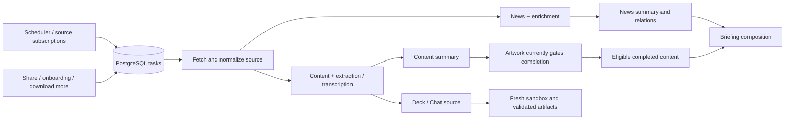

# Content pipeline resilience plan

Date: 2026-09-04. Reviewed local `main` at `add3ffbe868abf50734d3edf1452b3730011fb3e`.
Status: implemented and validated locally on 2026-09-04. No commit or deployment.

The findings and original-path table below preserve the audit snapshot at the reviewed SHA. Implementation now includes immutable artifact pointers with durable cleanup, shared pinned HTTP, durable X continuation, bounded interruption recovery and terminal settlement, per-source task fanout, per-entry persistence, summary readiness independent of artwork, News summary checkpoints, verified Share routing and item recovery, typed provider failures and safe deck retries, source Retry-After plus queue jitter, retained-feed catch-up, source/watchdog health, and scheduler catch-up. The architecture remains Rust plus PostgreSQL. Accepted feeds still have no byte cap and are buffered in memory; no spool parser or new workflow infrastructure was introduced.

Keep the Rust modular monolith, PostgreSQL queue, and prepare / external work / fenced finalize pattern. The largest gains come from correcting the boundaries of existing work: one source should fail independently, retries must not overwrite another attempt's files, completed provider work should survive a later stage failing, and optional artwork should not keep readable content unpublished.

## Implementation evidence

- Affected Rust suites: 334 tests passed, one credentialed live-provider test intentionally ignored. This includes PostgreSQL persistence, lease/finalizer failure, source/config fencing, terminal workflow settlement, X restart/continuation, artifact isolation, News checkpoint reuse, optional artwork readiness, source health and watchdog regressions.
- iOS: app and Share Extension compiled; all four `ScraperSettingsViewModelTests` passed on the local iPhone 17 Simulator after regenerating typed source-status models.
- Strict all-target Clippy for affected crates, formatting, architecture/module guards, task contract checksums, public contract drift and diff checks passed. Cleanup reviewers' findings were incorporated; later focused tests cover retry policy, direct verified Share routing and cleanup isolation.
- Runtime gates remain separate: no paid provider/E2B canary, private production-feed replay, release gate, commit, push or deployment. Production migrations and source cadence observation belong to the authorized release.

Implementation choices keep the design small: existing memberships provide durable feed catch-up progress; one source task can refetch a partial source while preserving accepted items; the existing queue carries X continuations and News checkpoints. Provider runtime errors that expose only an opaque message retain bounded retries; no exactly-once provider charging guarantee is claimed. Accepted feed bodies remain memory-buffered under the no-byte-cap law. Incremental parsing and cadence/yield alert calibration remain explicit operational follow-ups, not hidden guarantees.

## Evidence and limits

Reviewed the scheduler, queue kernel, scheduled scraping, feed parser and backfills, Share Actions and feed validation, onboarding and weekly discovery, content extraction, media, summarization, short-form processing, Briefing finalization, decks and artifact storage, X sync, and public submission projection. Read the product laws and the Daily Checkup task history.

The supplied summary is stale about local Git state: the latest feed hardening is committed in `add3ffbe`; the checkout was clean before this document. Earlier ingestion identity and finalizer repairs are also present. Deployment was not inspected in this audit. The engineering log records release validation still pending for the latest feed changes.

Fresh validation: `cargo test -p newsly-queue -p newsly-worker -p newsly-providers --lib --locked` passed **173 tests**: 62 provider, 11 queue, and 100 worker tests, including embedded SQLx integration tests. One credentialed provider test was intentionally ignored. These are existing tests, not reproductions of every new finding below. No production changes, private-feed replay, paid canaries, or native UI verification were performed. The initial test invocation was blocked from local PostgreSQL by the sandbox; the approved local run passed.

Findings below are grounded in local code. Failure traces are code-derived scenarios, not claims that these incidents have occurred in production. A full resilience guarantee would require the proposed fault tests and production observation.

## Current paths

| Entry or stage | Current work and durable handoff | Assessment |
| --- | --- | --- |
| Scheduled ingestion | Every 15 minutes, one deduped `scrape` task with `sources=[all]`; all provider results collected before one finalization | Too broad a retry and publication boundary |
| Aggregators | Hacker News; Techmeme, Mediagazer, Memeorandum; SciURLs, FinURLs; Brutalist Report → global News → article enrichment → news processing | Keep source-specific parsers and global reuse; preserve selection-based visibility |
| User sources | Atom/RSS, Substack, podcast feeds and Reddit configurations → user-attributed normalized records | Shared feed parser is a good improvement; partial failure and catch-up need work |
| Feed backfill | Subscription/onboarding → `backfill_feeds` → canonical content and `process_content` | Same parser, but batch persistence and success policy still differ from scheduled scraping |
| Download more | API directly fetches and persists a feed, then atomically queues content processing | Bounded synchronous contract; reuse its policy explicitly if moved to durable acceptance later |
| Share: Briefing | Durable `run_llm_task` → Share agent → validated feed subscription/backfill or direct content | Host validates feed output, but a rejected feed result does not recover a valid shared article |
| Share: Knowledge | Share workflow → saved, read source content → extraction and summary | Preserve explicit membership and read semantics |
| Share: Deck / Chat | Prepare shared source without ordinary unread content; dispatch deck or chat work | Preserve source identity, user instructions, and existing deterministic Chat dispatch |
| Onboarding / discovery | Durable discovery run → search lanes → host feed validation → suggestions → chosen sources and first edition | Good durable identities; transient partial failures and terminal status need consistent handling |
| Articles | `analyze_url` / `process_content` → bounded Python extraction or Rust Firecrawl fallback → stored source body → `summarize` | Keep extraction boundary and reuse of already extracted text |
| Podcasts / video | Media resolution/download → transcript → `summarize` | Existing cancellation, file bounds, and transcript reuse are useful; include them in crash tests |
| Short-form News | Optional article extraction → reusable summary or model summary → relation embeddings/matching → ready News and Briefing fanout | Summary currently depends on later relation work succeeding |
| Long-form publication | Summary → `awaiting_image` → generated image → `completed` | Artwork failure can block eligibility for Briefing |
| Briefing | Durable pending sources → composition → version/source validation → atomic publication | Preserve the previous usable edition on failed or stale work |
| Deck generation | Source preparation → fresh E2B attempt → agent → artifact/browser validation → object bundle → fenced publication | Good validation and prior-artifact preservation; storage keys are not unique per attempt |
| Discussions / narration | Separate worker paths with their own artifacts and provider calls | Keep them independent of content readiness |
| X bookmarks | Bounded paginated fetch → canonical submissions and ledger → checkpoint | Page-limit completion can advance past unseen bookmarks |

The diagram omits separate discussion/narration branches and the synchronous fetch portion of download-more. Image completion currently does not itself enqueue the same immediate Briefing followups that summarization does; later refresh paths can discover the content.

## Findings and smallest effective changes

### F1. Deck attempts share writable artifact paths — high priority correctness fix

`store_bundle` builds `learning_decks/{user}/{deck}/runs/{llm_task_id}`. Queue retries keep that LLM task ID. Upload and cleanup operate outside the database fence. A fence prevents stale database publication, but cannot protect shared object names from a stale uploader or deleter.

Use an opaque attempt identifier in every bundle and agent-log prefix. Upload immutable objects, validate the bundle, and atomically change the deck's database pointer only after exact-lease validation. Cleanup may delete only the attempt's own unreferenced prefix. Preserve an earlier successful deck throughout a rerun.

Apply the same immutable-pointer approach to generated image and thumbnail pairs. They currently replace two canonical files before the SQL transaction commits; failure after the first rename, or SQL rollback, can leave files inconsistent with metadata or replace earlier artwork. This is a separate filesystem atomicity gap, not a reason to hold provider work inside SQL.

Evidence: [deck paths](/Users/willem/Development/news_app/rust/crates/newsly-worker/src/learning_deck/artifacts.rs:220), [upload and lost-lease cleanup](/Users/willem/Development/news_app/rust/crates/newsly-worker/src/learning_deck/handler.rs:221), [deck publication](/Users/willem/Development/news_app/rust/crates/newsly-worker/src/learning_deck/finalizer.rs:72), [image publication](/Users/willem/Development/news_app/rust/crates/newsly-worker/src/image_generation/finalizer.rs:23), [image paths](/Users/willem/Development/news_app/rust/crates/newsly-worker/src/image_generation/storage.rs:91).

### F2. Scheduled feed fetches validate DNS without pinning dispatch — high priority correctness fix

`fetch_public_bytes` resolves and validates a hostname, discards the addresses, then sends through a normal client which can resolve again. Feed discovery already has the stronger pattern: validate addresses and use `resolve_to_addrs`. An accepted feed's hostname can change after its initial validation.

Extract the small existing public HTTP dispatch implementation for use by both validation and scraping. Retain distinct policies for candidate bodies, accepted feeds, and aggregator pages. Revalidate and pin every redirect, and give DNS plus the redirect chain one overall deadline. Test the resolver/transport seam locally; no external probing is needed.

Evidence: [scrape dispatch](/Users/willem/Development/news_app/rust/crates/newsly-providers/src/scraping.rs:761), [pinned validation](/Users/willem/Development/news_app/rust/crates/newsly-providers/src/feed_validation.rs:127), [discarded DNS result](/Users/willem/Development/news_app/rust/crates/newsly-extraction/src/public_url.rs:99).

### F3. X pagination can permanently skip unseen bookmarks — high priority correctness fix

The loop permits ten pages of five entries. Reaching that cap returns `success` with the newest ID from page one, even if the previous checkpoint was never reached. Finalization stores that newest ID. The next run stops at it, leaving older unseen entries behind.

Persist accepted pages plus a continuation and a pending newest ID. Promote the main checkpoint only after reaching the old checkpoint or exhausting the listing. If a continuation expires, restart against the old checkpoint and use the existing ledger to dedupe. Do not merely keep the old checkpoint while always restarting the same first 50 entries: that also fails to make progress through a large backlog.

Evidence: [page loop and limits](/Users/willem/Development/news_app/rust/crates/newsly-worker/src/x_sync/handler.rs:362), [checkpoint publication](/Users/willem/Development/news_app/rust/crates/newsly-worker/src/x_sync/finalizer.rs:83).

### F4. Retry exhaustion and public product status are not consistently coupled — high priority correctness fix

The recent finalizer repair correctly rolls back failed product writes and transitions the queue through a new exact-lease operation. On that error path, however, only the queue is settled. A previously marked `llm_tasks.running`, discovery run, or content state can remain active after the queue reaches terminal failure. Submission listing reads the LLM ledger and content, not the failed processing task.

Also, expired claims consume a retry only for Chat, deep research, audio episodes, and `run_llm_task`. Repeated process death during scraping, extraction, summary, or onboarding can reclaim indefinitely without spending that budget. The worker heartbeat is not an execution deadline, and scrape/backfill do not consistently cancel external work on lease loss.

Make interruption accounting and terminal settlement explicit for every task type. Keep prerequisite deferral separate from a failed attempt. Reuse each feature's existing failure-settlement function when terminalizing, in a fresh exact-lease transaction with the queue transition. Public progress must reconcile against the associated durable queue result and must distinguish accepted action from completed downstream content. Add an execution deadline and cancellation propagation where missing; do not simply raise leases or worker counts.

Evidence: [worker failure transition](/Users/willem/Development/news_app/rust/crates/newsly-worker/src/lib.rs:536), [claim accounting](/Users/willem/Development/news_app/rust/crates/newsly-queue/src/kernel.rs:1135), [submission query](/Users/willem/Development/news_app/rust/crates/newsly-db/src/content_misc.rs:691), [backfill ignores lease signal](/Users/willem/Development/news_app/rust/crates/newsly-worker/src/feed_backfill.rs:52).

### F5. One scrape task still couples all sources — structural simplification

The scheduler enqueues one `scheduled-scrape`. The worker buffers all source results in memory, then publishes them together. Savepoints isolate individual persistence failures, which is valuable, but a worker crash before finalization still loses every fetched result; a long feed group delays every source; and a finalization exceeding the remaining lease rolls back the batch. A failed source can cause all healthy sources to be fetched again.

Fan out directly into existing PostgreSQL tasks: one per public aggregator and one per user source configuration. Keep bounded concurrency and existing worker process separation. Use one enqueue helper for scheduled, manual, and first-edition entrypoints; give tasks stable target-based dedupe keys and revalidate the configuration snapshot at publication. A scheduler tick completes when it has durably enqueued its work, without waiting for children.

Retain per-item savepoints inside each bounded source batch. Share the normalized content persistence operation between scheduled ingestion and backfill, retaining their explicit membership policies. Background backfill currently has neither scheduled scraping's per-item savepoints nor its per-config partial fencing: a single persistence error or changed config can reject the whole batch.

Evidence: [global scheduling](/Users/willem/Development/news_app/rust/crates/newsly-scheduler/src/repository/fanout.rs:9), [collect before publish](/Users/willem/Development/news_app/rust/crates/newsly-worker/src/scrape.rs:100), [item savepoints](/Users/willem/Development/news_app/rust/crates/newsly-worker/src/scrape.rs:674), [backfill batch](/Users/willem/Development/news_app/rust/crates/newsly-worker/src/feed_backfill.rs:357).

### F6. Partial source failure loses retry policy — pair with F5

Scheduled scraping turns provider errors into strings. A configured-feed group is considered successful whenever it has any items; one healthy feed can mask a sibling timeout. Backfill likewise succeeds if any feed succeeds and records the failed first-edition sources as unavailable. This preserves successes, but it does not schedule recovery for failed transient siblings. Conversely, a whole-source failure is retried even if its original error was terminal.

Preserve a small typed outcome: source identity, success/partial/failure, stable code, retry disposition, counts, and optional retry delay. With one task per source, retry the failed source alone. Within a source, skip and count deterministic malformed entries while retaining good ones; retain retryable subrequests when needed, such as a failed HN item or Brutalist topic. A temporarily unavailable first-edition source can be shown as such without being treated as permanently finished while its retry is pending.

Unify provider error mapping at the gateway boundary. Summarization currently searches error-message text; News broadly retries provider failures; images deliberately retry every provider error; deck/Share agent failures are generally terminal unless they expose a deferral. Use typed transport/status/validation information where available. Honor provider retry delays, bound retries, and add jitter to the existing queue backoff. Avoid a generic provider failover system.

Evidence: [source success predicate](/Users/willem/Development/news_app/rust/crates/newsly-worker/src/scrape.rs:391), [error flattening](/Users/willem/Development/news_app/rust/crates/newsly-worker/src/scrape.rs:485), [backfill success policy](/Users/willem/Development/news_app/rust/crates/newsly-worker/src/feed_backfill.rs:129), [summary classifier](/Users/willem/Development/news_app/rust/crates/newsly-worker/src/summarization/handler.rs:295), [deck failures](/Users/willem/Development/news_app/rust/crates/newsly-worker/src/learning_deck/handler.rs:396).

### F7. Artwork blocks readable content — recommended product behavior change

An article or podcast summary without an image becomes `awaiting_image`. Briefing accepts completed content. Image provider failure changes the queue but does not complete the content or publish a terminal image state. Even image success does not use summarization's immediate Briefing fanout.

Make a valid summary complete the readable content and enqueue Briefing work in that same transaction. Track artwork separately as optional pending/ready/failed metadata; use existing placeholder styling. Artwork retries must never hide text or invalidate a previous image. Update the content and reliability laws deliberately, along with image eligibility, public status, and client expectations. News already avoids this artwork dependency.

Evidence: [summary readiness](/Users/willem/Development/news_app/rust/crates/newsly-worker/src/summarization/repository.rs:412), [followup conditions](/Users/willem/Development/news_app/rust/crates/newsly-worker/src/summarization/fanout.rs:155), [image completion](/Users/willem/Development/news_app/rust/crates/newsly-worker/src/image_generation/repository.rs:87), [Briefing eligibility law](/Users/willem/Development/news_app/docs/laws/briefing.md:5).

### F8. Successful News summarization is discarded when relation work fails — recovery and cost improvement

News processing obtains a summary, then loads candidates and requests embeddings. An embedding failure persists error/usage but not the newly generated summary. A retry can pay for the same summary again. Reuse works for already durable summaries, but this intermediate success is not durable.

Persist a fingerprinted summary checkpoint before optional relation enrichment. Prefer one additional short fenced checkpoint and the existing processing task, unless splitting into a summary task and relation task makes ownership clearer during implementation. The first version should retain current publication/deduplication semantics: checkpointing need not make unclassified duplicates visible. Keep relevant links and discussions optional. Validate summary shape and evidence provenance; metadata-only summaries must not claim unavailable article evidence.

Evidence: [summary before embeddings](/Users/willem/Development/news_app/rust/crates/newsly-worker/src/news_item/handler.rs:375), [final-only summary persistence](/Users/willem/Development/news_app/rust/crates/newsly-worker/src/news_item/repository.rs:319), [failure persistence](/Users/willem/Development/news_app/rust/crates/newsly-worker/src/news_item/repository.rs:912).

### F9. Feed limits are sampling limits, not outage recovery — reliability improvement

Normalization takes the first N entries before filtering and deduplication. A feed with more than N new entries between successful runs can lose older unseen items even while they remain in the document. Repeatedly fetching the same head does not catch up. Filtered Substack audio/transcript entries also consume that head window. Feed order is taken as supplied rather than established as newest-first.

Separate normal intake policy from catch-up. Select unseen eligible entries using stable per-feed entry identity plus canonical URL, with bounded batches and a durable continuation/progress marker. Do not use publication timestamp alone: undated and reordered entries exist. Respect the user's existing intake limits, but report a recoverable backlog instead of silently treating sampling as complete history. For top-list aggregators, promise collection of observed items only; an RSS/top-list endpoint cannot recover entries it no longer exposes.

Accepted feeds intentionally have no byte cap under P13. Today they are fully buffered and parsed in memory, sometimes more than once for podcast metadata. Preserve the current law for this plan; investigate incremental/spooled parsing and bound concurrency and overall time. Do not silently reintroduce the removed cap. A hard process resource limit would require an explicit policy decision and truthful resource-exhaustion reporting.

Evidence: [entry selection and filtering](/Users/willem/Development/news_app/rust/crates/newsly-providers/src/scraping/feed.rs:47), [unbounded accepted-feed buffer](/Users/willem/Development/news_app/rust/crates/newsly-providers/src/scraping.rs:761), [accepted-feed policy](/Users/willem/Development/news_app/docs/laws/processing-and-reliability.md:27).

### F10. Share feed validation failure has no host recovery to a valid item — targeted simplification

When the Share agent returns a feed target and host validation rejects it, the agent execution fails. The host does not then establish whether the originally shared URL is a valid article/episode, even though S4 allows that recovery. A model choosing a feed is therefore another failure dependency for an otherwise usable shared item.

Use deterministic host routing for known validated feeds and already recognized item types, then the existing agent only for ambiguous discovery. If feed resolution fails, ingest the original URL only after real item evidence passes existing extraction/media checks. Never treat an arbitrary homepage as an article. Retain action-mode checks, user instructions, explicit approval rules, and the distinction between subscribing to future items and ingesting the shared page.

For deck/Share transient infrastructure failures, allow bounded safe retries with fresh sandboxes and unique artifacts. Distinguish validation failures from transport/storage failure; do not rerun ambiguous external actions blindly.

Evidence: [host feed rejection](/Users/willem/Development/news_app/rust/crates/newsly-worker/src/share_actions/agent.rs:391), [terminal Share agent failure](/Users/willem/Development/news_app/rust/crates/newsly-worker/src/share_actions/handler.rs:325), [Share invariants](/Users/willem/Development/news_app/docs/laws/sharing-and-sources.md:9).

### F11. Health does not answer whether each source is still working — operational improvement

Queue health already reports useful task ages, failures, and leases. Source statistics derive publication/processing data from existing items. Neither proves that a particular source was recently fetched successfully, produced a valid empty result, suffered parser drift, or was continuously skipped by backpressure.

Add a compact durable per-source observation: last attempt, last successful fetch/parse, last successful persistence, last new item, outcome counts, consecutive failures, stable last error, and next retry. Reuse configuration storage where suitable and a minimal equivalent for global aggregators; avoid a new observability service. Expose this through `newsly-admin` and the existing source UI.

Alert separately on fetch failure, backlog age, and suspicious yield changes. A weekly podcast with no new episode is healthy if fetch/parse succeeds; an HTML aggregator suddenly producing zero links deserves investigation. Initial thresholds should be based on source cadence and task deadline, then calibrated from observation. Extend the existing watchdog to report terminal-product mismatches and dedupe/backpressure blocking progress; automated repair should enqueue only a demonstrably missing next task, not replay terminal failures forever.

The scheduler retries only within the scheduled minute. Missing Monday's discovery minute can postpone work a week. Use the existing durable tick records to run the latest missed daily/weekly occurrence once after restart; do not replay every missed 15-minute ingestion tick.

Evidence: [coarse health](/Users/willem/Development/news_app/rust/crates/newsly-admin/src/operator.rs:153), [derived source stats](/Users/willem/Development/news_app/rust/crates/newsly-db/src/scraper_stats.rs:37), [scheduler restart behavior](/Users/willem/Development/news_app/rust/crates/newsly-scheduler/src/runner.rs:62).

### F12. Cleanup after commit is best effort — bounded follow-up

Deck cleanup is held in process memory and logs deletion errors. A crash after commit or failed cleanup can leave obsolete objects. A crash after upload but before publication can also leave unpublished objects. Fresh sandbox cleanup has a stronger durable lifecycle and should be preserved.

After immutable attempt paths exist, add bounded cleanup using durable references and an age grace period. Record known obsolete prefixes transactionally or sweep old unreferenced attempts; use one mechanism with a clear owner. Never delete referenced artifacts or prefixes belonging to a live lease. Keep cleanup failure out of the successful content/deck publication path.

Evidence: [deck after-commit cleanup](/Users/willem/Development/news_app/rust/crates/newsly-worker/src/learning_deck/finalizer.rs:133), [durable sandbox lifecycle](/Users/willem/Development/news_app/rust/crates/newsly-worker/src/task_sandbox/lifecycle.rs:53).

## Concrete failure traces

These traces identify the assertions needed in regression tests.

| Scenario | Explicit state transitions in current code | Required result after the fix |
| --- | --- | --- |
| Partial feed failure | Start: `queue=pending`, `A=new`, `B=new`. Fetch: `A=10 items`, `B=timeout`. Combine: `items=10`, `errors=1`, `failed_without_progress=false`. Commit: `queue=completed`, A items durable, no retry for B | A commits; B retains its own retryable task and visible error |
| Deck lease replacement | Start: A owns queue T; `object_prefix=runs/L`. A begins upload. A expires; B claims T and uses the same prefix. B uploads/publishes. A finishes and observes lease loss; cleanup deletes its bundle keys, which also name B's bundle | `prefix_A != prefix_B`; A cannot overwrite or delete B, and only B's pointer commits |
| X backlog larger than 50 | Start: checkpoint `c0`, 60 unseen items. Ten pages return newest 50; `next_token` still present. Commit: checkpoint becomes newest `n60`. Next run sees `n60` first and stops; oldest 10 remain unseen | Persist continuation; commit `n60` as checkpoint only after all pages through `c0` are settled |
| Summary then image outage | Start: content `processing`, no image. Summary commits: `awaiting_image`; image task created. All image attempts fail: queue `failed`, content still `awaiting_image`, no Briefing eligibility | Summary commits readable `completed`; image failure remains independent |
| News embedding outage | Start: no durable summary. Model succeeds: summary only in memory. Embeddings fail: queue retries, error/usage persists, summary absent. Retry calls summarizer again | Retry reads matching durable summary; provider call count stays one for unchanged input |
| Finalizer repeatedly fails | Start: ledger `running`, queue claim live. Product finalization throws; transaction rolls back. Fresh queue failure consumes retry. After exhaustion: queue `failed`, ledger can remain `running` | Terminal product state and queue agree; public polling stops and offers valid recovery |
| Feed config changes midfetch | Start: task captures revision R1. User edits/disables config to R2. Provider returns R1 items. Current scheduled path fences affected items; backfill rejects all configs as a batch | Reject only obsolete source output, preserve unrelated source commits, use current config on any new attempt |

Do not claim exactly-once provider execution. A crash after an external provider accepted work but before Newsly recorded the result can still repeat a charge unless that provider supports a recoverable identity. Guarantee fenced publication and bounded repetition, and reuse durable provider identities wherever the adapter already supports them.

## Implementation sequence

Each slice must work end to end and include its own failure test. Split further if necessary; do not ship these as one large refactor.

| Slice | Scope | Completion evidence |
| --- | --- | --- |
| 1a | F1: unique deck attempt prefixes and immutable bundle publication | Two overlapping attempts cannot overwrite/delete each other; failed rerun preserves old deck; deletion revokes access |
| 1b | F2: shared pinned public HTTP dispatch | Resolver changes between check/send cannot alter destination; private redirects rejected; DNS/redirect deadline enforced |
| 1c | F3: X continuation and checkpoint correctness | More than 50 bookmarks, page failure, expired continuation, and process restart ingest every item exactly once in the ledger |
| 2a | F4: interruption budget, terminal settlement, truthful status | Kill/reclaim exhaustion and finalizer failure produce terminal queue and product states; accepted submissions do not spin forever |
| 2b | F5/F6: source-specific task fanout and typed outcomes | One aggregator outage and one broken feed leave healthy sources fresh; only transient failures retry; config/user fences hold |
| 2c | F5: shared bounded feed persistence | Malformed/database-failing entry preserves siblings; backfill and scheduled ingestion preserve archived/read state and cross-user access |
| 3a | F7: summary readiness independent of images | Article/podcast enters Briefing with image provider unavailable; image success later updates artwork without duplicate publication |
| 3b | F1/F12: immutable image pair and bounded artifact cleanup | Crash at every upload/rename/commit boundary preserves published pointers; orphan cleanup never touches live artifacts |
| 4a | F8/F6: reusable News summary checkpoint and consistent error mapping | Embedding retry reuses summary and usage identity; changed input invalidates checkpoint; terminal configuration errors stop |
| 4b | F10: deterministic Share routing and validated item recovery | Feed URL, article URL, episode URL, homepage, unavailable feed, and mismatched agent output all produce the intended outcome |
| 5a | F9: feed catch-up and bounded memory investigation | Feed with more unseen entries than normal intake, reordered/undated entries, duplicate head, and filtered head all make explicit progress |
| 5b | F11: source health, scoped reconciliation, missed scheduled work | Healthy empty source differs from broken parser; stalled product is detected; scheduler restart catches the latest missed weekly run once |

Add the source observation fields while implementing source fanout if needed to verify 2b; 5b is the broader operator/UI and alerting finish, not permission to postpone all visibility.

## Verification and release

Use small typed fake gateways and local HTTP/storage seams, plus isolated PostgreSQL tests. Assert product rows, task rows, ownership, artifact bytes, and provider call counts together. A task reaching HTTP 200 or queue `completed` is insufficient evidence by itself.

Required scenario matrix:

- Successful article, podcast, aggregator story, feed subscription, saved item, Chat source, deck, onboarding first edition, and X bookmark.
- Timeout, 429 with retry delay, 5xx, permanent 4xx/configuration error, malformed feed/model output, HTML selector drift, empty result, and missing source body.
- Worker termination after provider success and before commit; lease replacement during artifact upload; database failure during finalization; disk/object-store write failure; failed post-commit cleanup.
- Deletion, source disable/edit, inactive user, cross-user deduplication, read/archive preservation, and unauthorized content access.
- Old successful Briefing/deck remains available after a failed rerun; stale summary/image fingerprints reject publication; downstream work cannot disappear between a product commit and enqueue.
- Onboarding/deck dependencies stop on terminal source failure, preserve retry budget while genuine prerequisites progress, and do not defer indefinitely behind an interrupted task.

Retain focused parser fixtures for all seven aggregators. The current feed tests are useful, but they do not prove live HTML selectors or provider routing. Record sanitized representative RSS/Atom/HTML examples, including iTunes metadata, enclosure-only episodes, relative links, repeated homepages, and source attribution. Any live private-feed replay or paid provider smoke needs its own authorized execution scope.

For each changed slice run formatting, warning-denied Clippy, focused tests and SQLx integration coverage; run contract drift checks for task/public changes and regenerate/build affected Swift clients. Update relevant laws for intended behavior changes and architecture notes only after the design is implemented. Maintain the engineering log.

Before an authorized release, run `scripts/release_gate.sh` with the required live smoke flags for these backend/provider/Share/deck changes, then deploy the exact tested SHA. Verify runtime revision separately from source freshness. Observe at least several scheduled intervals: successful fetches by source, new/duplicate/rejected counts, queue age, completion latency, retry volume, missing downstream tasks, and publication. Recovery tests must establish correctness even if a real source publishes nothing during observation.

## Scope discipline

Keep PostgreSQL as the sole task authority, the current Rust crate boundaries, and the database-free Python extractor. Preserve user visibility, fresh task sandboxes, exact-lease finalization, bounded model/tool execution policies, summary input checks, and artifact/browser validation.

Do not add a workflow engine, event bus, generic DAG framework, sandbox pool, parallel Python backend, universal retry wrapper, or broad provider failover matrix. Do not combine Content and News identities. Do not add a separate raw-page archive or shared aggregator warm-pool initiative to this work. Durable checkpoints are justified only at an observed repeat-work or data-loss boundary.

The minimal recommendation is slices 1–3 first: correct artifacts/network/checkpoints, isolate and settle work, then let readable summaries publish independently. Follow with News reuse, Share recovery, catch-up, and source-level observation. This keeps the useful architecture while removing concrete failure dependencies.
