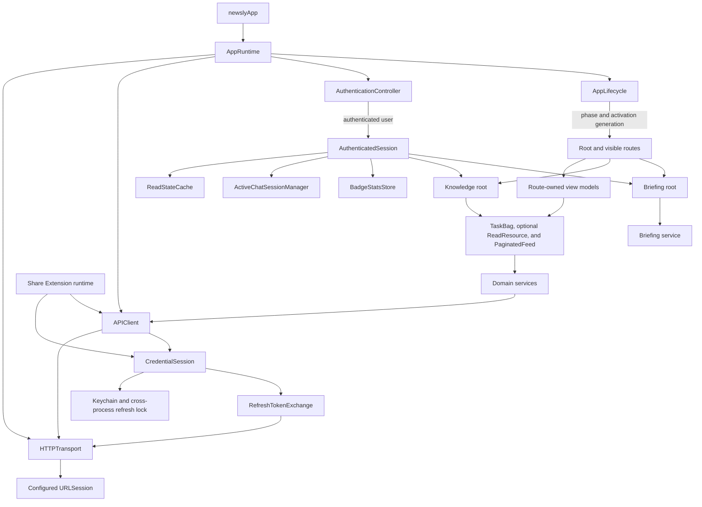

# iOS lifecycle, networking, and refresh simplification — revision 2

Status: core implementation complete and validated locally; final dependency-factory migration and release-gated credential cleanup remain

Date: 2026-08-29

Supersedes: `10-approach-plan.md` (same initiative). This revision keeps that plan's architecture and slicing and corrects it after a code-verification pass: every factual claim was checked against the current checkout. Changes from r1 are marked inline as **[r2]** where they alter a decision or scope, and silently where they only correct a count or file reference.

Scope: iOS app, Share Extension networking, and refresh-token replay safety

Behavioral intent: preserve existing product behavior while making wake, loading, revalidation, and session recovery predictable

## Decision summary

Adopt a deliberately small architecture:

1. One `AppLifecycle` value records process lifecycle facts.
2. One process-lifetime `AppRuntime` owns lifecycle, authentication, and authenticated-user scopes in the correct order. `APIClient` and `CredentialSession` are one process-scoped graph behind the current shared composition factory until the final dependency-injection cutover recorded in the ledger.
3. One app/extension-neutral `APIClient` and `CredentialSession`, over a tiny raw transport seam, own HTTP behavior and token recovery without a dependency cycle.
4. One ordinary-read pattern uses the existing `TaskBag`, flat failures, and retained-value rendering. **[r2]** `TaskBag` already exists (`ViewModels/TaskBag.swift`, 13 adopters) and is already mandated by `docs/coding-guidelines-ios.md`; this plan extends its use, it does not introduce it. Extract a shared `ReadResource` only after Content Detail and a second independent feature prove the same boundary.
5. Existing feature state machines continue to own domain workflows such as Briefing versioning, chat completion, Learning Deck generation, polling, and mutations.

This is the middle path between another Briefing-only wake patch and a global sync framework. It centralizes only behavior that is genuinely common. It does not create a registry of lifecycle participants, a global `refreshAll()`, a reachability gate, or a resource cache that tries to model every feature.

Slices 0–8 and the high-confidence Slice 9 cleanup have now established the common lifecycle, request, credential, replay-safety, and read-state boundaries described below. The remaining ledger entries are either a broader composition migration or compatibility that cannot be removed until already-distributed app and extension builds have crossed the credential-envelope window.

## Relationship to prior initiatives **[r2]**

This section is new in r2. The r1 plan cited no other initiative; three are directly relevant.

### ios-modernization-2026-07

Phases 1–2 of that plan landed (commit `e131a69a`): the dead-code deletions are done, and `TaskBag`, `PaginatedFeed`, `ReadStateCache`, and `docs/coding-guidelines-ios.md` all exist because of it. At the time this revision was written, Phase 4's poller gating had not reached `BadgeStatsStore`, and `OpenAIService` still bypassed `APIClient`. This plan's baseline evidence reflects that post-modernization checkout; Slice 7 later closed the authenticated multipart path.

**This plan explicitly reverses one standing decision from that initiative.** ios-modernization Phase 7 concluded that "a full shared-framework extraction is not worth it yet" for the Share Extension. The duplicated surface later grew to nine near-verbatim elements, including the stale-token recovery block, while replay-safe rotation required both processes to change together. Slice 7 removed that duplicate networking implementation. The `ShareExtensionTransport` name remains only for a thin composition and presentation adapter over the target-neutral core; typography and color sharing are unaffected.

ios-modernization also declared the Briefing surface owned by the briefing-tab initiative and off-limits to parallel refactors. This plan supersedes that boundary **only** for the narrow inputs listed in the Briefing migration map (lifecycle signal, failure classification, safe-read retry). Briefing's domain state machines remain untouched, as the Non-goals section requires.

### briefing-tab-2026-07

Briefing internals (versioning, snapshots, retention, read reconciliation, refresh polling) are preserved wholesale; this plan simplifies their inputs. The 2026-08-15 log entry ("Prevent stale Briefing retries after reopen") already established that deactivation clears action-level refresh failures and that poll results must own their task generation — the index/refresh side of hypothesis H2 below is therefore **already fixed and tested**, and this plan builds on that decision rather than restating it as new.

### typed-contracts-2026-06

The Pydantic→Swift generator is the required vehicle for Slice 8's contract change. At the baseline, `RefreshTokenRequest`, `TokenResponse`, and `AccessTokenResponse` generated into `APIModels.generated.swift` but had zero call sites. The replay-safe refresh slice now uses the generated request and response contracts in both client processes.

## Baseline problem statement

This section records the checkout assessed before implementation. Closed paths are described in the implementation sections and transitional ledger below.

Newsly does not have one definition of what should happen when the app becomes inactive, enters the background, returns to the foreground, or is relaunched after iOS reclaimed the process. Each feature currently owns part of that behavior:

- `ContentView` forwards `scenePhase` to Briefing and the global chat manager.
- `ChatSessionView` independently observes `scenePhase` and refreshes the visible transcript.
- `BadgeStatsStore` observes UIKit active/background notifications (`didBecomeActive`/`didEnterBackground`) and owns a timer behind a scheduler protocol.
- Voice capture observes a background notification (a hand-rolled string equal to `UIApplication.didEnterBackgroundNotification`'s raw value).
- Knowledge, Content Detail, and Learning Deck screens have no explicit foreground contract.
- Authentication validates only during process construction and keeps its last user only in memory.

The networking layer has the same split ownership:

- `APIClient` builds authenticated requests and retries once after bearer rejection (triggered on 401 **or heuristic 403**, gated by `shouldTreatAsAuthFailure`).
- `TokenRefreshService` owns token rotation and throws `AuthError` (shared with `AuthenticationService`, not private to it).
- `AuthenticationService` and `OpenAIService` bypass `APIClient` for several calls; `AuthenticationService`'s hand-rolled 401/403 branches delete only the access token and perform no refresh, replay, or notification.
- `ShareExtensionTransport` duplicates request construction, authentication-failure detection, refresh coalescing, token rotation, response parsing, and error mapping — plus the refresh DTOs and the stale-token recovery block, which r1 did not list.
- Briefing owns a private list of retryable URL errors and private retry delays.
- The shared cancellation helper `isNetworkCancellation` has **44 call sites across 17 files** (r1 said "eighteen"; that was the file count, roughly). A separate population of inline `catch is CancellationError` checks bypasses the helper entirely (`PaginatedFeed`, `ActiveChatSessionManager`, `ChatMessageCompletionRegistry`, `LearningDeckStatusRegistry`, `OnboardingViewModel`).

**Six** files send HTTP requests directly, not five as r1 stated:

- `Services/APIClient.swift`
- `Services/TokenRefreshService.swift`
- `Services/AuthenticationService.swift` (five separate send sites)
- `Services/OpenAIService.swift`
- `Shared/ShareExtensionTransport.swift`
- `Services/ImageCacheService.swift` — **[r2]** exempted from this initiative: it fetches public media through its own injected session, holds no user-private state, and gains nothing from bearer/refresh/replay machinery. It stays outside `APIClient` deliberately; the inventory names it so the exemption is a decision rather than an oversight.

This produces failures that depend on callback timing and wrapper depth. A real refresh connectivity failure currently becomes:

```text
URLError
  -> AuthError.networkError   (TokenRefreshService.swift:141-145)
      -> APIError.networkError (APIClient.swift:355-357, 407-408)
```

Both `isNetworkCancellation` and Briefing's private classifier recurse through `APIError.networkError` but have **no `AuthError` case**, so they unwrap one level and stop. A transient wake-time failure can therefore bypass retry or appear as a user-visible error. (r1's "do not completely unwrap that shape" was correct; "handles no nesting" would not have been — one level is handled, the `AuthError` level is not.)

The architecture also makes small fixes expensive. A change to wake semantics requires reasoning about scene observers, view-owned tasks, view-model-owned tasks, retry loops, notification observers, cache freshness, token refresh, and UI error state separately.

## Baseline evidence

**[r2]** The wake/lifecycle surface was patched three times in mid-August (2026-08-15, -26, -27). Slice 0 must re-verify this section against `main` at implementation time rather than trusting this snapshot.

### Lifecycle ownership

The current lifecycle paths are spread across:

- `client/newsly/newsly/ContentView.swift`
- `client/newsly/newsly/Views/ChatSessionView.swift`
- `client/newsly/newsly/Services/BadgeStatsStore.swift`
- `client/newsly/newsly/Services/SpeechTranscribing.swift`
- `client/newsly/newsly/Services/VoiceDictationService.swift`

The app has exactly two SwiftUI `scenePhase` observers and additional UIKit notification observers. The observers do not agree on whether `.inactive` should behave like a true background transition.

### Composition and lifetime

`RootDependencyFactory` is located in `Shared/AppChrome.swift` as an enum of 20 static functions, even though it constructs authentication, content, chat, Briefing, Knowledge, narration, decks, search, and settings dependencies. Most of those dependencies reconnect global `.shared` objects. The iOS Services and Shared directories contain exactly 30 process-global singletons (31 app-wide).

This has three consequences:

1. Construction order is implicit. `AuthenticationViewModel` is created by a stored-property initializer (`newslyApp.swift:13`) before `newslyApp.init()` configures the shared Keychain access group (`:21`), so its synchronous `checkAuthStatus()` reads the Keychain with no access group. The nil-group fallback in `KeychainManager.getToken` makes this a latent hazard rather than a hard failure — which is worse, because it works until it doesn't.
2. User-scoped state survives because observers reset it, rather than because its lifetime ends with the user session. Only three observers exist for the auth notifications; `AuthenticationService.logout()` does its heaviest cleanup inline, and the remaining ~27 singletons hold state across logout with no reset hook. Account change is handled separately by SwiftUI identity (`ContentView(userId:).id(user.id)`), which recreates the view subtree but not the global singletons.
3. Tests inject selected dependencies into individual view models but cannot easily construct one coherent app runtime.

### Credential storage **[r2 — this subsection is new; r1 did not know about the mirror]**

`KeychainManager` performs a **triple write** on every token save:

1. the access-group Keychain item;
2. a legacy no-access-group Keychain item;
3. a **plaintext access/refresh token mirror in App Group `UserDefaults`** (`KeychainManager.swift:54-58, 110-131`).

`getToken` falls back access-group → legacy → mirror and self-heals values back into the Keychain. On the simulator, the access group is forced nil, so sim runs exercise only the legacy item and the mirror. Consequences for this plan:

- Refresh tokens currently sit in cleartext in a plist inside `group.com.newsly`. The credential-envelope migration (Slices 6–8) must reconcile and eventually retire the mirror explicitly, or a stale mirrored token can be resurrected by the fallback path after the envelope becomes canonical. This gets its own transitional-ledger row.
- The `.userId` Keychain key is written (sign-in, debug menu) and **never read anywhere**. No token↔user binding exists today — which confirms the cached-shell risk r1 identified, and also means the envelope migration has no existing `.userId` read sites to break.
- Publication ordering is only half-enforced: both refresh paths write refresh-token-first, but the **sign-in** path writes access-token-first (`AuthenticationService.swift:487-492`). The envelope's atomic-write guarantees must cover sign-in, not just refresh.

### Networking and authentication

`APIClient.swift` currently exposes six overlapping public entry points — decoded-descriptor, decoded-path, raw-data, HTTP-response, void, and `authorizedMediaResource` — all funnelling into one private `executeRequest`. Call-site distribution: 65 decoded path-based calls, 6 descriptor calls (all in `CLILinkService`, `ChatService`, `ContentService`), and roughly ten across the other overloads.

The main app and Share Extension duplicate:

- URL session configuration (byte-identical timeouts);
- base URL and request construction — duplicated **and divergent**: different base-URL source and different join semantics;
- bearer attachment;
- authentication-like `401`/`403` classification — divergent, see below;
- one-time refresh and original-request replay;
- response-detail parsing — divergent: the extension probes four candidate keys, the app one;
- in-process refresh coalescing (the app's coordinator has a 10s success cooldown; the extension's has none);
- refresh-token-first publication ordering;
- refresh request/response DTOs and the stale-token recovery block;
- error enums and error-to-presentation mapping.

The 403 heuristics differ in two behavior-relevant ways: the extension never tracks whether a bearer header was attached (the app treats a 403 on an unauthenticated request as an auth failure), and the extension's body-marker list is missing `"invalid refresh token"`. Slice 7's parity suite must **canonicalize on the app's heuristic** (with the extension gaining `sentAuthHeader` tracking and the full marker list) and settle one detail parser, rather than asserting equivalence between two behaviors that currently disagree.

The cross-process refresh lock (`flock` over the App Group container, held across network call and publication, failing closed when the container is unavailable) and refresh-token-first publication are important and must remain. The duplication around them should not.

### Read, revalidation, command, and polling state

The word “refresh” currently describes several different operations:

- obtaining the first readable value;
- conditionally revalidating a cached value;
- forcing a client-side reload;
- issuing a server mutation that starts new work;
- polling until that durable server work changes state.

Those operations need different cancellation and retry rules.

Current state ownership by surface:

| Surface | Current shape | Assessment |
|---|---|---|
| Briefing | Snapshot restore, ETag revalidation, freshness, read reconciliation, version fencing, Lens pagination, document retention, manual server-refresh command, and version polling | A specialized domain state machine. Preserve it and simplify its inputs and failure handling. |
| Knowledge root | Coordinates four independently recoverable sources (saved content, chats, decks, narrations) and publishes one merged timeline behind a coalesced-load barrier | Required by K5 and K13. Keep the aggregate coordinator; simplify child loading. |
| Saved Knowledge | Uses `PaginatedFeed` for generation-fenced paging | Keep and strengthen. |
| Knowledge chats | Reimplements initial paging, load-more state, cursor ownership, reconciliation, and errors | Migrate the list portion to `PaginatedFeed`; retain chat work and voice state. |
| Content Detail | Uses repeated value/loading/error fields and captured IDs to reject stale responses | Best first adopter for a small ordinary-read abstraction. |
| Deck and narration lists | Repeat array/loading/error patterns plus request-start-revision mutation reconciliation. **[r2]** Their latest-request handling differs: narrations fence with a request UUID, decks with a re-entrancy guard — the Slice 5 extraction gate must adjudicate this divergence, not paper over it. | Good ordinary-read candidates with feature-supplied reconciliation. |
| Badge stats | Manually coalesces a GET, observes UIKit lifecycle, and polls while processing exists | Move lifecycle ownership out. Keep processing-aware polling local. |
| Chat and Learning Deck reader | Mix durable commands, acknowledgement boundaries, polling, handoff, and presentation | Do not place these workflows in a generic read abstraction. |

The documented `LoadPhase` includes `.empty`, but the concrete enum in `PaginatedFeed.swift` does not. Several features continue to use independent booleans or local phase enums.

## Wake-error hypotheses and test status

The sporadic symptom is probably not one bug. Warm resume, a completed request while inactive, a one-second connectivity transition, token refresh, and process-reclaimed launch can produce similar UI through different paths. Keep the hypotheses separate and try to falsify each one.

| Hypothesis | Current evidence | Current verdict | Decisive test |
|---|---|---|---|
| H1: a refresh-time connectivity error bypasses retry because it is nested as `APIError(AuthError(URLError))` | The baseline wrapper chain was reproduced. Slice 7 removed `APIError`, made `ClientFailure` the API boundary, and retained recursive `AuthError`/URL-error normalization. Direct and auth-wrapped connectivity and cancellation tests now pass. | **Closed in Slice 7** | Covered by `ClientFailureTests`, API client retry tests, and feature cancellation tests. |
| H2: selected Briefing Lens hydration completes with failure while inactive and publishes `Try Again` before activation replaces it | **[r2] Narrowed.** The reactivation fence is in-flight-only (`resumeSelectedLensLoadOnReactivation` keys on `tasks.isRunning`), and a selected-Lens failure can publish while inactive. But the unconditional `loadLensIfNeeded` on reactivation clears the failure in the common cases. The one reachable path where an inactive failure **survives** into the reactivated UI is the read-retirement-protected early return (`keepsRetiredDocumentVisible`), which is reached because `setActive(true)` protects the selected lens before resuming it. Index/refresh failures are already fully fenced with tests (2026-08-15 change). | **Confirmed mechanism, narrow surviving path** | Complete a selected-Lens failure while inactive on a read-retirement-protected lens that retains its document; assert reactivation does not surface the stale failure. A test on the unprotected path passes vacuously today — do not use one as evidence. |
| H3: Content Detail turns lifecycle cancellation into a visible retry state | Confirmed: `ContentDetailViewModel.swift:188-193` sets the retry message on cancellation, and a test locks it in. | **Confirmed current behavior; may explain reports outside Briefing** | Delay the primary detail read, background/cancel, return with the same content identity, and assert silent cancellation followed by one activation read. |
| H4: the radio/path is temporarily unavailable during wake and requests fail before connectivity settles | The main session now uses `waitsForConnectivity`; selected `GET`/`HEAD` reads also have bounded safe-read retry, while commands remain single-send. | **Mitigated in the common stack; device evidence still required** | Continue device wake traces for unavailable connectivity before connection establishment and connection loss after establishment. |
| H5: wake fan-out causes duplicate refreshes or duplicate session teardown | In-process refresh is already single-flight (with a 10s success cooldown in the app) and the app/extension use a cross-process lock. Terminal auth publication is still distributed. | **Refresh duplication less likely; terminal event fan-out remains** | Resume Briefing, badge, and chat against an expired access token; require one refresh exchange and one terminal transition per credential generation. |
| H6: cold relaunch is being mistaken for warm resume | A reclaimed process reconstructs auth and models. Only Briefing has persisted readable snapshots; cached user state is memory-only and `/auth/me` transient failure can sign out. | **Separate confirmed architectural gap** | Compare PID across reopen. Test new-process launch online/offline with valid credentials, matching snapshot, transient `/auth/me`, and terminal rejection. |

The implementation order follows this evidence: instrument and add deterministic tests first, repair H1/H2 without waiting for the larger architecture, then move lifecycle ownership and cold-session restoration. A passing warm-resume test does not close the cold-relaunch hypothesis, and vice versa.

## Goals

- Make process launch, temporary inactivity, true backgrounding, warm resume, and process-reclaimed relaunch explicit.
- Preserve readable data while revalidation is in progress or recoverable connectivity fails.
- Give cancellation one meaning everywhere: stop obsolete work without presenting an error.
- Apply one bounded retry policy to safe reads.
- Keep mutating requests single-attempt unless the endpoint has an explicit idempotency contract.
- Ensure concurrent bearer failures share one token refresh.
- Make authenticated user state and its pollers/caches end when that user session ends.
- Keep feature-specific reconciliation and durable workflows close to their feature.
- Reduce singleton lookup, NotificationCenter coordination, duplicate transport code, and repeated load-state plumbing.
- Migrate in small slices that leave the affected product path working and tested.

## Non-goals

- No global query cache or offline database for every endpoint.
- No `LifecycleParticipant` registry or `refreshAll()` callback fan-out.
- No `NWPathMonitor` gate that decides whether requests may execute.
- No new repository or use-case layer around every service.
- No conversion of Briefing, chat, decks, narration, or WebKit into one universal state machine.
- No retry of arbitrary `POST`, `PATCH`, or `DELETE` requests.
- **[r2]** No redesign of the generated-contract system. Slice 8 adds fields through the existing generator and migrates decoders onto already-generated types; it does not rewrite the generation pipeline. (r1's "no rewrite of generated API contracts" wording contradicted Slice 8 on its face.)
- No change to `ImageCacheService`'s independent media fetching.
- No UI redesign.
- No production, deployment, or distribution change as part of the architecture refactor.

## Behavioral invariants

The implementation must preserve these product rules. **[r2]** Where r1 paraphrased, the clauses it dropped are restored below because each one constrains this plan specifically:

- B10: **server state remains authoritative**; local snapshots support cold starts, and recoverable failures, retries, or reopening preserve readable content while unfinished work resumes safely. The leading clause bounds the cached-shell design: a cached shell renders stale data, it never overrides server truth.
- B13: revalidation cannot reverse accepted Briefing read mutations — **within the reconciliation window only; outside it, the latest server index remains authoritative even when its version is lower**. A generic retained-value rule applied more broadly than the window would violate the law, not implement it.
- K5: a failure in one Knowledge source cannot erase other sources.
- K13: initial Knowledge loading publishes one merged timeline with no partial/empty flash — **and sustained loads and independent source failures remain visible** (implemented today as a 250 ms delayed spinner; a suppression-only reading breaks it).
- CH2: accepted chat turns survive navigation and backgrounding (acceptance is atomic: message saved and assistant turn queued together).
- CH8: cancellation remains distinct from failure, and **recoverable errors preserve the transcript** — directly relevant to the `ClientFailure` normalization.
- A1: user-scoped device caches are cleared when the account changes.
- A3: refresh tokens rotate once; a consumed refresh token cannot mint another session.

One additional cross-feature invariant should be documented when implementation begins:

> A recoverable lifecycle or connectivity failure cannot replace readable content with a blocking error. Without readable content, the app exhausts a short safe-read recovery budget before presenting retry.

## Terminology

Use the following names consistently:

- **Load**: obtain the first readable value.
- **Revalidate**: issue a safe read while retaining the current value.
- **Force reload**: an explicit user request to re-read server state without a freshness check.
- **Command**: send a mutation such as marking read, creating a deck, sending chat, or requesting a new Briefing composition.
- **Observe**: poll or subscribe to durable server work after the command was accepted.
- **Warm resume**: the same process returns from true background to active.
- **Interruption return**: the app returns from `.inactive` without a true background transition.
- **Cold relaunch**: a new process starts, whether the user killed it or iOS reclaimed it.

“Refresh” may remain in user-facing controls, but code should name the actual operation.

## Options considered

| Option | Shape | Benefit | Cost | Decision |
|---|---|---|---|---|
| Patch the existing features | Add `AppLifecycle` and repair the nested error classifier, leaving composition and refresh state unchanged | Lowest immediate risk | Duplicate loading, auth, extension transport, and lifecycle ownership remain | Too narrow |
| Scoped runtime plus common transport and ordinary-read state | Thin lifecycle facts, explicit process/user lifetimes, one authenticated HTTP path, one small read abstraction, feature-owned workflows | Removes the proven duplication without flattening domain behavior | Requires a staged migration and clear ownership rules | **Recommended** |
| Global query/sync engine | Key every server resource globally and centralize cache, invalidation, lifecycle, retry, and polling | Uniform API in theory | Briefing versions, paging, mutations, chat completion, audio, and durable jobs do not share one useful lifecycle | Rejected |

## Target architecture



The arrows represent ownership or explicit injection. `AppLifecycle` does not know about endpoints or feature models. `AppRuntime` does not expose arbitrary dependency lookup to leaf views.

## Component design

### 1. `AppLifecycle`

`AppLifecycle` is a small `@MainActor @Observable` value retained by `AppRuntime`. The app root is its only writer. It records facts and derives semantic transitions.

Proposed state:

```swift
@MainActor
@Observable
final class AppLifecycle {
    enum Phase {
        case active
        case inactive
        case background
    }

    struct Activation: Equatable {
        enum Kind {
            case initialLaunch
            case warmResume
        }

        let generation: UInt64
        let kind: Kind
        let occurredAt: Date
        let backgroundDuration: Duration?
    }

    private(set) var phase: Phase
    private(set) var activation: Activation?
    private(set) var lastInterruptionReturnAt: Date?
}
```

Rules:

- `newslyApp` is the only product-level writer.
- A real background-to-active transition creates a new warm-resume generation.
- An inactive-to-active transition without background records an interruption return for diagnostics. It does not advance the activation generation or trigger normal stale-data revalidation.
- Initial process activation is explicitly different from warm resume.
- The lifecycle object contains no selected tab, route, endpoint, feature registry, or `refreshAll()` method.
- OS-specific audio session interruptions remain owned by the audio subsystem.

Consumption pattern:

- Process-wide managers in `AuthenticatedSession` receive phase changes once. During migration, one explicitly temporary root adapter performs that forwarding until the session scope exists.
- Visible screens use `activation.generation` in `.task(id:)` for initial activation and true warm resume. Phase changes that affect a route-owned domain workflow are consumed separately and do not create a second refresh task identity.
- Tab visibility remains a separate input. A backgrounded Briefing tab and a hidden Briefing tab are different states.
- Route-owned chat and Learning Deck reader models receive `AppLifecycle` explicitly when they must combine app interactivity with route visibility and durable-work handoff. They do not observe `scenePhase` themselves.
- Feature request-generation tokens continue to fence their own results. The lifecycle generation is context, not a replacement for request identity.

### 2. `AppRuntime` and `AuthenticatedSession`

`AppRuntime` is the composition root and process-lifetime owner. It is not a service locator and does not hold feature presentation state.

Responsibilities:

- configure the shared container and Keychain before constructing authentication;
- create one configured URL session for the app;
- create one `HTTPTransport`, `RefreshTokenExchange`, `CredentialSession`, and `APIClient`;
- create the authentication controller;
- create and destroy one `AuthenticatedSession` as auth state changes;
- provide explicit live and test initializers.

`AuthenticatedSession` owns values that must have exactly one authenticated-user lifetime:

- the current user identity supplied by `AuthenticationController`;
- `ReadStateCache`;
- `BadgeStatsStore`;
- `ActiveChatSessionManager` and its completion registry;
- root Briefing and Knowledge models;
- root navigation and tab state;
- user-scoped snapshot/cache handles.

Route-owned models such as Content Detail, Search, a visible chat, and a Learning Deck reader remain owned by their views. They receive exact dependencies through initializers created by the session’s factory methods.

Guardrails:

- Only the app root receives `AppRuntime`.
- Leaf view models never call `runtime.resolve(...)` or read arbitrary services from the environment.
- The session may construct a feature model, but it does not expose feature actions or a global refresh API.
- Logout destroys the session. Badge timers, chat polling, root view models, read caches, and navigation state end by lifetime rather than by notification fan-out.
- Truly process-global OS facilities, such as image caching or audio playback, can remain process scoped if they contain no private user state.

This moves `RootDependencyFactory` out of `AppChrome.swift`. The initial migration may keep factory methods, but they become instance methods over an explicit dependency graph rather than static methods reconnecting `.shared` values.

### 3. `APIClient` and `CredentialSession`

Keep the network stack shallow:

```text
feature view model
  -> domain service
      -> APIClient
          -> HTTPTransport -> configured URLSession
          -> CredentialSession
              -> RefreshTokenExchange -> HTTPTransport
```

`HTTPTransport` is package-internal and deliberately mechanical: it executes a prepared `URLRequest` against the configured session and returns `(Data, HTTPURLResponse)`. It has no bearer logic, refresh, retry, decoding, feature policy, or presentation mapping. `RefreshTokenExchange` is the one unauthenticated refresh operation built on that transport. This avoids both a circular `APIClient` -> `CredentialSession` -> `APIClient` dependency and a second auth transport implementation.

`APIClient` owns:

- base URL resolution;
- URL request construction;
- typed HTTP methods;
- headers, query parameters, body, and allowed status handling;
- bearer attachment;
- one original-request replay after an explicit bearer rejection;
- response-detail extraction;
- decoding;
- common safe-read retry;
- request logging and timing;
- normalization into one failure type.

It does not broadcast auth events. `CredentialSession` emits at most one terminal event for a credential generation. Production composition installs a direct handler on `AuthenticationController`; the controller conditionally clears only the matching current credential identity and generation. Concurrent requests may each receive `.authenticationExpired`, but stale terminal or validation callbacks cannot destroy or recreate a newer authenticated session.

`CredentialSession` owns:

- Keychain reads and writes;
- in-process single-flight token refresh (preserving the existing post-success cooldown behavior in the app policy);
- the existing cross-process refresh lock;
- re-reading credentials after acquiring the lock;
- atomic credential-envelope publication, plus refresh-token-first dual-write of legacy split keys during the mixed-version window;
- **[r2]** the same atomic ordering guarantees on the **sign-in** publication path, which today writes access-token-first;
- **[r2]** under-lock reconciliation with the plaintext App Group `UserDefaults` mirror while legacy builds can still read or self-heal from it, and the mirror's scheduled retirement (own ledger row);
- under-lock reconciliation in both directions while legacy app or extension builds can still rotate only the split keys;
- recovery when the other process already rotated the rejected token;
- terminal versus recoverable credential outcomes;
- one terminal-event emission per credential generation.

The Share Extension constructs the same networking core with an extension-specific URL-session policy and terminal-auth handler. It does not import `AppLifecycle`, the authenticated app session, or the full feature graph.

#### Public request surface

Slice 7 kept the path shape already used by most service calls and removed the lightly used `APIRequestDescriptor` plus its six call sites.

`APIClient` now exposes three public request operations:

```swift
func request<Response: Decodable>(
    _ path: String,
    method: HTTPMethod = .get,
    body: Data? = nil,
    queryItems: [URLQueryItem]? = nil,
    headers: [String: String]? = nil,
    allowedStatusCodes: Set<Int> = [],
    recoveryPolicy: RequestRecoveryPolicy = .none,
    authentication: RequestAuthentication = .required,
    decoding: ResponseDecoding = .standard
) async throws -> Response

func requestHTTP(/* same request inputs */) async throws -> (Data, HTTPURLResponse)

func requestVoid(/* same request inputs */) async throws
```

This keeps feature services and generated response DTOs. It does not introduce a generated runtime, endpoint registry, interceptors, repositories, gateways, or use-case wrappers.

Special cases remain explicit:

- ETag callers use headers and allowed `304` handling through `requestHTTP`.
- Multipart transcription uses `requestHTTP` with its own content type.
- Authorized media preparation (today's `authorizedMediaResource` overload) remains a small dedicated helper because AVFoundation consumes a URL and headers rather than decoded JSON.
- Public sign-in endpoints use `.none`; authenticated endpoints default to `.required`.
- `ResponseDecoding.standard` preserves the shared-client decoder. `.iso8601` handles authentication dates for `/auth/me`, sign-in, and debug-session responses. The separate `AuthenticationResponseDecoder` has been deleted.

#### Failure model

Normalize failures once:

```swift
enum ClientFailure: Error {
    case cancelled
    case connectivity(URLError.Code)
    case authenticationRequired
    case authenticationExpired
    case invalidRequest
    case invalidResponse
    case http(statusCode: Int, detail: String?)
    case decoding(endpoint: String)
    case unexpected
}
```

Rules:

- Cancellation is emitted directly as `.cancelled`; it is never wrapped in auth or network errors.
- A connectivity failure during token refresh remains `.connectivity`, with auth phase included in diagnostics rather than in a nested error enum.
- A `.required` request with no credential material fails locally as `.authenticationRequired`; it does not send a request and does not claim that an existing session expired.
- Only definitive refresh-token rejection becomes `.authenticationExpired`.
- `403` uses the canonical bearer-header/body heuristic, including `sentAuthHeader` tracking and the full marker list with `"invalid refresh token"`, in both the app and extension.
- User-facing strings are derived at the presentation boundary. Transport logs retain endpoint, status, error code, attempt, and timing without tokens or private response bodies.
- The final cutover is complete. `APIClient` emits `ClientFailure` directly; the classifier still recognizes direct URL errors and transitional `AuthError` values. Source search is clear of `APIError`, `isNetworkCancellation`, the Briefing URL-error walker, and inline product cancellation decisions that bypass `ClientFailure`.

#### Recovery policy

Central policy:

- The main app session uses `waitsForConnectivity` with a 30-second request timeout and a 60-second resource timeout. Commands may wait for their first connection within those deadlines, but the transport never reissues them.
- The extension supplies its own session and uses one 250 ms refresh retry because extension execution time is constrained.
- Retry only `GET` and `HEAD` for selected connectivity errors, with a small jittered budget.
- Start with the existing Briefing delays of approximately 250 ms and 750 ms (currently injectable, with jitter up to `min(base/5, 100ms)`), then tune from device evidence.
- Optionally retry selected transient `5xx` responses only after endpoint-by-endpoint evidence; do not include them in the first slice.
- Never generically retry commands.
- Pre-ack lifecycle tests cover chat, deck, narration, and upload commands. Connection waiting does not change their single-send rule.
- Safe-read retry applies only to the original resource transport attempt. Credential acquisition and `/auth/refresh` sit outside that budget. The refresh exchange owns a separate replay-safe attempt ID and may retry that same attempt within its own bounded policy; it never restarts the resource retry budget.
- Replaying the original request after an explicit bearer rejection is auth recovery, not transport retry. Server auth runs before the command handler, and the client still performs at most one such replay.
- Do not add `NWPathMonitor` as a request gate. URLSession outcomes remain authoritative.

The request algorithm keeps those budgets separate:

```text
acquire current credential
send original resource attempt with method-safe connectivity budget
if resource response is an explicit bearer rejection:
  run one credential refresh outside the resource retry loop
  if refresh succeeds, replay the resource once
  the replayed resource may use the remaining method-safe connectivity budget
if refresh transport is ambiguous:
  return connectivity now
  do not invoke refresh again until replay safety exists
```

The networking layer decides whether a failure is recoverable. It does not decide whether a feature should show a blocking error or retain data.

### 4. Ordinary-read pattern and extraction gate

Do not make a new generic read container a prerequisite for the lifecycle repair. First simplify Content Detail with the existing `TaskBag`, the flat failure vocabulary, and the rendering rules below. Then compare that implementation with one independent adopter, likely a deck or narration list. Extract `ReadResource<Key, Value>` only if both features have the same ownership boundary without feature-specific branches. **[r2]** One known divergence the gate must resolve up front: narrations fence latest-request with a UUID token, decks with a re-entrancy guard. If the gate cannot pick one mechanism for both, the extraction fails honestly.

The shared pattern, whether it remains local code or becomes a type, is:

- one typed resource key;
- one keyed `TaskBag` entry that coalesces the same key and replaces a different key;
- generation fencing for both success and failure;
- separate readable value, initial phase, and revalidation activity;
- silent cancellation;
- retained data after revalidation failure;
- caller-owned freshness timing and user-facing error strings;
- an exactly-once winning-generation commit inside the task owner, not in every caller awaiting the task.

That last point matters for Content Detail: tracking, mark-read, and dependent source-body work must begin once after the winning primary response. Coalesced callers may observe the result, but they cannot each repeat those side effects.

Mutation-aware list features also retain their request-start context. Deck and narration reconciliation currently depends on a revision captured before the request. The feature must apply the response against that captured revision. A future shared type may pass an opaque request context into one winning-generation commit, but it must not reduce reconciliation to `(existing, incoming)` or place mutation semantics in generic infrastructure.

If a second adopter proves the boundary, the extracted `ReadResource` may own only:

- keyed task coalescing and replacement through `TaskBag`;
- generation fencing;
- readable value plus initial/revalidation state;
- one winning-generation apply/commit hook;
- reset and late-result prevention.

It must not own lifecycle, freshness intervals, display strings, domain reconciliation rules, mutation revisions, commands, polling, pagination, or transport retry. `AppLifecycle` and route visibility decide when a read begins; `APIClient` decides transport recovery; the feature owns presentation and domain effects.

Candidate comparison set:

- primary Content Detail load and rendered/source body load;
- Learning Deck list read;
- custom narration list read;
- optionally the GET portion of badge stats after lifecycle ownership moves.

Do not use the pattern or an extracted type for:

- Briefing ETag, snapshots, Lens assembly, retention, read reconciliation, manual generation, or version polling;
- Knowledge’s four-source publication barrier;
- cursor pagination;
- chat sends, acknowledgement boundaries, completion polling, or council branches;
- Learning Deck generation, status observation, viewer resolution, or WebKit state;
- badge timers or optimistic count deltas;
- any mutation retry policy.

### 5. `PaginatedFeed`

Keep the existing paging abstraction and align it with the common failure and load vocabulary.

Changes:

- Move `LoadPhase` to a shared UI-state file.
- Add the documented `.empty` state.
- Replace raw `CancellationError` matching with `ClientFailure.cancelled` handling.
- Keep cursor, `hasMore`, generation, replacement merge, and append semantics inside the pager.
- Migrate Knowledge chat history to it.
- Preserve feature-supplied reconciliation for local chat creation, deletion, saved-content mutations, and read state.

Do not merge `PaginatedFeed` with an ordinary-read helper. Paging has different state and merge rules.

### 6. Feature-owned workflows

The following existing concepts remain feature specific:

- `BriefingIndexSynchronizer` for the manual server-refresh command and version observation;
- `BriefingSnapshotStore` and Lens state for local-first versioned documents;
- `TaskBag` for keyed commands, pollers, and feature-owned long-running work;
- `ChatMessageCompletionRegistry` for durable assistant-message observation;
- `LearningDeckStatusRegistry` for durable deck-generation observation;
- mutation revision/tombstone reconciliation in content, deck, and narration models;
- audio interruption and playback state;
- WebKit page loading.

The architecture should simplify their inputs:

- one lifecycle signal;
- one `ClientFailure` model;
- one safe-read retry policy;
- one authenticated session lifetime.

It should not replace their domain state machines.

## State and rendering rules

Value and request phase must remain separate. A request failure does not imply that the resource has no value.

| Readable value | Operation | Outcome | Presentation |
|---|---|---|---|
| No | Initial safe read | In progress or waiting for connectivity | Skeleton/loading; no retry yet. K13's delayed-spinner rule still applies where a feature has one. |
| No | Initial safe read | Recovery budget exhausted | Blocking error with retry |
| Yes | Automatic revalidation | In progress | Keep value; optional subtle activity indicator |
| Yes | Automatic revalidation | Recoverable failure | Keep value; log quietly |
| Yes | User-forced reload | Recoverable failure | Keep value; show a nonblocking banner/toast if useful |
| Either | Cancellation/replacement | Cancelled | Restore prior phase; no error |
| Either | No credentials before a required request | Authentication required | Authentication boundary handles sign-in/restoration; feature does not invent a local network error |
| Either | Definitive authentication expiry | Terminal | Session controller transitions once; feature does not invent a local network error |

While the app is not interactive:

- do not start automatic reads;
- a successful already-running safe read may populate a cache if its feature identity is still current;
- cancellation or recoverable failure cannot publish a blocking UI error;
- accepted commands continue according to their durable domain contract;
- pollers pause on true background and resume from durable IDs without duplicating owners.

Briefing preserves its current intentional distinction: selected-Lens hydration may continue while inactive or backgrounded, while speculative neighboring loads may be cancelled. A selected hydration failure completed while noninteractive is recorded but cannot publish a blocking error. Activation re-evaluates whether the selected Lens still needs work and starts or replaces it only under the feature’s existing task-identity rules — **[r2]** including the read-retirement-protected early return, which is the one path where a stale failure survives today and must be covered explicitly. This avoids assuming that every in-progress assembly has a persisted cursor from which it can safely restart.

## Lifecycle flows

### Warm resume with fresh data

```text
background -> active
  AppLifecycle creates warm-resume generation
  AuthenticatedSession resumes process-wide managers once
  visible route receives activate(generation)
  feature evaluates freshness
  fresh resource performs no network request
  existing UI remains unchanged
```

### Warm resume with stale readable data

```text
background -> active
  existing value remains visible
  visible feature starts one conditional revalidation
  APIClient waits/retries only within the safe-read budget
  200/304 updates lastValidatedAt
  recoverable failure keeps the prior value
```

### Temporary interruption

```text
active -> inactive -> active, without background
  interruption return is recorded for diagnostics
  activation generation does not change
  durable work is not cancelled
  no routine freshness revalidation runs
  presentation resumes
```

### Process-reclaimed relaunch

```text
new process
  configure shared container and Keychain
  create AppRuntime and read credential material
  restore matching cached user/session shell when safe
  restore user-scoped snapshots
  validate /auth/me asynchronously
  transient connectivity retains recovering/cached session
  definitive credential rejection destroys session and signs out
```

### Command followed by observation

```text
user command
  send once
  server acknowledgement provides durable identity
  feature registry observes that identity
  background pauses observation, not accepted work
  foreground resumes observation without sending command again
```

This is the correct model for chat turns, deck generation, narration generation, and Briefing server refresh.

## Authentication and cold relaunch

Replace `AuthenticationViewModel`’s launch-only, memory-only restoration with an explicit authentication controller owned by `AppRuntime`.

`AuthenticationService` may remain as the Apple authorization adapter. Its server requests move through `APIClient`, while `AuthenticationController` owns state, restoration, and session transitions.

Proposed session states:

```swift
enum AuthenticationState {
    case restoring(cachedUser: CachedUser?)
    case authenticated(User, validation: ValidationState)
    case signedOut
}

enum ValidationState {
    case current
    case cached
}
```

Rules:

- Configure Keychain access before reading tokens.
- Make `AuthenticationController` the sole owner of cached-profile persistence and restoration. `AuthenticatedSession` receives the current `User`; it does not read or write the cached profile.
- Persist the minimum user profile required to construct the authenticated shell, keyed by user ID.
- Add a single secure credential envelope containing the token pair, user ID, and credential generation. Replace that envelope atomically while holding the existing cross-process lock. **[r2]** The stored `.userId` Keychain key is write-only today, so the envelope creates the first real token↔user binding; there are no legacy `.userId` readers to migrate.
- Make the envelope canonical for new builds. During the mixed-version window, dual-write legacy token items under the same lock in the existing refresh-token-first order so an older app or extension can still converge safely. **[r2]** "Legacy token items" includes all three legs of the current triple write: the access-group Keychain item, the nil-access-group Keychain item, and the plaintext App Group `UserDefaults` mirror. The mirror must be updated or cleared under the same lock; otherwise the `getToken` fallback can resurrect a stale mirrored token after the envelope becomes canonical.
- **[r2]** Route the sign-in publication path through the same atomic envelope write. Today sign-in writes access-token-first, the opposite of the refresh paths; the envelope removes the ordering question entirely, and the parity suite tests sign-in as well as refresh.
- Also read the legacy pair under that lock. If it differs from the envelope, treat the cached identity as unconfirmed, validate the newer legacy candidate through the auth server, and promote it into a new user-bound envelope before using a cached shell. This protects against both a legacy extension rotation and an older app changing accounts; compatibility cannot be one-way.
- Restore cached user state only when its user ID matches the secure credential envelope. Legacy loose tokens cannot establish that match: validate `/auth/me` first, then write the new envelope.
- Validate `/auth/me` through `APIClient` after local restoration.
- Transient connectivity leaves the cached session intact and retryable.
- Definitive refresh-token rejection signs out exactly once.
- Account change or logout destroys `AuthenticatedSession`, clears user caches, and clears the cached profile.
- Keychain reads distinguish missing credentials from unavailable Keychain access. **[r2]** Note the simulator forces a nil access group, so simulator coverage exercises only the legacy item and mirror paths; device coverage is required for the access-group path.
- Remove authentication lifecycle notifications after direct session ownership is proven.

The exact cached-shell policy is a product/security decision. The recommendation is to allow existing persisted user-scoped data—currently the Briefing snapshot—to render only when a cached user matches the secure credential envelope. B10's "server state remains authoritative" bounds this: the shell renders, it never overrides. This does not promise an offline Knowledge timeline; that would require a separate cache design. Server mutations still go through `CredentialSession` and cannot report success without server acknowledgement; this initiative does not add an offline mutation queue.

## Refresh-token response-loss safety

The current backend consumes a refresh token before returning a new access/refresh pair: `/auth/refresh` inserts the token hash into `consumed_refresh_tokens` and the session commit finalizes before the response body reaches the client. Nothing stores the issued pair against the consumed hash, so there is no replay mechanism of any kind today. If the server commits rotation and the response is lost, the client retains a consumed token and cannot safely retry; the current outcome is a forced sign-out. The client's existing `rotatedRetryCount` recovery only helps when another **local** process won the race — it cannot recover a lost response.

Do not solve this with generic POST retry.

Add a separate replay-safe rotation contract:

1. After acquiring the cross-process lock, the client creates a rotation-attempt ID and writes a pending-attempt record to shared durable secure storage before sending the request.
2. A retry after ambiguous response loss or process death reuses that pending ID for the same credential generation. The app and extension re-read the record while holding the same lock rather than generating independent IDs.
3. The server atomically records the old token hash, user, attempt ID, replacement result, and a short replay expiry in the same transaction as token consumption.
4. Repeating the same old token plus the same attempt ID returns the already-created replacement pair; it does not mint another session.
5. The same consumed token with a different attempt ID remains rejected.
6. Stored replay material is encrypted and expires quickly. The client clears its pending record only after atomically publishing the replacement envelope or receiving a definitive rejection.
7. During mixed-version rollout, the request attempt ID is optional. Legacy clients retain the current one-time behavior; new clients gain replay retrieval. Make it mandatory only after the minimum supported app and extension builds can send and persist it, or keep it optional if mandatory enforcement has no security benefit. An optional `attempt_id: str | None` on the Pydantic model generates as a Swift optional and satisfies the contract policy without a `lenient_field`.
8. **[r2 — load-bearing addition.]** Migrate the hand-written refresh DTOs onto the generated contracts as part of this slice. The refresh wire shape currently has **three** parallel definitions: the generated `APIRefreshTokenRequest`/`APIAccessTokenResponse` (zero call sites), `TokenRefreshService`'s private `TokenRefreshResponsePayload`, and the extension's `ShareExtensionRefreshRequest/Response`. A new field added to the Pydantic model generates cleanly but lands only in the unused generated types; without this migration, neither process would ever send or read the attempt ID, and the feature would be silently inert. The extension's copies are already deleted by Slice 7; the app's private payload must be replaced by the generated types here (or in Slice 7 if sequencing prefers it), with decode-parity fixtures.

This preserves A3: one refresh token still mints at most one replacement session. A repeated request may retrieve that session, not create another one. Slice 8 changes the rotation record shape, so it updates the account law in the same change, as `docs/laws/README.md` requires.

The backend API, persistence model, tests, account law, generated contracts, app, and extension must change in one end-to-end slice.

## Feature migration map

### Briefing

Keep:

- snapshots and seven-day display policy;
- ETag/304 handling;
- 15-minute revalidation freshness;
- index and Lens version fencing;
- Lens retention and document assembly;
- read-mutation reconciliation;
- manual server-refresh command and version polling.

Change:

- consume `AppLifecycle` plus tab visibility instead of deriving scene behavior in multiple places;
- discard/suppress failures completed during noninteractive lifecycle state — **[r2]** the reachable defect is specifically the read-retirement-protected selected-Lens path; index/refresh failures are already fenced and tested, so do not re-implement that side;
- consume normalized `ClientFailure` decisions, then use it directly after the final error cutover;
- delete private URL-error classification and retry delays after common safe-read recovery lands;
- name initial load, revalidation, command, and version observation separately;
- test completed-while-inactive Lens failure explicitly, on the retirement-protected path.

### Knowledge

Keep:

- the four-source initial-load publication barrier and its delayed-spinner behavior (K13, both halves);
- merged reverse-chronological projection;
- source-specific failure recovery;
- mutation reconciliation and active-work polling.

Change:

- give the root an explicit freshness policy and activation method;
- keep current rows during revalidation;
- migrate chat history paging to `PaginatedFeed`;
- compare deck/narration list reads with the proven Content Detail pattern and extract `ReadResource` only if the boundary is genuinely identical;
- use one shared cancellation and failure model;
- retain independent source errors without full-screen replacement.

### Content Detail

Change first among ordinary reads:

- key primary state by typed content identity;
- use `TaskBag` plus the ordinary-read state rules for primary content and body reads;
- make cancellation silent;
- cancel/replace when identity or lifecycle work ID changes;
- retain existing content during revalidation;
- perform tracking, mark-read, and dependent body work once inside the winning-generation commit;
- keep mark-read, opened tracking, feed subscription, chat, discussion, and audio behavior in the feature.

### Badge stats

Keep:

- optimistic count adjustments;
- processing-aware polling interval;
- silent background errors.

Change:

- remove UIKit lifecycle observers (`didBecomeActive`/`didEnterBackground`) and `UIApplication.shared.applicationState` checks;
- let `AuthenticatedSession` activate/suspend it once;
- use async task scheduling instead of the `BadgeStatsRefreshScheduling` timer where practical;
- consider `ReadResource` only for the coalesced GET after lifecycle extraction.

### Chat

Keep:

- durable send acceptance;
- pre-ack versus post-ack behavior;
- `ChatMessageCompletionRegistry`;
- timeline reconciliation and council branches.

Change:

- remove duplicate `scenePhase` observation while preserving both domain owners;
- let the authenticated session own process-wide manager lifecycle once;
- inject `AppLifecycle` into the visible chat model so it can combine route visibility with app interactivity, hand accepted polling to the manager, stop manager ownership on return, and reconcile the transcript;
- use common initial-load state and `ClientFailure` without genericizing sends or polling.

### Learning Decks and narration

Keep:

- durable generation identities and registries;
- local mutation/tombstone reconciliation;
- viewer and WebKit-specific phases;
- audio playback ownership.

Change:

- use common ordinary-read state for simple list loads;
- let the authenticated session own process-wide generation registries, while route-owned readers receive `AppLifecycle` and retain their pre-ack/post-ack handoff logic;
- keep commands single-attempt and resume observation from durable IDs.

### Share Extension

Keep:

- extension-specific presentation state and recovery actions;
- small target surface;
- cross-process refresh lock;
- non-destructive behavior when the app may already have rotated credentials.

Implemented:

- the extension constructs the common `APIClient` and `CredentialSession` with its own session and refresh-retry policy;
- both targets use the canonical 403 heuristic (`sentAuthHeader`, the full body-marker list including `"invalid refresh token"`) and detail parser;
- the duplicated request builder, refresh coordinator, refresh payloads, status heuristic, and credential-recovery path are deleted;
- `ShareExtensionTransport` remains as a thin adapter that delegates to the common client and maps `ClientFailure` into extension presentation recovery.

## Observability

Add correlated, privacy-safe events before changing behavior.

Lifecycle event fields:

- process launch ID;
- old and new phase;
- activation generation and kind;
- background duration;
- account generation or redacted user correlation ID;
- selected root tab and route category.

Read event fields:

- feature/resource name;
- request ID and feature generation;
- trigger: initial, activation, manual, dependency change, or pagination;
- whether readable data existed;
- freshness decision and age;
- attempt count and elapsed time;
- normalized failure category and URL error code;
- result disposition: applied, retained, suppressed, cancelled, stale, or terminal.

Auth event fields:

- refresh reason;
- whether refresh was coalesced;
- whether another process had already rotated;
- outcome category;
- no token values, hashes, identities, or response bodies.

Logs should allow one wake to be reconstructed without filtering separate uncorrelated UIKit and SwiftUI events.

## Test strategy

### Pure lifecycle tests

- initial launch creates `.initialLaunch` once;
- active -> inactive -> active records an interruption return without advancing activation generation;
- active -> inactive -> background -> active creates one warm-resume generation;
- duplicate scene notifications do not create duplicate activations;
- background duration uses an injected clock;
- account change destroys the prior authenticated session.

### Networking tests with scripted URL protocol

- direct and transitional `AuthError`-wrapped cancellation normalize to `.cancelled`;
- refresh-time `-1005` and `-1009` normalize to `.connectivity` without an outer API error wrapper;
- a required request with no credentials fails locally as `.authenticationRequired`;
- safe reads retry within the bounded policy and then succeed;
- `GET -> 401 -> dropped refresh response` reuses one persisted attempt ID and retrieves the same rotation result without re-entering safe-read retry;
- commands may wait for first connectivity within their deadline but do not retry after ambiguous transport failure;
- pre-ack command backgrounding and cancellation never cause a second send;
- normal permission `403` does not trigger refresh, and the canonical heuristic (bearer-header tracking plus body markers) classifies the shared response corpus identically in app and extension;
- bearer rejection triggers at most one shared refresh and one original-request replay;
- concurrent rejected requests share one refresh;
- concurrent terminal failures emit one session-transition event per credential generation;
- decoding and HTTP failures retain their categories;
- standard and ISO-8601 decoder policies preserve current endpoint behavior, including both `User` date fields from `/auth/me`;
- ETag `304` and endpoint-specific allowed statuses remain supported;
- multipart upload preserves headers across auth recovery;
- app and extension clients pass the same credential-rotation parity suite, including sign-in publication ordering.

### Ordinary-read contract tests

- same-key concurrent callers coalesce;
- new key cancels and replaces old work;
- old success and old failure cannot publish;
- cancellation is silent;
- initial failure becomes blocking only after API recovery is exhausted;
- revalidation retains the current value;
- empty success publishes `.empty`;
- winning-generation side effects commit exactly once even when multiple callers await the read;
- request-start revision reaches feature reconciliation and preserves only mutations newer than that request;
- reset prevents late publication.

Run these first against the local Content Detail implementation. If `ReadResource` is later extracted, run the same contract suite against the shared type and at least two feature adopters.

### Feature state-machine tests

- a selected Briefing Lens on the read-retirement-protected path fails completely while inactive, then reactivates without surfacing the stale failure;
- fresh Briefing activation does not read;
- stale Briefing activation performs one conditional read while keeping its document;
- Knowledge keeps all successful source rows while one source revalidation fails;
- Content Detail cancellation does not render `Try Again` and activation can revalidate;
- Badge activation does not duplicate its timer or GET;
- accepted chat and deck work resumes observation without resending the command;
- visible chat and route-owned deck readers combine the shared lifecycle value with route visibility without observing `scenePhase` themselves;
- true terminal authentication destroys the user session once.

### Auth replay tests

- server commits rotation, first response is dropped, identical attempt retrieves the same pair;
- identical attempt cannot mint a second pair;
- different attempt using a consumed token is rejected;
- replay record expires;
- concurrent app/extension attempts converge on one rotated pair;
- a pending attempt survives response loss and client process death;
- a legacy request without an attempt ID retains one-time rotation behavior during the migration window;
- a legacy extension rotation updates split keys, after which the new app validates and promotes that pair into the envelope without losing the session;
- a legacy app account change cannot render the prior user's cached shell and promotes only after server identity validation;
- **[r2]** a stale plaintext-mirror token cannot be resurrected by the fallback path after the envelope is canonical;
- old app/extension versions cannot delete a newer rotated credential during staged migration.

### Authenticated UI coverage

Run on an explicit Simulator UUID and, before release, one physical device. **[r2]** The device pass is not optional for credential work: the simulator forces a nil Keychain access group, so access-group and cross-process paths are only exercised on device.

- Home and reopen with the same PID;
- lock and unlock;
- short inactive interruption without background;
- short background with fresh data;
- stale-data revalidation;
- connectivity loss before request and during response;
- access-token expiry during wake fan-out;
- process termination while backgrounded followed by online and offline relaunch;
- Briefing, Knowledge, Content Detail, visible chat, and Learning Deck reader routes;
- no test-state clearing between background and reopen.

Warm resume and cold relaunch results must be reported separately.

## Migration plan

Each slice ends with deletion of the superseded local path where safe. Temporary adapters must name their removal condition.

### Slice 0: Characterization and logs

Add:

- **[r2]** a re-verification of this plan's evidence section against current `main` (the wake surface changed three times in the two weeks before this plan was written);
- scripted fixtures for nested errors and completed-while-inactive work;
- lifecycle correlation logging;
- URL protocol fixtures for delayed connectivity and auth refresh;
- an authenticated background/reopen UI harness that does not reinstall or clear state.

Behavior remains unchanged. Characterization tests and reusable fixtures land green. Each target-behavior regression is added to the slice that fixes it, where it is verified failing before the implementation and passing afterward.

Validation:

- focused lifecycle/auth/Briefing tests;
- current-checkout Simulator warm-resume trace;
- `git diff --check`.

### Slice 1: Recursive failure classification and opt-in safe-read recovery

Add `ClientFailure.classify(_:)` behind the current public error shape:

- recursively flatten direct and nested token-refresh connectivity and cancellation, explicitly covering the `AuthError` layer both current classifiers miss;
- add typed HTTP method internally;
- add bounded GET/HEAD retry as an explicit per-request policy, defaulting off for unmigrated callers;
- retain one private auth-replay flag;
- preserve `403`, ETag, upload, and allowed-status behavior;
- keep legacy `APIError` mapping and `isNetworkCancellation` for unmigrated callers.

Migrate Briefing index and Lens reads to the normalized classifier and opt-in safe-read policy first. Delete the private Briefing transient classifier and retry loop when parity tests prove the common policy. Do not globally change the thrown error shape or enable session-wide connection waiting in this slice; either would alter dozens of unreviewed consumers.

Every later feature slice migrates its cancellation and error decisions to `ClientFailure`. The compatibility façade is removed only when source search shows zero direct `APIError` matches and zero legacy cancellation classifiers — **[r2]** where "legacy cancellation classifiers" explicitly includes both the 44 `isNetworkCancellation` call sites and the inline `catch is CancellationError` sites that bypass the helper.

Slice 7 satisfied that removal condition. The product and test targets contain no `APIError` or `isNetworkCancellation` references, and feature cancellation decisions use `ClientFailure`.

Do not change dependency ownership or extension transport yet.

### Slice 2: `AppLifecycle`

Add a minimal `AppRuntime` shell that retains `AppLifecycle`, then observe `scenePhase` once at the app root. Until `AuthenticatedSession` exists, an explicitly temporary `RootLifecycleAdapter` forwards that value to the existing root-owned managers. The runtime gains broader composition responsibilities in Slice 4; the lifecycle object itself does not move again.

Migrate:

- `ContentView` root behavior;
- `BadgeStatsStore` activation/suspension through the temporary root adapter;
- root chat-manager lifecycle through the temporary adapter;
- visible chat and Learning Deck reader domain handoff through injected `AppLifecycle`;
- Briefing tab visibility plus lifecycle input.

Remove:

- Badge UIKit `didBecomeActive`/`didEnterBackground` observers;
- `ChatSessionView` and other duplicate product-level `scenePhase` observation;
- routine revalidation on interruption return.

Keep audio interruption observers documented as subsystem-specific exceptions. **[r2]** The voice-capture background observer uses a hand-rolled notification-name string; replace it with lifecycle injection or at minimum the typed constant while touching this area.

This slice completes Badge lifecycle extraction. Slice 4 moves process-wide forwarding from `RootLifecycleAdapter` into `AuthenticatedSession` and deletes the adapter; Slice 5 does not reopen lifecycle ownership.

### Slice 3: Prove ordinary-read state on Content Detail

Simplify primary Content Detail and body reads with the existing `TaskBag`, a typed content key, and explicit value/initial-load/revalidation state. Replace the existing test that treats initial transport cancellation as a visible retry with silent cancellation plus lifecycle-driven revalidation.

Keep tracking, mark-read, and dependent body work inside one winning-generation commit so coalesced callers cannot duplicate side effects. This slice proves key replacement, stale-result fencing, retained data, and initial error behavior without touching polling, multi-source aggregation, or adding a generic read container.

Record the resulting shape and compare it with a second adopter in Slice 5. Extract `ReadResource` only if the two implementations match the extraction gate in this document.

### Slice 4: Establish process and user scopes

Expand `AppRuntime` and create `AuthenticatedSession`:

- configure Keychain first;
- create target-neutral `HTTPTransport`, `RefreshTokenExchange`, `CredentialSession`, and `APIClient` types from the start;
- introduce `AuthenticationController`'s idempotent terminal-session transition and wire the credential-generation terminal event to it, while temporarily adapting the existing launch/restoration state;
- enable the main session's bounded connection waiting only after the pre-ack command tests pass;
- define standard and ISO-8601 response-decoder policies, then migrate `/auth/me` through the shared client with date-decoding parity before authentication restoration depends on it;
- move `RootDependencyFactory` out of `AppChrome.swift`;
- instantiate root user stores inside the authenticated session;
- move process-wide lifecycle forwarding into the authenticated session and delete `RootLifecycleAdapter`;
- replace logout reset notifications with session destruction where migrated — **[r2]** noting the current cleanup is a hybrid: only three notification observers exist, `AuthenticationService.logout()` does inline cleanup, and account change relies on SwiftUI identity; all three mechanisms converge on session lifetime;
- keep explicit injection into leaf models.

Do not remove all singletons in one change. Move user-private state first. Process-global, user-neutral facilities can move later only when doing so reduces hidden coupling.

### Slice 5: Consolidate Knowledge and badge reads

- Move Knowledge chat history to `PaginatedFeed`.
- Compare deck and narration list reads with Content Detail. Resolve the UUID-token versus re-entrancy-guard divergence first; if one mechanism fits both without feature branches, extract the narrow `ReadResource` and migrate both; otherwise retain clear feature-local implementations.
- Give the Knowledge root an activation/freshness convention while preserving its publication barrier and delayed-spinner behavior.
- Decide whether the already lifecycle-independent Badge GET benefits from the proven ordinary-read pattern.
- Align documented and concrete `LoadPhase`.

Delete migrated boolean/loading/latest-request plumbing as each feature lands.

### Slice 6: Complete authentication restoration

- Expand the runtime-owned authentication controller from its Slice 4 terminal-session role and replace the remaining launch-only auth state.
- Persist and validate the minimal cached user profile under sole controller ownership.
- Migrate legacy token material into an atomically written credential envelope only after `/auth/me` establishes user identity.
- **[r2]** Route sign-in through the envelope publication path, closing the access-token-first ordering exception.
- **[r2]** Reconcile the plaintext App Group `UserDefaults` mirror under the cross-process lock: while legacy builds exist, keep it converged with the envelope; schedule its retirement per the ledger.
- When envelope and legacy split keys disagree, validate and promote the newer legacy candidate under the cross-process reconciliation flow before allowing cached-shell restoration.
- Distinguish missing from unavailable credentials.
- Keep a matching cached session during transient `/auth/me` failure.
- Transition to signed out only for terminal credential rejection.
- Remove the `authenticationRequired` notification path. Keep `authDidLogOut`
  only for the two remaining global store observers until the composition
  follow-up moves them fully inside explicit session lifetime.

### Slice 7: Shared app/extension networking and final error cutover

Status: the networking and error cutover is complete locally.

- Share Extension submission uses the target-neutral `APIClient`, `CredentialSession`, `RefreshTokenExchange`, and credential stores.
- Authentication backend calls and multipart transcription use `APIClient`; multipart data is sent through `requestHTTP` with its content type.
- The canonical 403 heuristic and response-detail parser serve both targets.
- The feature-call-site migration and façade removal landed as separate passes. `ClientFailure` is the only error emitted by `APIClient`.
- `APIRequestDescriptor`, its overload, `requestData`, `APIError`, `isNetworkCancellation`, `AuthenticationResponseDecoder`, the private multipart HTTP/auth-replay path, and the duplicate extension refresh/request helpers and payloads are deleted.

`ShareExtensionTransport` and `ShareExtensionTransportError` remain deliberately small presentation boundaries. The adapter constructs the shared core, calls `requestVoid`, and maps `ClientFailure`; it owns no request construction, auth heuristic, refresh coordinator, refresh DTO, or credential publication logic. The old token-refresh facade and `AuthenticationService.refreshAccessToken()` pass-through have also been removed; authenticated callers rely on `APIClient` and `CredentialSession` directly.

Retain legacy Keychain/app-group fallbacks through a separately defined mixed-version migration. They must not disappear merely because the transport is shared.

### Slice 8: Replay-safe refresh rotation

Status: complete and validated locally for the backend, app, and Share
Extension paths. Production rollout and physical-device access-group validation
remain separate release work.

Implement the backend/client/extension contract together:

- migration and bounded replay record;
- request/response contract and generated artifacts;
- **[r2]** migration of the app's hand-written refresh decode path onto the generated `APIRefreshTokenRequest`/`APIAccessTokenResponse` types (see the response-loss-safety section, item 8 — without this the attempt ID is never sent);
- credential-session attempt persistence;
- app and extension parity tests;
- optional attempt-ID compatibility for already-distributed clients;
- updated account law and architecture documentation;
- lost-response end-to-end test.

Only after this slice may `/auth/refresh` retry an ambiguous transport failure.

### Slice 9: Remove transitional paths and document the final system

Status: the safe cleanup and documentation work is complete locally. The broad
static `RootDependencyFactory` migration and the last `authDidLogOut` consumers
remain explicit follow-ups rather than being mixed into the wake correctness
change.

- remove obsolete `.shared` defaults from migrated user-scoped services;
- remove temporary lifecycle adapters and compatibility constructors;
- remove stale notification names and tests;
- **[r2]** write new process/user-scope, lifecycle, and networking sections in `docs/architecture.md` — none exist today, and §17.2's `AuthenticationViewModel` description becomes wrong; this is section creation plus one correction, not an update;
- **[r2]** rewrite the `LoadPhase` section of `docs/coding-guidelines-ios.md` to incorporate the ordinary-read/retained-value rules — the current section mandates `LoadPhase` as the single loading vocabulary ("migrate local variants toward `LoadPhase` instead of adding another shape"), so the new pattern must be integrated into that doctrine, not appended beside it; also add lifecycle, command, and observation rules;
- add or update relevant product laws only where intended behavior changed;
- verify no old request, lifecycle, or error-classification paths remain by source search.

### Transitional path ledger

The ledger records both closed paths and compatibility that remains intentionally open:

| Transitional path | Introduced | Removal condition | Planned removal |
|---|---:|---|---:|
| Recursive `ClientFailure` classifier plus legacy `APIError`/cancellation façade | Slice 1 | **Closed:** product source search is clear, the façade is deleted, and app/extension request tests use `ClientFailure` | Closed in Slice 7 |
| `RootLifecycleAdapter` forwarding lifecycle to current root managers | Slice 2 | **Closed:** `AuthenticatedSession` owns the managers and receives lifecycle facts directly from `AppRuntime` | Closed in Slice 4 |
| Static `RootDependencyFactory` entry points | Existing | Every root and route builder uses the instance composition graph; no static call sites remain | Follow-up composition migration |
| Process-shared `APIClient` and `CredentialSession` factory | Existing | `AppRuntime` constructs and injects the process networking graph without reintroducing a service locator | Follow-up composition migration |
| Authentication-required NotificationCenter event | Existing | **Closed:** terminal credential events route directly from `CredentialSession` to `AuthenticationController`; source search shows no event name, post, or observer | Closed in Slice 9 |
| `authDidLogOut` NotificationCenter event | Existing | Session lifetime reaches the remaining global badge/chat observers and source search shows zero observers | Follow-up composition migration |
| Duplicate Share Extension request/auth/refresh implementation | Existing | **Closed:** both targets compile the target-neutral core; `ShareExtensionTransport` remains only as a thin presentation adapter | Closed in Slice 7 |
| `APIRequestDescriptor`, `requestData`, and overlapping request overloads | Existing | **Closed:** all services compile against the three typed path operations and source search is clear | Closed in Slice 7 |
| `AuthenticationResponseDecoder` | Existing | **Closed:** authentication fixtures use the shared ISO-8601 response policy | Closed in Slice 7 |
| **[r2]** Hand-written refresh DTOs (`TokenRefreshResponsePayload`; extension request/response payloads) | Existing | **Closed:** both processes encode and decode refresh with generated contracts | Closed in Slices 7–8 |
| **[r2]** Sign-in access-token-first publication | Existing | **Closed:** sign-in publishes through the atomic envelope path and the parity suite covers ordering | Closed in Slice 6 |
| **[r2]** Plaintext App Group `UserDefaults` token mirror | Existing | Envelope is canonical, mirror is reconciled under the lock during the mixed-version window, minimum supported builds no longer read or self-heal from the mirror, and the resurrection test passes | Post-Slice 8 or later release |
| Legacy Keychain and app-group token fallbacks | Existing | Bidirectional envelope/split-key reconciliation tests pass, the defined minimum supported app and extension builds have written the credential envelope, and the mixed-version migration window has elapsed | Post-Slice 8 or later release |
| Optional refresh attempt ID on the server | Slice 8 | Minimum supported app and extension builds persist/reuse attempt IDs, and making the field mandatory has an explicit operational benefit | Later release, or remain optional |
| Feature-local ordinary-read code | Slice 3 | **Closed as a non-extraction decision for this initiative:** Content Detail proves the retained-value rules, while deck and narration ownership still differs; revisit only when a second independent adopter proves the same boundary | Remain feature-local |

## Implemented code movement

The final homes are:

```text
client/newsly/newsly/App/
  AppRuntime.swift
  AppLifecycle.swift
  AuthenticatedSession.swift
  AuthenticatedUserCache.swift
  RootDependencyFactory.swift    # composition-only follow-up remains

client/newsly/newsly/ViewModels/
  AuthenticationViewModel.swift # AuthenticationController plus compatibility type alias

client/newsly/newsly/Services/
  APIClient.swift                # target-neutral client core

client/newsly/newsly/Services/Networking/
  APIRequestTypes.swift          # ResponseDecoding and media resource
  APIClient+App.swift            # app composition only
  ClientFailure+AuthError.swift  # app presentation mapping only
  ClientFailure.swift
  CredentialEnvelope.swift
  CredentialSession+App.swift   # app composition only
  CredentialSession.swift       # target-neutral credential core
  CredentialStore.swift
  HTTPTransport.swift
  RefreshAttemptStore.swift
  RefreshTokenExchange.swift
  RequestRecoveryPolicy.swift   # HTTPMethod and safe-read policy
  URLSession+NewslyDefault.swift
```

The target-neutral networking files compile in both the app and Share Extension targets without importing app-only models. Target membership points both processes at the same files; no networking source is copied into the extension.

`ReadResource` was deliberately not introduced. Content Detail and Knowledge use
the retained-value and winning-generation rules through their existing feature
state plus `TaskBag`; their ownership boundaries remain different enough that a
shared resource object would add indirection without removing domain state.

Completed networking removals:

- duplicate Share Extension request, auth, refresh, status, detail, and payload implementations;
- authentication and transcription raw HTTP paths;
- `APIRequestDescriptor`, `requestData`, and overlapping request overloads;
- legacy `APIError`, cancellation helpers, feature-specific error unwrapping, and Briefing transport retry;
- hand-written refresh DTOs in both targets.

Explicit follow-ups:

- static `RootDependencyFactory` construction and the process-shared
  `APIClient`/`CredentialSession` graph;
- the narrow `authDidLogOut` NotificationCenter bridge retained for
  `BadgeStatsStore` and `ActiveChatSessionManager`;
- direct `.shared` reads that disappear with that composition migration;
- repeated ordinary-read loading/error/latest-request fields where the proven shared boundary applies.

## Risks and mitigations

### A runtime container becomes a service locator

Mitigation:

- expose the full runtime only to the app root;
- inject exact dependencies into feature models;
- prohibit `resolve(Type.self)` and feature action methods on the container;
- keep route-owned view models route owned.

### A generic read abstraction absorbs domain behavior

Mitigation:

- do not extract `ReadResource` until two independent adopters pass the same contract;
- if extracted, limit it to idempotent non-paginated reads and one winning-generation commit;
- keep request-start context and reconciliation feature owned;
- keep freshness, lifecycle timing, commands, polling, snapshots, and mutations outside it;
- stop or reverse an extraction when a feature needs domain-specific phases.

### Common retry duplicates commands

Mitigation:

- infer safe retry only for typed `GET`/`HEAD`;
- test ambiguous command transport failure as exactly one send;
- require explicit idempotency before any command retry;
- keep token rotation non-retryable until Slice 8.

### App/extension credential regression

Mitigation:

- preserve the cross-process lock, refresh-token-first publication, credential re-read, and stale-token recovery;
- run one shared parity suite against both runtime policies, covering sign-in as well as refresh;
- retain legacy credential fallbacks — all three legs of the triple write, including the plaintext mirror — through a staged migration;
- test that a stale mirrored token cannot be resurrected after the envelope is canonical;
- test mixed-version behavior before deleting old storage paths;
- run credential tests on a physical device, since the simulator cannot exercise the access-group path.

### Cached auth shell exposes the wrong user

Mitigation:

- key the cached profile and every snapshot by user ID;
- match cached identity to the atomic credential envelope before constructing a session (the envelope is the first user↔token binding; nothing performs this check today);
- require `/auth/me` before caching a shell for legacy loose-token credentials;
- destroy the complete session on account change;
- never report a mutation as successful without server acknowledgement;
- cover switch-account and unavailable-Keychain cases.

### Lifecycle refactor interrupts durable work

Mitigation:

- distinguish interruption, background, and route visibility;
- preserve selected Briefing hydration and suppress only inactive failure publication;
- preserve pre-ack chat/deck command rules;
- pause observation only after durable identity exists;
- test every workflow before removing its old observer.

### Migration creates two active ownership paths

Mitigation:

- migrate one owner at a time;
- mark temporary adapters with their removal slice;
- use logs and tests to assert one request/poller per resource;
- delete old observers in the same slice that installs the new owner when safe.

## Acceptance criteria

### Architecture

- Exactly one product-level `scenePhase` observer exists.
- `AppLifecycle` contains no feature references or network behavior.
- One activation generation advances only on initial activation and true warm resume; interruption return is diagnostic state, not a refresh trigger.
- `AppRuntime` is a composition/lifetime owner, not an arbitrary dependency resolver.
- Logging out destroys all user-scoped polling, caches, root models, and navigation state.
- Leaf view models receive explicit dependencies and do not read the runtime container.

### Networking

- Main app and Share Extension use the same request/error/credential implementation, including one canonical 403 heuristic and one detail parser.
- `CredentialSession` reaches refresh through the one unauthenticated `RefreshTokenExchange`, without calling back into `APIClient` or duplicating an auth stack.
- Authentication and multipart upload no longer implement private HTTP stacks.
- Direct and refresh-nested cancellation normalize identically, including the two-level `AuthError` shape.
- One bounded safe-read policy applies to Briefing index, Lens, Knowledge, and Content Detail reads.
- No common policy retries a command.
- A command may wait for its first connection only within the explicit session deadline and is still sent at most once.
- Concurrent bearer failures share one credential refresh.
- Terminal auth changes session state once.
- Ambiguous refresh response loss is not retried until replay safety exists.
- Both processes encode and decode the refresh exchange through generated contracts.

### Lifecycle and UX

- Foregrounding with fresh data does not issue feature reads, except explicitly always-current app-wide stats.
- Foregrounding with stale data issues at most one revalidation per visible owned resource.
- Temporary inactivity does not trigger a full wake cycle.
- Readable content remains visible through revalidation and recoverable failure.
- Cancellation never renders Error or Try Again.
- A no-cache resource presents retry only after the safe-read recovery budget is exhausted.
- Pollers pause on true background and resume without duplicate owners.
- Accepted commands are never resent merely because the app foregrounded.
- Warm resume and process-reclaimed relaunch both have explicit automated coverage, reported separately.

### Simplification

- No `LifecycleParticipant` registry, global `refreshAll()`, reachability gate, or global query cache is introduced.
- `TaskBag`, `PaginatedFeed`, Briefing snapshots, chat completion, and deck-status registries remain the single owners of their existing responsibilities.
- `ReadResource` is extracted only if two independent adopters pass the same ordinary-read contract without domain-specific branches.
- Superseded observers, overloads, and duplicate extension/auth transport implementations are deleted rather than retained as indefinite compatibility layers. Thin presentation adapters may remain when they own no transport policy.

## Review decisions

The approach needs agreement on five points before implementation planning:

1. Use the scoped middle design rather than a global query/sync engine.
2. Allow a cached authenticated shell only after the cached user matches an atomic secure credential envelope; legacy loose tokens must validate `/auth/me` first. The envelope migration explicitly covers the sign-in publication path and the plaintext App Group mirror.
3. Treat replay-safe refresh rotation as a separate cross-stack slice rather than hiding it behind client retry — including the migration of hand-written refresh DTOs onto generated contracts, without which the attempt ID never reaches the wire.
4. Prove ordinary-read behavior locally in Content Detail and one second feature before extracting `ReadResource`.
5. **[r2]** Accept the reversal of ios-modernization-2026-07's "no shared extension framework yet" decision, on the evidence that the duplicated surface has grown and Slice 8 requires lockstep changes in both processes.

If those decisions are accepted, implementation planning should decompose Slices 0–3 into exact file/test changes first. Later slices — especially the Slice 7 error cutover, which is larger than r1 estimated — should be re-estimated after the common failure and lifecycle behavior has been proven in the current checkout.
